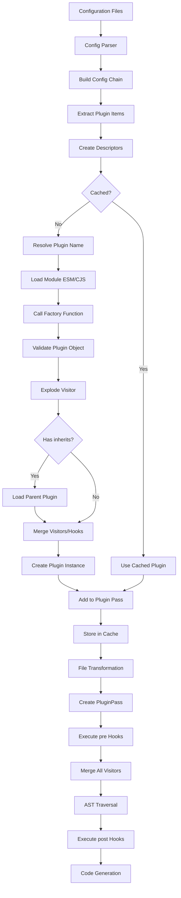

# Babel Plugin Architecture - Comprehensive Analysis

## 1. High-Level Summary

### Architecture Type
Babel implements a **sophisticated visitor pattern-based plugin architecture** with the following characteristics:

* **Interface-driven with Registry Pattern**: Plugins implement a well-defined interface (`PluginObject`) and are registered through a configuration-based system
* **Visitor Pattern Core**: AST transformation is driven by the visitor pattern, allowing plugins to declaratively specify transformations for specific node types
* **Dynamic Module Loading**: Plugins are discovered and loaded dynamically using Node.js module resolution (both CommonJS `require` and ESM `import`)
* **Multi-Pass Pipeline**: Supports multiple transformation passes, where each pass can contain multiple plugins that share a single AST traversal
* **Preset Composition**: Presets bundle multiple plugins together, providing curated collections of transformations

### Problem Solved
The Babel plugin architecture solves several critical problems:

* **Extensible JavaScript Transformation**: Allows arbitrary code transformations without modifying Babel's core
* **Modularity**: Each transformation is isolated in its own plugin, enabling independent development and testing
* **Composition**: Plugins can be combined through presets to create reusable transformation pipelines
* **Performance**: Multiple plugins share a single AST traversal per pass, minimizing overhead
* **Ecosystem Growth**: Third-party developers can create plugins without needing to understand Babel's internals
* **Backward Compatibility**: The plugin API provides a stable interface while Babel's internals evolve

---

## 2. Plugin Discovery & Loading

### Discovery Mechanisms

Babel uses **configuration-based discovery** rather than directory scanning. Plugins are explicitly declared in configuration files:

**Configuration Files:**
* `.babelrc` / `.babelrc.json` / `.babelrc.js`
* `babel.config.js` / `babel.config.json`
* `package.json` (under `"babel"` key)
* Programmatic options passed to `babel.transform()`

**Example Configuration:**
```javascript
// babel.config.js
module.exports = {
  plugins: [
    "transform-arrow-functions",                    // String shorthand
    ["@babel/plugin-proposal-decorators", {         // Array with options
      version: "2023-05"
    }],
    ["custom-plugin", {}, "unique-name"],           // With custom identifier
    pluginFunction,                                  // Direct function reference
    pluginObject                                     // Direct object reference
  ],
  presets: [
    "@babel/preset-env",
    ["@babel/preset-react", { runtime: "automatic" }]
  ]
};
```

### Name Standardization

Babel provides intelligent name resolution with multiple conventions:

**File: `packages/babel-core/src/config/files/plugins.ts:59-87`**
```typescript
function standardizeName(type: "plugin" | "preset", name: string) {
  // Let absolute and relative paths through.
  if (path.isAbsolute(name)) return name;

  const isPreset = type === "preset";

  return (
    name
      // foo -> babel-preset-foo
      .replace(
        isPreset ? BABEL_PRESET_PREFIX_RE : BABEL_PLUGIN_PREFIX_RE,
        `babel-${type}-`,
      )
      // @babel/es2015 -> @babel/preset-es2015
      .replace(
        isPreset ? BABEL_PRESET_ORG_RE : BABEL_PLUGIN_ORG_RE,
        `$1${type}-`,
      )
      // @foo/mypreset -> @foo/babel-preset-mypreset
      .replace(
        isPreset ? OTHER_PRESET_ORG_RE : OTHER_PLUGIN_ORG_RE,
        `$1babel-${type}-`,
      )
      // @foo -> @foo/babel-preset
      .replace(OTHER_ORG_DEFAULT_RE, `$1/babel-${type}`)
      // module:mypreset -> mypreset
      .replace(EXACT_RE, "")
  );
}
```

**Supported Name Formats:**
* Shorthand: `"arrow-functions"` → `"babel-plugin-transform-arrow-functions"`
* Full name: `"babel-plugin-transform-arrow-functions"`
* Scoped: `"@babel/plugin-transform-arrow-functions"`
* Scoped shorthand: `"@babel/arrow-functions"` → `"@babel/plugin-transform-arrow-functions"`
* Third-party scoped: `"@company/my-plugin"` → `"@company/babel-plugin-my-plugin"`
* Module prefix: `"module:custom-plugin"` (exact name, no transformation)
* Absolute/relative paths: `"./my-plugin.js"`, `"/absolute/path/to/plugin"`

### Loading Mechanism

Babel uses **hybrid loading** supporting both CommonJS and ESM:

**File: `packages/babel-core/src/config/files/plugins.ts:34-57`**
```typescript
export function* loadPlugin(
  name: string,
  dirname: string,
): Handler<{ filepath: string; value: unknown }> {
  const { filepath, loader } = resolvePlugin(name, dirname, yield* isAsync());

  const value = yield* requireModule("plugin", loader, filepath);
  debug("Loaded plugin %o from %o.", name, dirname);

  return { filepath, value };
}

export function* loadPreset(
  name: string,
  dirname: string,
): Handler<{ filepath: string; value: unknown }> {
  const { filepath, loader } = resolvePreset(name, dirname, yield* isAsync());

  const value = yield* requireModule("preset", loader, filepath);
  debug("Loaded preset %o from %o.", name, dirname);

  return { filepath, value };
}
```

**Resolution Strategy:**

1. **ESM-first (async mode)**: Uses `import.meta.resolve()` to resolve modules
2. **CommonJS fallback**: Falls back to `require.resolve()` if ESM resolution fails
3. **Sync-only mode**: Uses only `require.resolve()` when async is not available

**File: `packages/babel-core/src/config/files/plugins.ts:189-217`**
```typescript
function resolveStandardizedName(
  type: "plugin" | "preset",
  name: string,
  dirname: string,
  allowAsync: boolean,
) {
  if (!supportsESM || !allowAsync) {
    return resolveStandardizedNameForRequire(type, name, dirname);
  }

  try {
    const resolved = resolveStandardizedNameForImport(type, name, dirname);
    if (!existsSync(resolved.filepath)) {
      throw Object.assign(
        new Error(`Could not resolve "${name}" in file ${dirname}.`),
        { type: "MODULE_NOT_FOUND" },
      );
    }
    return resolved;
  } catch (e) {
    try {
      return resolveStandardizedNameForRequire(type, name, dirname);
    } catch (e2) {
      if (e.type === "MODULE_NOT_FOUND") throw e;
      if (e2.type === "MODULE_NOT_FOUND") throw e2;
      throw e;
    }
  }
}
```

### Key Files Responsible

* **Discovery**: `packages/babel-core/src/config/files/configuration.ts` - Config file discovery
* **Resolution**: `packages/babel-core/src/config/files/plugins.ts` - Plugin/preset resolution and loading
* **Module Loading**: `packages/babel-core/src/config/files/module-types.ts` - ESM/CJS loading logic
* **Descriptor Creation**: `packages/babel-core/src/config/config-descriptors.ts` - Creating cached descriptors

---

## 3. Plugin Registration

### Registration Flow

Plugins are registered through a multi-stage process:

1. **Configuration Parsing** → Extract plugin items from config
2. **Descriptor Creation** → Create `UnloadedDescriptor` objects
3. **Module Loading** → Load plugin module and call factory function
4. **Validation** → Validate plugin object structure
5. **Visitor Explosion** → Normalize visitor syntax
6. **Inheritance Handling** → Merge inherited plugins
7. **Plugin Instance Creation** → Create final `Plugin` instance

### Descriptor Creation

**File: `packages/babel-core/src/config/config-descriptors.ts`**

Descriptors are intermediate objects that cache plugin metadata:

```typescript
type UnloadedDescriptor = {
  name: string;                    // Plugin name
  value: any;                      // Plugin function or object
  options: object;                 // Plugin options
  dirname: string;                 // Base directory
  alias: string;                   // Unique identifier for caching
  file: {
    request: string;               // Original request string
    resolved: string;              // Resolved file path
  };
};
```

**Caching Strategy:**
* **Weak caches** for plugin/preset functions (keyed by function identity)
* **Strong caches** for descriptor configurations (keyed by descriptor properties)
* Cache invalidation based on external dependencies

### Plugin Factory Function

Plugins are typically created using the `declare()` helper:

**File: `packages/babel-helper-plugin-utils/src/index.ts:40-66`**
```typescript
export function declare<State = object, Option = object>(
  builder: (
    api: PluginAPI,
    options: Option,
    dirname: string,
  ) => PluginObject<State & PluginPass>,
): (
  api: PluginAPI,
  options: Option,
  dirname: string,
) => PluginObject<State & PluginPass> {
  return (api, options: Option, dirname: string) => {
    let clonedApi: PluginAPI;

    for (const name of Object.keys(apiPolyfills)) {
      if (api[name]) continue;
      clonedApi ??= copyApiObject(api);
      clonedApi[name] = apiPolyfills[name](clonedApi);
    }

    return builder(clonedApi ?? api, options || {}, dirname);
  };
}
```

**Example Plugin:**
```typescript
import { declare } from "@babel/helper-plugin-utils";

export default declare((api, options) => {
  api.assertVersion(7);

  return {
    name: "my-plugin",
    visitor: {
      ArrowFunctionExpression(path) {
        path.arrowFunctionToExpression();
      }
    }
  };
});
```

### Plugin Class

**File: `packages/babel-core/src/config/plugin.ts:5-37`**
```typescript
export default class Plugin {
  key: string | undefined | null;
  manipulateOptions?: PluginObject["manipulateOptions"];
  post?: PluginObject["post"];
  pre?: PluginObject["pre"];
  visitor: PluginObject["visitor"];
  parserOverride?: PluginObject["parserOverride"];
  generatorOverride?: PluginObject["generatorOverride"];
  options: object;
  externalDependencies: ReadonlyDeepArray<string>;

  constructor(
    plugin: PluginObject,
    options: object,
    key?: string,
    externalDependencies: ReadonlyDeepArray<string> = finalize([]),
  ) {
    this.key = plugin.name || key;
    this.manipulateOptions = plugin.manipulateOptions;
    this.post = plugin.post;
    this.pre = plugin.pre;
    this.visitor = plugin.visitor || {};
    this.parserOverride = plugin.parserOverride;
    this.generatorOverride = plugin.generatorOverride;
    this.options = options;
    this.externalDependencies = externalDependencies;
  }
}
```

### Inheritance Mechanism

Plugins can inherit from other plugins via the `inherits` property:

**File: `packages/babel-core/src/config/full.ts`**

```typescript
// Example from real plugins
{
  inherits: require("@babel/plugin-syntax-jsx"),
  visitor: { /* transformation logic */ }
}
```

When a plugin inherits:
* **Visitors are merged** - Both parent and child visitors are combined
* **Pre/post hooks are chained** - Parent hooks run first, then child hooks
* **ManipulateOptions are chained** - Both functions are called in sequence

---

## 4. Plugin Interface / Contract

### Required Plugin Object Structure

**File: `packages/babel-core/src/config/validation/plugins.ts:84-107`**
```typescript
export type PluginObject<S extends PluginPass = PluginPass> = {
  name?: string;
  manipulateOptions?: (
    options: ResolvedOptions,
    parserOpts: ParserOptions,
  ) => void;
  pre?: (this: S, file: File) => void | Promise<void>;
  post?: (this: S, file: File) => void | Promise<void>;
  inherits?: (
    api: PluginAPI,
    options: unknown,
    dirname: string,
  ) => PluginObject;
  visitor?: Visitor<S>;
  parserOverride?: (
    ...args: [...Parameters<typeof parse>, typeof parse]
  ) => ReturnType<typeof parse>;
  generatorOverride?: (
    ast: File["ast"],
    generatorOpts: GeneratorOptions,
    code: File["code"],
    generate: typeof babelGenerator,
  ) => GeneratorResult;
};
```

### Required Methods

**None are strictly required** - all properties are optional. However, a useful plugin typically has at least:
* `visitor` - The AST transformation logic
* `name` - For debugging and identification

### Optional Methods

All plugin properties are optional:

#### 1. `name: string`
* Plugin identifier for debugging and error messages
* Used as cache key if no explicit alias provided

#### 2. `manipulateOptions(options, parserOpts): void`
* Modify Babel's options before parsing
* Add parser plugins (e.g., `parserOpts.plugins.push("jsx")`)
* Called before the file is parsed

#### 3. `pre(file): void | Promise<void>`
* Hook called **before** AST traversal
* Initialize plugin state
* Access: `this` refers to `PluginPass` instance
* Can be async in async mode

#### 4. `visitor: Visitor<State>`
* Main transformation logic
* Declarative specification of node visitors
* See "Extension Points" section for details

#### 5. `post(file): void | Promise<void>`
* Hook called **after** AST traversal
* Cleanup plugin state
* Access: `this` refers to `PluginPass` instance
* Can be async in async mode

#### 6. `inherits(api, options, dirname): PluginObject`
* Specify parent plugin to inherit from
* Returns another plugin object
* Visitors and hooks are merged

#### 7. `parserOverride(...args, parse): AST`
* Completely override the parser
* Rare - used for alternative parsers
* Must return valid Babel AST

#### 8. `generatorOverride(ast, opts, code, generate): GeneratorResult`
* Completely override code generation
* Rare - used for alternative generators
* Must return `{ code, map }` object

### Expected Data Structures

#### Visitor Structure

Visitors can use multiple syntax forms:

```typescript
// Form 1: Function shorthand
visitor: {
  Identifier(path) { /* ... */ }
}

// Form 2: Object with enter/exit
visitor: {
  Identifier: {
    enter(path) { /* ... */ },
    exit(path) { /* ... */ }
  }
}

// Form 3: Multiple node types (pipe syntax)
visitor: {
  "Identifier|MemberExpression"(path) { /* ... */ }
}

// Form 4: Alias types
visitor: {
  Expression(path) { /* ... */ }  // Matches all expression types
}

// Form 5: Virtual types
visitor: {
  ReferencedIdentifier(path) { /* ... */ }  // Runtime check
}
```

#### Plugin API

Plugins receive a comprehensive API object:

**File: `packages/babel-core/src/config/helpers/config-api.ts:54-55`**
```typescript
export type PluginAPI = {
  version: string;                               // Babel version (e.g., "7.23.0")
  cache: SimpleCacheConfigurator;                // Caching API
  env: EnvFunction;                              // Environment detection
  async: () => boolean;                          // Check if async mode
  caller?: CallerFactory;                        // Caller metadata
  assertVersion: typeof assertVersion;           // Assert Babel version
  targets: TargetsFunction;                      // Compilation targets
  addExternalDependency: (ref: string) => void;  // Track external deps
  assumption: AssumptionFunction;                // Check assumptions
};
```

#### Plugin Pass (State Object)

**File: `packages/babel-core/src/transformation/plugin-pass.ts:4-61`**
```typescript
export default class PluginPass<Options = object> {
  _map: Map<unknown, unknown> = new Map();       // Private storage
  key: string | undefined | null;                 // Plugin identifier
  file: File;                                     // File being transformed
  opts: Partial<Options>;                         // Plugin options
  cwd: string;                                    // Working directory
  filename: string | void;                        // File path
  isAsync: boolean;                               // Async mode flag

  set(key: unknown, val: unknown) { /* ... */ }
  get(key: unknown): any { /* ... */ }
  availableHelper(name: string, versionRange?: string | null) { /* ... */ }
  addHelper(name: string) { /* ... */ }
  buildCodeFrameError(node, msg, _Error?) { /* ... */ }
}
```

**Usage in Visitor:**
```typescript
visitor: {
  pre(file) {
    this.set("metadata", new Map());  // Initialize state
  },

  Identifier(path) {
    const metadata = this.get("metadata");  // Access state
    metadata.set(path.node.name, path);

    // Access plugin options
    if (this.opts.someOption) { /* ... */ }

    // Access file info
    console.log(this.filename);

    // Add helper
    this.addHelper("classCallCheck");
  }
}
```

---

## 5. Plugin Lifecycle

The plugin lifecycle consists of several distinct phases:

### Phase 1: Creation (Build Time)

**Trigger**: Configuration parsing
**Location**: `packages/babel-core/src/config/full.ts:59-61`

```typescript
export default gensync(function* loadFullConfig(
  inputOpts: InputOptions,
): Handler<ResolvedConfig | null> {
  const result = yield* loadPrivatePartialConfig(inputOpts);
  // ...
```

**Steps:**
1. Parse configuration files
2. Extract plugin/preset items
3. Create descriptors for each plugin

### Phase 2: Loading (Build Time)

**Trigger**: Descriptor instantiation
**Location**: `packages/babel-core/src/config/files/plugins.ts:34-44`

**Steps:**
1. Resolve plugin name to file path
2. Load module (ESM or CommonJS)
3. Extract default export
4. Call plugin factory function with API

```typescript
const { filepath, value } = yield* loadPlugin(name, dirname);
```

### Phase 3: Validation (Build Time)

**Trigger**: After loading
**Location**: `packages/babel-core/src/config/validation/plugins.ts:109-137`

```typescript
export function validatePluginObject(obj: {
  [key: string]: unknown;
}): PluginObject {
  const rootPath: RootPath = { type: "root", source: "plugin" };
  Object.keys(obj).forEach((key: string) => {
    const validator = VALIDATORS[key];
    if (validator) {
      const optLoc: OptionPath = { type: "option", name: key, parent: rootPath };
      validator(optLoc, obj[key]);
    } else {
      throw new Error(`.${key} is not a valid Plugin property`);
    }
  });
  return obj as any;
}
```

**Steps:**
1. Validate all plugin properties
2. Check visitor structure
3. Verify function signatures
4. Reject unknown properties

### Phase 4: Visitor Explosion (Build Time)

**Trigger**: After validation
**Location**: `packages/babel-traverse/src/visitors.ts:53-148`

**Steps:**
1. Expand pipe syntax (`"Identifier|NumericLiteral"`)
2. Expand alias types (`Expression` → all expression types)
3. Wrap virtual types with runtime checks
4. Convert function shorthand to `{ enter: fn }`
5. Convert enter/exit to arrays for merging

```typescript
function explode$1<S>(visitor: Visitor<S>): ExplodedVisitor<S> {
  if (isExplodedVisitor(visitor)) return visitor;
  visitor._exploded = true;

  // Normalize pipes
  for (const nodeType of Object.keys(visitor)) {
    const parts = nodeType.split("|");
    if (parts.length > 1) {
      const fns = visitor[nodeType];
      delete visitor[nodeType];
      for (const part of parts) {
        visitor[part] = fns;
      }
    }
  }

  // ... more normalization
}
```

### Phase 5: Plugin Instance Creation (Build Time)

**Trigger**: After visitor explosion
**Location**: `packages/babel-core/src/config/full.ts:180-210`

**Steps:**
1. Create `Plugin` instance with normalized visitor
2. Store in plugin passes array
3. Handle inheritance (merge visitors, chain hooks)

### Phase 6: Transformation (Runtime)

**Trigger**: `babel.transform()` call
**Location**: `packages/babel-core/src/transformation/index.ts:83-135`

```typescript
function* transformFile(file: File, pluginPasses: PluginPasses): Handler<void> {
  const async = yield* isAsync();

  for (const pluginPairs of pluginPasses) {
    const passPairs: [Plugin, PluginPass][] = [];
    const passes = [];
    const visitors = [];

    // Step 1: Create PluginPass for each plugin
    for (const plugin of pluginPairs.concat([loadBlockHoistPlugin()])) {
      const pass = new PluginPass(file, plugin.key, plugin.options, async);
      passPairs.push([plugin, pass]);
      passes.push(pass);
      visitors.push(plugin.visitor);
    }

    // Step 2: Execute pre hooks
    for (const [plugin, pass] of passPairs) {
      if (plugin.pre) {
        yield* plugin.pre.call(pass, file);
      }
    }

    // Step 3: Merge all visitors and traverse
    const visitor = traverse.visitors.merge(
      visitors,
      passes,
      file.opts.wrapPluginVisitorMethod,
    );
    traverse(file.ast, visitor, file.scope);

    // Step 4: Execute post hooks
    for (const [plugin, pass] of passPairs) {
      if (plugin.post) {
        yield* plugin.post.call(pass, file);
      }
    }
  }
}
```

### Lifecycle Diagram

```
Configuration Parsing
        ↓
Descriptor Creation (per plugin)
        ↓
Module Loading (require/import)
        ↓
Factory Function Call (with PluginAPI)
        ↓
Validation (check structure)
        ↓
Visitor Explosion (normalize syntax)
        ↓
Inheritance Handling (merge)
        ↓
Plugin Instance Creation
        ↓
━━━━━ BUILD TIME / RUNTIME BOUNDARY ━━━━━
        ↓
PluginPass Creation (per file)
        ↓
pre() hooks (sequential)
        ↓
AST Traversal (merged visitors)
        ↓
post() hooks (sequential)
        ↓
Code Generation
```

### Phase Triggers by File

| Phase | Triggered In | Line Reference |
|-------|-------------|----------------|
| Configuration Parsing | `packages/babel-core/src/config/config-chain.ts` | Multiple |
| Descriptor Creation | `packages/babel-core/src/config/config-descriptors.ts` | Various |
| Module Loading | `packages/babel-core/src/config/files/plugins.ts` | 34-57 |
| Validation | `packages/babel-core/src/config/validation/plugins.ts` | 109-137 |
| Visitor Explosion | `packages/babel-traverse/src/visitors.ts` | 53-148 |
| Inheritance | `packages/babel-core/src/config/full.ts` | 180-210 |
| Plugin Instance | `packages/babel-core/src/config/plugin.ts` | 19-36 |
| PluginPass Creation | `packages/babel-core/src/transformation/index.ts` | 92 |
| pre() execution | `packages/babel-core/src/transformation/index.ts` | 99-108 |
| Traversal | `packages/babel-core/src/transformation/index.ts` | 112-121 |
| post() execution | `packages/babel-core/src/transformation/index.ts` | 123-132 |

---

## 6. Extension Points

Babel provides multiple extension points for plugins:

### 6.1 Visitor Methods (Primary Extension Point)

**How Plugins Bind**: Define visitor methods in the `visitor` property

**Node Type Visitors**

Plugins can visit any AST node type defined in `@babel/types`:

```typescript
visitor: {
  // Common node types
  Identifier(path) { },
  FunctionDeclaration(path) { },
  ArrowFunctionExpression(path) { },
  CallExpression(path) { },
  MemberExpression(path) { },
  BinaryExpression(path) { },
  VariableDeclaration(path) { },
  ImportDeclaration(path) { },
  JSXElement(path) { },

  // With enter/exit
  FunctionExpression: {
    enter(path, state) { },
    exit(path, state) { }
  }
}
```

**Code Reference**: `packages/babel-traverse/src/types.ts`

### 6.2 Alias Type Visitors

**How Plugins Bind**: Use alias names from `@babel/types`

Visit groups of related node types:

```typescript
visitor: {
  // Matches all expression types
  Expression(path) { },

  // Matches all statement types
  Statement(path) { },

  // Matches all declaration types
  Declaration(path) { },

  // Matches all Flow types
  Flow(path) { },

  // Matches all function types
  Function(path) { },  // FunctionDeclaration, FunctionExpression, ArrowFunctionExpression, etc.

  // Matches property types
  Property(path) { },  // ObjectProperty, ClassProperty
}
```

**Code Reference**: `packages/babel-types/src/definitions` (FLIPPED_ALIAS_KEYS)

### 6.3 Virtual Type Visitors

**How Plugins Bind**: Use virtual type names with runtime validation

**File**: `packages/babel-traverse/src/path/lib/virtual-types.ts:1-80`

```typescript
visitor: {
  // Only identifiers that are referenced (not declarations)
  ReferencedIdentifier(path) {
    // Runtime check: path.isReferencedIdentifier()
  },

  // Only identifiers that are binding declarations
  BindingIdentifier(path) { },

  // Member expressions that are referenced
  ReferencedMemberExpression(path) { },

  // Nodes within a scope
  Scope(path) { },

  // Block-scoped declarations
  BlockScoped(path) { },

  // Variable declarations with 'var'
  Var(path) { },

  // User-written code (not generated by Babel)
  User(path) { },

  // Generated by Babel
  Generated(path) { },

  // Pure expressions (no side effects)
  Pure(path) { }
}
```

**Available Virtual Types:**
* `BindingIdentifier`
* `BlockScoped`
* `Expression`
* `Flow`
* `ForAwaitStatement`
* `Generated`
* `Pure`
* `Referenced`
* `ReferencedIdentifier`
* `ReferencedMemberExpression`
* `Scope`
* `Statement`
* `User`
* `Var`

### 6.4 Lifecycle Hooks

**How Plugins Bind**: Define hook methods in plugin object

#### `manipulateOptions(options, parserOpts)`

**When**: Before parsing
**Use**: Modify parser configuration

```typescript
export default declare((api, options) => {
  return {
    name: "jsx-plugin",
    manipulateOptions(opts, parserOpts) {
      // Enable JSX parsing
      parserOpts.plugins.push("jsx");

      // Configure parser options
      parserOpts.sourceType = "module";
    },
    visitor: { /* ... */ }
  };
});
```

**Code Reference**: `packages/babel-core/src/transformation/normalize-opts.ts`

#### `pre(file)`

**When**: Before AST traversal (per file)
**Use**: Initialize plugin state

```typescript
visitor: {
  pre(file) {
    // 'this' is PluginPass instance
    this.set("identifiers", new Set());
    this.set("metadata", {
      transformedCount: 0,
      filename: this.filename
    });
  },

  Identifier(path) {
    const identifiers = this.get("identifiers");
    identifiers.add(path.node.name);
  }
}
```

**Code Reference**: `packages/babel-core/src/transformation/index.ts:99-108`

#### `post(file)`

**When**: After AST traversal (per file)
**Use**: Cleanup, finalize metadata

```typescript
visitor: {
  post(file) {
    const metadata = this.get("metadata");
    file.metadata.myPlugin = metadata;

    // Cleanup
    this._map.clear();
  }
}
```

**Code Reference**: `packages/babel-core/src/transformation/index.ts:123-132`

### 6.5 Parser Override

**How Plugins Bind**: Define `parserOverride` method

**Use**: Completely replace the parser (rare)

```typescript
export default declare((api, options) => {
  return {
    name: "custom-parser",
    parserOverride(code, parserOpts, parse) {
      // Use alternative parser
      const ast = myCustomParser(code, parserOpts);
      return ast;
    }
  };
});
```

**Code Reference**: `packages/babel-core/src/parser/index.ts`

### 6.6 Generator Override

**How Plugins Bind**: Define `generatorOverride` method

**Use**: Completely replace code generation (rare)

```typescript
export default declare((api, options) => {
  return {
    name: "custom-generator",
    generatorOverride(ast, generatorOpts, code, generate) {
      // Use alternative generator
      return myCustomGenerator(ast, generatorOpts);
    }
  };
});
```

**Code Reference**: `packages/babel-core/src/transformation/file/generate.ts`

### 6.7 Plugin Inheritance

**How Plugins Bind**: Define `inherits` property

**Use**: Extend existing plugins

```typescript
export default declare((api, options) => {
  return {
    name: "jsx-transform",
    inherits: require("@babel/plugin-syntax-jsx"),
    visitor: {
      JSXElement(path) {
        // Transform JSX elements
        // Syntax plugin already enabled JSX parsing
      }
    }
  };
});
```

**Code Reference**: `packages/babel-core/src/config/full.ts`

### Extension Point Summary Table

| Extension Point | How to Use | Common Use Cases | Code Location |
|----------------|------------|------------------|---------------|
| Node Visitors | `visitor: { NodeType(path) {} }` | AST transformations | traverse/src/types.ts |
| Alias Visitors | `visitor: { Expression(path) {} }` | Transform groups of nodes | types/src/definitions |
| Virtual Types | `visitor: { ReferencedIdentifier(path) {} }` | Conditional visiting | traverse/src/path/lib/virtual-types.ts |
| manipulateOptions | `manipulateOptions(opts, parserOpts) {}` | Parser configuration | transformation/normalize-opts.ts |
| pre hook | `pre(file) {}` | State initialization | transformation/index.ts:99-108 |
| post hook | `post(file) {}` | Cleanup, metadata | transformation/index.ts:123-132 |
| parserOverride | `parserOverride(code, opts, parse) {}` | Alternative parsers | parser/index.ts |
| generatorOverride | `generatorOverride(ast, opts, code, gen) {}` | Alternative generators | transformation/file/generate.ts |
| inherits | `inherits: otherPlugin` | Extend plugins | config/full.ts |

---

## 7. Configuration & Metadata

### Configuration Files

Babel discovers configuration from multiple sources in this order:

1. **Programmatic options** (highest priority)
2. **babel.config.js** / **babel.config.json** (project-wide)
3. **.babelrc** / **.babelrc.js** / **.babelrc.json** (file-relative)
4. **package.json** `"babel"` field

**File**: `packages/babel-core/src/config/files/configuration.ts`

### Configuration Formats

#### JavaScript (Recommended)

```javascript
// babel.config.js
module.exports = function(api) {
  api.cache(true);

  const presets = [
    ["@babel/preset-env", { targets: { node: "current" } }]
  ];

  const plugins = [
    ["@babel/plugin-proposal-decorators", { version: "2023-05" }]
  ];

  return { presets, plugins };
};
```

#### JSON

```json
{
  "presets": [
    ["@babel/preset-env", {
      "targets": { "node": "current" }
    }]
  ],
  "plugins": [
    "@babel/plugin-transform-arrow-functions"
  ]
}
```

#### ESM (Async Mode)

```javascript
// babel.config.mjs
export default {
  presets: [
    "@babel/preset-env"
  ],
  plugins: [
    "@babel/plugin-transform-arrow-functions"
  ]
};
```

### Plugin Options

Plugins receive options as the second parameter:

```javascript
// Configuration
{
  plugins: [
    ["my-plugin", {
      mode: "strict",
      exclude: ["node_modules"],
      customOption: true
    }]
  ]
}

// Plugin implementation
export default declare((api, options) => {
  const mode = options.mode || "loose";
  const exclude = options.exclude || [];

  return {
    visitor: {
      // Use options...
    }
  };
});
```

### Metadata Storage

Plugins can store metadata in the `File` object:

```typescript
visitor: {
  pre(file) {
    file.metadata.myPlugin = {
      transformedNodes: []
    };
  },

  Identifier(path) {
    const { file } = this;
    file.metadata.myPlugin.transformedNodes.push(path.node);
  },

  post(file) {
    // Metadata available in result
    console.log(file.metadata.myPlugin);
  }
}
```

**Access metadata after transformation:**

```javascript
const result = babel.transformSync(code, options);
console.log(result.metadata.myPlugin);
```

### Environment-Specific Configuration

```javascript
module.exports = {
  presets: ["@babel/preset-env"],
  env: {
    production: {
      plugins: ["transform-remove-console"]
    },
    development: {
      plugins: ["transform-react-jsx-source"]
    },
    test: {
      presets: [
        ["@babel/preset-env", { targets: { node: "current" } }]
      ]
    }
  }
};
```

**Controlled by**: `BABEL_ENV` or `NODE_ENV` environment variable

**Code Reference**: `packages/babel-core/src/config/config-chain.ts`

### Overrides

Apply configuration conditionally based on file patterns:

```javascript
module.exports = {
  presets: ["@babel/preset-env"],
  overrides: [
    {
      test: "./src/**/*.js",
      plugins: ["my-custom-plugin"]
    },
    {
      test: /\.tsx?$/,
      presets: ["@babel/preset-typescript"]
    },
    {
      exclude: "./src/vendor",
      compact: true
    }
  ]
};
```

**Code Reference**: `packages/babel-core/src/config/config-chain.ts`

### Caching API

Plugins can use the caching API for performance:

```javascript
export default declare((api, options) => {
  // Cache forever
  api.cache(true);

  // Cache based on environment
  api.cache(() => process.env.NODE_ENV);

  // Conditional caching
  api.cache.using(() => options.someValue);

  // Never cache
  api.cache(false);

  return { visitor: {} };
});
```

**Code Reference**: `packages/babel-core/src/config/caching.ts`

### External Dependencies

Plugins can declare external dependencies for cache invalidation:

```javascript
export default declare((api, options) => {
  // Add external dependency
  api.addExternalDependency("./my-config.json");

  const config = require("./my-config.json");

  return {
    visitor: {
      // Use config...
    }
  };
});
```

**Code Reference**: `packages/babel-core/src/config/helpers/config-api.ts:106-108`

### Hot Reload / Dynamic Reconfiguration

**Capability**: Limited

* **Config files**: Not hot-reloadable by default
* **Plugin code**: Requires cache invalidation
* **Workarounds**:
  * Use `api.cache(false)` to disable caching
  * Use `api.cache.using()` with file contents for auto-invalidation
  * Implement custom watch mode with cache clearing

**No built-in hot reload** - Babel is designed for build-time transformation, not runtime.

---

## 8. Security, Isolation & Error Handling

### Security Measures

#### 1. **No Sandboxing**

Plugins execute **without isolation** in the same Node.js process. This means:
* Plugins have full access to the file system
* Plugins can require any module
* Plugins can execute arbitrary code
* No memory or CPU limits

**Implication**: Only use trusted plugins

#### 2. **Reentrant Loading Prevention**

**File**: `packages/babel-core/src/config/files/plugins.ts:220-237`

```typescript
if (!process.env.BABEL_8_BREAKING) {
  var LOADING_MODULES = new Set();
}

function* requireModule(type: string, loader: "require" | "auto", name: string) {
  if (!(yield* isAsync()) && LOADING_MODULES.has(name)) {
    throw new Error(
      `Reentrant ${type} detected trying to load "${name}". ` +
      `This module is not ignored and is trying to load itself while compiling itself, ` +
      `leading to a dependency cycle. ` +
      'We recommend adding it to your "ignore" list in your babelrc, or to a .babelignore.'
    );
  }
  // ...
}
```

**Protection**: Prevents plugins from causing infinite loops by transforming themselves

#### 3. **Validation Before Execution**

**File**: `packages/babel-core/src/config/validation/plugins.ts:109-137`

All plugin objects are validated before execution:
* Check for unknown properties
* Validate visitor structure
* Verify function signatures
* Reject malformed plugins

```typescript
export function validatePluginObject(obj: { [key: string]: unknown }): PluginObject {
  Object.keys(obj).forEach((key: string) => {
    const validator = VALIDATORS[key];
    if (validator) {
      validator(optLoc, obj[key]);
    } else {
      const invalidPluginPropertyError = new Error(
        `.${key} is not a valid Plugin property`
      );
      invalidPluginPropertyError.code = "BABEL_UNKNOWN_PLUGIN_PROPERTY";
      throw invalidPluginPropertyError;
    }
  });
  return obj as any;
}
```

#### 4. **Version Assertion**

Plugins can assert Babel version compatibility:

```typescript
export default declare((api, options) => {
  api.assertVersion(7);  // Requires Babel 7.x
  // or
  api.assertVersion("^7.12.0");  // Requires >= 7.12.0

  return { visitor: {} };
});
```

**File**: `packages/babel-core/src/config/helpers/config-api.ts:123-150`

### Error Handling

#### 1. **Plugin Loading Errors**

**Enhanced error messages** with helpful suggestions:

**File**: `packages/babel-core/src/config/files/plugins.ts:91-132`

```typescript
function* resolveAlternativesHelper(type: "plugin" | "preset", name: string) {
  const standardizedName = standardizeName(type, name);
  const { error, value } = yield standardizedName;
  if (!error) return value;

  if (error.code !== "MODULE_NOT_FOUND") throw error;

  // Provide helpful suggestions
  if (standardizedName !== name && !(yield name).error) {
    error.message += `\n- If you want to resolve "${name}", use "module:${name}"`;
  }

  if (!(yield standardizeName(type, "@babel/" + name)).error) {
    error.message += `\n- Did you mean "@babel/${name}"?`;
  }

  const oppositeType = type === "preset" ? "plugin" : "preset";
  if (!(yield standardizeName(oppositeType, name)).error) {
    error.message += `\n- Did you accidentally pass a ${oppositeType} as a ${type}?`;
  }

  if (type === "plugin") {
    const transformName = standardizedName.replace("-proposal-", "-transform-");
    if (transformName !== standardizedName && !(yield transformName).error) {
      error.message += `\n- Did you mean "${transformName}"?`;
    }
  }

  throw error;
}
```

**Example error message**:
```
Cannot find module 'babel-plugin-arrow-functions'
- Did you mean "@babel/plugin-transform-arrow-functions"?
- Make sure that all the Babel plugins and presets you are using
  are defined as dependencies or devDependencies in your package.json
```

#### 2. **Transformation Errors**

**File**: `packages/babel-core/src/transformation/index.ts:49-57`

```typescript
try {
  yield* transformFile(file, config.passes);
} catch (e) {
  e.message = `${opts.filename ?? "unknown file"}: ${e.message}`;
  if (!e.code) {
    e.code = "BABEL_TRANSFORM_ERROR";
  }
  throw e;
}
```

**Error codes**:
* `BABEL_TRANSFORM_ERROR` - Transformation failed
* `BABEL_GENERATE_ERROR` - Code generation failed
* `BABEL_UNKNOWN_OPTION` - Invalid configuration option
* `BABEL_UNKNOWN_PLUGIN_PROPERTY` - Invalid plugin property
* `BABEL_VERSION_UNSUPPORTED` - Version mismatch

#### 3. **Plugin Error Handling**

**File**: `packages/babel-core/src/transformation/plugin-pass.ts:54-60`

Plugins can create informative errors with code frames:

```typescript
buildCodeFrameError(
  node: t.Node | undefined | null,
  msg: string,
  _Error?: typeof Error,
) {
  return this.file.buildCodeFrameError(node, msg, _Error);
}
```

**Example usage**:
```typescript
visitor: {
  Identifier(path) {
    if (path.node.name === "reserved") {
      throw this.buildCodeFrameError(
        path.node,
        "Cannot use reserved identifier"
      );
    }
  }
}
```

**Output**:
```
app.js: Cannot use reserved identifier
  1 | const reserved = 5;
    |       ^^^^^^^^
```

#### 4. **Graceful Degradation**

No built-in graceful degradation - errors are **fail-fast**:
* Plugin loading failure → Build fails
* Transformation error → Build fails
* Validation error → Build fails

**Rationale**: Silent failures lead to incorrect output

#### 5. **Error Context Wrapping**

**File**: `packages/babel-core/src/config/files/plugins.ts:271-273`

```typescript
try {
  return yield* loadCodeDefault(/* ... */);
} catch (err) {
  err.message = `[BABEL]: ${err.message} (While processing: ${name})`;
  throw err;
}
```

### Isolation

**No isolation between plugins** in the same pass:
* Plugins share the same AST
* Mutations are visible to subsequent plugins
* State can be shared via `File` object

**Isolation between passes**:
* Each pass creates new `PluginPass` instances
* AST is shared but state is separate

### Trust Model

Babel's security model assumes:
* **Trusted plugins**: All plugins are from trusted sources
* **Trusted configuration**: Configuration files are not malicious
* **Development-time execution**: Not designed for untrusted user input

**Recommendations**:
* Only install plugins from npm or trusted sources
* Review plugin code before installation
* Use lock files to prevent supply chain attacks
* Run Babel in CI/CD with controlled dependencies

---

## 9. Dependency Management

### Plugin Dependencies

#### 1. **Declaration via `inherits`**

Plugins can declare dependencies on other plugins:

```typescript
export default declare((api, options) => {
  return {
    name: "jsx-transform",
    inherits: require("@babel/plugin-syntax-jsx"),
    visitor: {
      JSXElement(path) {
        // Syntax plugin ensures JSX is parsed
      }
    }
  };
});
```

**Behavior**:
* Dependency plugin is loaded automatically
* Visitors are merged
* Pre/post hooks are chained
* No version constraints

**Code Reference**: `packages/babel-core/src/config/full.ts`

#### 2. **External Dependencies**

Plugins can track external file dependencies for cache invalidation:

```typescript
export default declare((api, options) => {
  api.addExternalDependency("./config.json");
  api.addExternalDependency("./lib/helper.js");

  const config = require("./config.json");

  return { visitor: {} };
});
```

**Purpose**: Cache invalidation when external files change

**Code Reference**: `packages/babel-core/src/config/helpers/config-api.ts:106-108`

#### 3. **Helper Dependencies**

Plugins can inject runtime helper functions:

```typescript
visitor: {
  ClassDeclaration(path) {
    // Inject _classCallCheck helper
    this.addHelper("classCallCheck");

    // Check if helper is available
    if (this.availableHelper("classCallCheck", "^7.12.0")) {
      // Use helper
    }
  }
}
```

**Helpers** are runtime functions injected into the output:
* `classCallCheck`, `extends`, `asyncToGenerator`, etc.
* Managed by `@babel/helpers` package
* Deduplicated across transformations

**Code Reference**: `packages/babel-core/src/transformation/plugin-pass.ts:46-52`

### Dependency Injection

Babel does **not use a DI container**, but provides dependencies via:

#### 1. **Plugin API Object**

The `PluginAPI` passed to factory functions provides access to Babel internals:

```typescript
export default declare((api, options) => {
  // Available on api:
  api.types         // @babel/types
  api.template      // @babel/template
  api.traverse      // @babel/traverse
  api.version       // Babel version
  api.cache         // Caching API
  api.assertVersion // Version checking
  api.env()         // Environment detection
  api.caller()      // Caller metadata
  api.targets()     // Compilation targets
  api.assumption()  // Assumption checking

  return { visitor: {} };
});
```

**Code Reference**: `packages/babel-core/src/config/helpers/config-api.ts:54-55`

#### 2. **PluginPass Context**

The `this` context in visitor methods provides file-level dependencies:

```typescript
visitor: {
  Identifier(path) {
    this.file          // Current file
    this.opts          // Plugin options
    this.filename      // File path
    this.cwd           // Working directory
    this.addHelper()   // Add helper
    this.get()         // Get state
    this.set()         // Set state
  }
}
```

**Code Reference**: `packages/babel-core/src/transformation/plugin-pass.ts:4-61`

#### 3. **Path Object**

The `path` parameter in visitor methods provides AST navigation:

```typescript
visitor: {
  Identifier(path) {
    path.node          // Current node
    path.parent        // Parent node
    path.scope         // Scope information
    path.hub           // File hub
    path.context       // Traversal context

    // Traversal methods
    path.traverse()
    path.visit()
    path.skip()
    path.stop()

    // Manipulation methods
    path.replaceWith()
    path.remove()
    path.insertBefore()
    path.insertAfter()
  }
}
```

**Code Reference**: `packages/babel-traverse/src/path/index.ts`

### Version Constraints

#### 1. **Babel Version**

Plugins can assert Babel version:

```typescript
api.assertVersion(7);           // Major version
api.assertVersion("^7.12.0");   // Semver range
api.assertVersion(">=7.0.0");   // Semver range
```

**Code Reference**: `packages/babel-core/src/config/helpers/config-api.ts:123-150`

#### 2. **Helper Version**

Plugins can check helper availability:

```typescript
this.availableHelper("classCallCheck", "^7.12.0")
```

**Code Reference**: `packages/babel-core/src/transformation/plugin-pass.ts:46-48`

#### 3. **No Plugin Version Constraints**

Babel does **not enforce version constraints** between plugins:
* No way to specify "plugin A requires plugin B >= 1.2.0"
* No automatic version checking
* Manual coordination required

### Service Locator Pattern

Babel uses a **Service Locator** pattern:

* **File object** acts as service locator
* Provides access to shared services (scope, hub, metadata)
* No explicit DI container

```typescript
visitor: {
  Identifier(path) {
    const file = path.hub.file;           // Access file
    const scope = path.scope;              // Access scope
    const metadata = file.metadata;        // Access metadata
  }
}
```

### Implicit Imports

Plugins implicitly have access to:
* `@babel/types` (via `api.types` or path methods)
* `@babel/template` (via `api.template`)
* `@babel/traverse` (via `api.traverse`)
* `@babel/core` (via `api.version`, etc.)

**No need to explicitly import** these in plugin code.

### Dependency Graph

```
Configuration
     ↓
Preset (collection)
     ↓
Plugin 1 ──inherits──> Syntax Plugin
Plugin 2 ──addHelper──> Runtime Helper
Plugin 3 ──addExternalDependency──> config.json
     ↓
PluginAPI (provides Babel internals)
     ↓
PluginPass (provides file context)
     ↓
Path (provides AST navigation)
```

---

## 10. Architecture Diagram

### High-Level Architecture

```
┌─────────────────────────────────────────────────────────────────┐
│                      Configuration Layer                         │
│  (.babelrc, babel.config.js, package.json, programmatic API)   │
└────────────────────┬────────────────────────────────────────────┘
                     │
                     ↓
┌─────────────────────────────────────────────────────────────────┐
│                    Discovery & Loading Layer                     │
│  ┌──────────────┐  ┌──────────────┐  ┌──────────────┐         │
│  │   Plugin     │  │   Preset     │  │   Config     │         │
│  │  Resolution  │  │  Resolution  │  │   Merging    │         │
│  └──────────────┘  └──────────────┘  └──────────────┘         │
└────────────────────┬────────────────────────────────────────────┘
                     │
                     ↓
┌─────────────────────────────────────────────────────────────────┐
│                    Validation & Instantiation                    │
│  ┌──────────────┐  ┌──────────────┐  ┌──────────────┐         │
│  │   Validate   │  │   Explode    │  │   Create     │         │
│  │   Plugin     │  │   Visitor    │  │   Plugin     │         │
│  │   Object     │  │   Patterns   │  │   Instance   │         │
│  └──────────────┘  └──────────────┘  └──────────────┘         │
└────────────────────┬────────────────────────────────────────────┘
                     │
                     ↓
┌─────────────────────────────────────────────────────────────────┐
│                     Transformation Pipeline                      │
│  ┌──────────────┐  ┌──────────────┐  ┌──────────────┐         │
│  │    Parse     │  │  Transform   │  │   Generate   │         │
│  │    (AST)     │  │   (Visitor)  │  │    (Code)    │         │
│  └──────────────┘  └──────────────┘  └──────────────┘         │
└─────────────────────────────────────────────────────────────────┘
```

### Detailed Plugin Lifecycle Flow



### Plugin Execution Model

```
┌──────────────────────────────────────────────────────────────────┐
│                           File Input                              │
└───────────────────────────┬──────────────────────────────────────┘
                            │
                            ↓
                    ┌───────────────┐
                    │     Parse     │
                    └───────┬───────┘
                            │
                            ↓
                   ┌─────────────────┐
                   │  AST Generated  │
                   └────────┬────────┘
                            │
    ┌───────────────────────┴───────────────────────┐
    │           Plugin Pass 1                       │
    │  ┌─────────────────────────────────────────┐ │
    │  │  Plugin A: pre()                        │ │
    │  │  Plugin B: pre()                        │ │
    │  │  Plugin C: pre()                        │ │
    │  └─────────────────────────────────────────┘ │
    │  ┌─────────────────────────────────────────┐ │
    │  │  Merged Visitor:                        │ │
    │  │    - Plugin A visitors                  │ │
    │  │    - Plugin B visitors                  │ │
    │  │    - Plugin C visitors                  │ │
    │  │  Single AST Traversal                   │ │
    │  └─────────────────────────────────────────┘ │
    │  ┌─────────────────────────────────────────┐ │
    │  │  Plugin A: post()                       │ │
    │  │  Plugin B: post()                       │ │
    │  │  Plugin C: post()                       │ │
    │  └─────────────────────────────────────────┘ │
    └────────────────────┬──────────────────────────┘
                         │
    ┌────────────────────┴──────────────────────────┐
    │           Plugin Pass 2 (if any)              │
    │  (Same structure as Pass 1)                   │
    └────────────────────┬──────────────────────────┘
                         │
                         ↓
                 ┌───────────────┐
                 │   Generate    │
                 └───────┬───────┘
                         │
                         ↓
                ┌─────────────────┐
                │  Output Code    │
                └─────────────────┘
```

### Visitor Pattern Detail

```
┌─────────────────────────────────────────────────────────────────┐
│                        AST Node Tree                             │
│                                                                   │
│                    Program                                        │
│                       │                                           │
│          ┌────────────┼────────────┐                             │
│          │            │            │                             │
│     FunctionDecl  VarDecl    ReturnStmt                         │
│          │            │            │                             │
│     Identifier    Identifier   BinaryExpr                        │
│                                    │                             │
│                              ┌─────┴─────┐                       │
│                         Identifier   NumericLiteral              │
└─────────────────────────────────────────────────────────────────┘
                         │
                         ↓
┌─────────────────────────────────────────────────────────────────┐
│                   Visitor Execution                              │
│                                                                   │
│  1. enter Program                                                │
│  2.   enter FunctionDeclaration ──> Plugin A visitor runs       │
│  3.     enter Identifier ──────────> Plugin B visitor runs       │
│  4.     exit Identifier                                          │
│  5.   exit FunctionDeclaration                                   │
│  6.   enter VariableDeclaration ──> Plugin C visitor runs       │
│  7.     enter Identifier                                         │
│  8.     exit Identifier                                          │
│  9.   exit VariableDeclaration                                   │
│  10.  enter ReturnStatement                                      │
│  11.    enter BinaryExpression ──> Multiple plugins may match   │
│  12.      enter Identifier                                       │
│  13.      exit Identifier                                        │
│  14.      enter NumericLiteral ──> Plugin D visitor runs        │
│  15.      exit NumericLiteral                                    │
│  16.    exit BinaryExpression                                    │
│  17.  exit ReturnStatement                                       │
│  18. exit Program                                                │
└─────────────────────────────────────────────────────────────────┘
```

### Module Organization

```
babel/
├── packages/
│   ├── babel-core/                 # Core orchestration
│   │   ├── src/
│   │   │   ├── config/             # Configuration system
│   │   │   │   ├── files/          # File loading
│   │   │   │   │   ├── plugins.ts       # Plugin resolution
│   │   │   │   │   ├── configuration.ts # Config discovery
│   │   │   │   │   └── module-types.ts  # ESM/CJS loading
│   │   │   │   ├── validation/     # Validation
│   │   │   │   │   ├── plugins.ts       # Plugin validation
│   │   │   │   │   └── options.ts       # Option validation
│   │   │   │   ├── helpers/        # Helper utilities
│   │   │   │   │   └── config-api.ts    # PluginAPI creation
│   │   │   │   ├── plugin.ts            # Plugin class
│   │   │   │   ├── config-chain.ts      # Config merging
│   │   │   │   ├── full.ts              # Full config loading
│   │   │   │   └── caching.ts           # Cache management
│   │   │   ├── transformation/     # Transformation pipeline
│   │   │   │   ├── index.ts             # Main pipeline
│   │   │   │   ├── plugin-pass.ts       # PluginPass class
│   │   │   │   └── file/
│   │   │   │       ├── file.ts          # File representation
│   │   │   │       └── generate.ts      # Code generation
│   │   │   ├── parser/             # Parser integration
│   │   │   └── index.ts            # Public API
│   │
│   ├── babel-traverse/             # AST traversal
│   │   ├── src/
│   │   │   ├── index.ts            # Traverse entry
│   │   │   ├── visitors.ts         # Visitor explosion/merging
│   │   │   ├── traverse-node.ts    # Node traversal
│   │   │   ├── types.ts            # Visitor types
│   │   │   ├── context.ts          # Traversal context
│   │   │   └── path/               # Path API
│   │   │       ├── index.ts             # NodePath class
│   │   │       └── lib/
│   │   │           ├── virtual-types.ts # Virtual types
│   │   │           └── virtual-types-validator.ts
│   │
│   ├── babel-helper-plugin-utils/  # Plugin helpers
│   │   └── src/
│   │       └── index.ts            # declare() function
│   │
│   ├── babel-plugin-transform-*/   # Individual plugins
│   │   └── src/
│   │       └── index.ts            # Plugin implementation
│   │
│   └── babel-preset-*/             # Presets
│       └── src/
│           └── index.ts            # Preset implementation
```

---

## 11. Improvement Recommendations

### 11.1 Performance Improvements

#### 1. **Lazy Plugin Loading**

**Current**: All plugins are loaded upfront
**Improvement**: Load plugins on-demand during traversal

**Rationale**: Some plugins may not match any nodes in a file

**Implementation**:
```typescript
// Instead of loading all plugins:
const plugins = await loadAllPlugins(config);

// Load lazily:
const pluginLoader = createLazyLoader(config);
traverse(ast, {
  enter(path) {
    const plugin = pluginLoader.getPluginFor(path.node.type);
    if (plugin) plugin.visitor.enter.call(this, path);
  }
});
```

**Impact**: Reduce startup time for large plugin sets

---

#### 2. **Parallel Plugin Loading**

**Current**: Plugins load sequentially
**Improvement**: Load independent plugins in parallel

**Implementation**:
```typescript
// Current:
for (const desc of descriptors) {
  const plugin = yield* loadPlugin(desc);
  plugins.push(plugin);
}

// Improved:
const plugins = yield* Promise.all(
  descriptors.map(desc => loadPlugin(desc))
);
```

**Impact**: Faster configuration loading, especially with many plugins

---

#### 3. **Visitor Deduplication**

**Current**: Multiple plugins may visit the same node redundantly
**Improvement**: Deduplicate identical visitor logic

**Implementation**:
```typescript
// Track visitor function identity
const visitorCache = new WeakMap();
function deduplicateVisitors(visitors) {
  return visitors.filter((v, i) => {
    if (visitorCache.has(v.fn)) return false;
    visitorCache.set(v.fn, true);
    return true;
  });
}
```

**Impact**: Reduce redundant traversals

---

#### 4. **Incremental Transformation**

**Current**: Full AST traversal on every change
**Improvement**: Track changed nodes and only re-transform affected subtrees

**Implementation**:
```typescript
// Track dirty nodes
const dirtyNodes = new WeakSet();
function markDirty(node) {
  dirtyNodes.add(node);
  if (node.parent) markDirty(node.parent);
}

// Only traverse dirty subtrees
traverse(ast, {
  enter(path) {
    if (!dirtyNodes.has(path.node)) {
      path.skip();
    }
  }
});
```

**Impact**: Faster watch mode and hot reload

---

### 11.2 Stability Improvements

#### 1. **Plugin Sandboxing**

**Current**: Plugins execute without isolation
**Improvement**: Run plugins in isolated contexts (VM or worker threads)

**Rationale**: Prevent malicious or buggy plugins from crashing the build

**Implementation**:
```typescript
import { Worker } from 'worker_threads';

function runPluginInWorker(plugin, ast) {
  return new Promise((resolve, reject) => {
    const worker = new Worker('./plugin-worker.js', {
      workerData: { plugin, ast }
    });
    worker.on('message', resolve);
    worker.on('error', reject);
  });
}
```

**Trade-off**: Performance overhead from serialization

---

#### 2. **Plugin Timeout Protection**

**Current**: No timeout for plugin execution
**Improvement**: Kill plugins that take too long

**Implementation**:
```typescript
function runWithTimeout(fn, timeout = 30000) {
  return Promise.race([
    fn(),
    new Promise((_, reject) =>
      setTimeout(() => reject(new Error('Plugin timeout')), timeout)
    )
  ]);
}
```

**Impact**: Prevent infinite loops in plugins

---

#### 3. **Better Error Recovery**

**Current**: First error stops entire build
**Improvement**: Collect all errors and continue when safe

**Implementation**:
```typescript
const errors = [];

for (const plugin of plugins) {
  try {
    yield* runPlugin(plugin);
  } catch (err) {
    errors.push(err);
    if (err.severity === 'fatal') break;
  }
}

if (errors.length) {
  throw new AggregateError(errors);
}
```

**Impact**: Better developer experience with comprehensive error reporting

---

#### 4. **Plugin Version Constraints**

**Current**: No version checking between plugins
**Improvement**: Allow plugins to declare dependencies with version ranges

**Implementation**:
```typescript
export default declare((api, options) => {
  return {
    name: "my-plugin",
    dependencies: {
      "@babel/plugin-syntax-jsx": "^7.12.0",
      "other-plugin": ">=2.0.0"
    },
    visitor: {}
  };
});
```

**Impact**: Prevent incompatible plugin combinations

---

### 11.3 Cleaner Extension Points

#### 1. **Typed Plugin API**

**Current**: Loose typing, easy to misuse
**Improvement**: Strict TypeScript types with better IDE support

**Implementation**:
```typescript
// Current:
visitor: {
  Identifier(path) {
    path.node.name = "foo";  // No type checking
  }
}

// Improved with strict types:
visitor: {
  Identifier(path: NodePath<t.Identifier>) {
    path.node.name = "foo";  // Type-checked
    path.node.invalid = true;  // ERROR: Property doesn't exist
  }
}
```

---

#### 2. **Declarative Transformations**

**Current**: Imperative visitor pattern
**Improvement**: Declarative transformation syntax

**Implementation**:
```typescript
// Current (imperative):
visitor: {
  ArrowFunctionExpression(path) {
    path.replaceWith(
      t.functionExpression(
        null,
        path.node.params,
        t.blockStatement([
          t.returnStatement(path.node.body)
        ])
      )
    );
  }
}

// Improved (declarative):
transforms: {
  ArrowFunctionExpression: {
    to: "FunctionExpression",
    params: node => node.params,
    body: node => t.blockStatement([t.returnStatement(node.body)])
  }
}
```

**Impact**: Easier to write and understand transformations

---

#### 3. **Query-Based Visitors**

**Current**: Pattern matching by node type only
**Improvement**: CSS-like selectors for complex patterns

**Implementation**:
```typescript
// Current:
visitor: {
  CallExpression(path) {
    if (
      path.node.callee.type === "Identifier" &&
      path.node.callee.name === "require" &&
      path.node.arguments.length === 1 &&
      path.node.arguments[0].type === "StringLiteral"
    ) {
      // Transform require() calls
    }
  }
}

// Improved:
visitor: {
  'CallExpression[callee.name="require"][arguments.length=1] > StringLiteral'(path) {
    // Automatically matches the pattern
  }
}
```

**Reference**: Similar to ESLint selectors

---

#### 4. **Plugin Composition API**

**Current**: Manual visitor merging
**Improvement**: First-class plugin composition primitives

**Implementation**:
```typescript
import { compose, pipe, merge } from "@babel/plugin-utils";

// Compose plugins
export default compose(
  pluginA,
  pluginB,
  pluginC
);

// Pipe transformations
export default pipe(
  stripTypes,
  transformJSX,
  minify
);

// Merge with conflict resolution
export default merge(
  pluginA,
  pluginB,
  {
    conflicts: {
      Identifier: "takeFirst"  // or "takeLast", "merge", custom fn
    }
  }
);
```

---

### 11.4 Better Lifecycle APIs

#### 1. **Granular Lifecycle Hooks**

**Current**: Only `pre`, `visitor`, `post`
**Improvement**: More lifecycle events

**Implementation**:
```typescript
export default declare((api, options) => {
  return {
    name: "my-plugin",

    onConfigLoaded(config) {
      // After configuration is loaded
    },

    onBeforeParse(code, options) {
      // Before parsing
      return { code, options };
    },

    onAfterParse(ast) {
      // After parsing, before transformation
    },

    pre(file) {
      // Before traversal (existing)
    },

    visitor: {},

    post(file) {
      // After traversal (existing)
    },

    onBeforeGenerate(ast, options) {
      // Before code generation
    },

    onAfterGenerate(result) {
      // After code generation
    }
  };
});
```

---

#### 2. **Plugin Cleanup API**

**Current**: No guaranteed cleanup
**Improvement**: `dispose()` hook for resource cleanup

**Implementation**:
```typescript
visitor: {
  pre(file) {
    this.set("tempFile", createTempFile());
  },

  dispose() {
    const tempFile = this.get("tempFile");
    if (tempFile) {
      tempFile.delete();
    }
  }
}
```

---

### 11.5 Safer Plugin Execution

#### 1. **Plugin Permissions System**

**Current**: Plugins have unrestricted access
**Improvement**: Declare required permissions

**Implementation**:
```typescript
export default declare((api, options) => {
  return {
    name: "my-plugin",
    permissions: {
      fileSystem: ["read"],           // read, write, execute
      network: false,                  // No network access
      childProcess: false,             // No child processes
      environment: ["NODE_ENV"]        // Specific env vars only
    },
    visitor: {}
  };
});
```

**Enforcement**: Runtime checks in plugin execution

---

#### 2. **Deterministic Plugin Ordering**

**Current**: Plugin order matters but not enforced
**Improvement**: Explicit ordering constraints

**Implementation**:
```typescript
export default declare((api, options) => {
  return {
    name: "my-plugin",
    runBefore: ["plugin-transform-classes"],
    runAfter: ["plugin-syntax-jsx"],
    visitor: {}
  };
});
```

**Impact**: Prevent subtle bugs from plugin ordering

---

#### 3. **Plugin Validation Rules**

**Current**: Basic structure validation only
**Improvement**: Schema-based validation for plugin options

**Implementation**:
```typescript
export default declare((api, options) => {
  return {
    name: "my-plugin",
    optionsSchema: {
      type: "object",
      properties: {
        mode: { type: "string", enum: ["strict", "loose"] },
        exclude: { type: "array", items: { type: "string" } }
      },
      required: ["mode"]
    },
    visitor: {}
  };
});
```

**Impact**: Better error messages for misconfiguration

---

### Summary of Recommendations

| Category | Recommendation | Impact | Difficulty |
|----------|---------------|--------|------------|
| Performance | Lazy Plugin Loading | Medium | Medium |
| Performance | Parallel Loading | High | Low |
| Performance | Visitor Deduplication | Low | Medium |
| Performance | Incremental Transformation | High | High |
| Stability | Plugin Sandboxing | High | High |
| Stability | Timeout Protection | Medium | Low |
| Stability | Error Recovery | Medium | Medium |
| Stability | Version Constraints | High | Medium |
| Extension Points | Typed Plugin API | High | Low |
| Extension Points | Declarative Transforms | Medium | High |
| Extension Points | Query Visitors | Medium | Medium |
| Extension Points | Composition API | Medium | Medium |
| Lifecycle | Granular Hooks | Low | Low |
| Lifecycle | Cleanup API | Low | Low |
| Safety | Permissions System | High | High |
| Safety | Deterministic Ordering | Medium | Medium |
| Safety | Options Validation | High | Low |

---

## Conclusion

Babel's plugin architecture is a mature, well-designed system that has proven itself in production for years. It successfully balances:

* **Flexibility**: Plugins can perform arbitrary AST transformations
* **Performance**: Multi-pass architecture with shared traversal
* **Composability**: Presets and inheritance enable plugin reuse
* **Developer Experience**: Rich API with comprehensive tooling

The visitor pattern is the core innovation, providing a declarative way to specify transformations while the infrastructure handles the complexity of AST traversal, scope tracking, and code generation.

While there are opportunities for improvement—particularly in sandboxing, performance optimization, and developer ergonomics—the architecture has scaled to support hundreds of plugins and thousands of projects in the JavaScript ecosystem.

