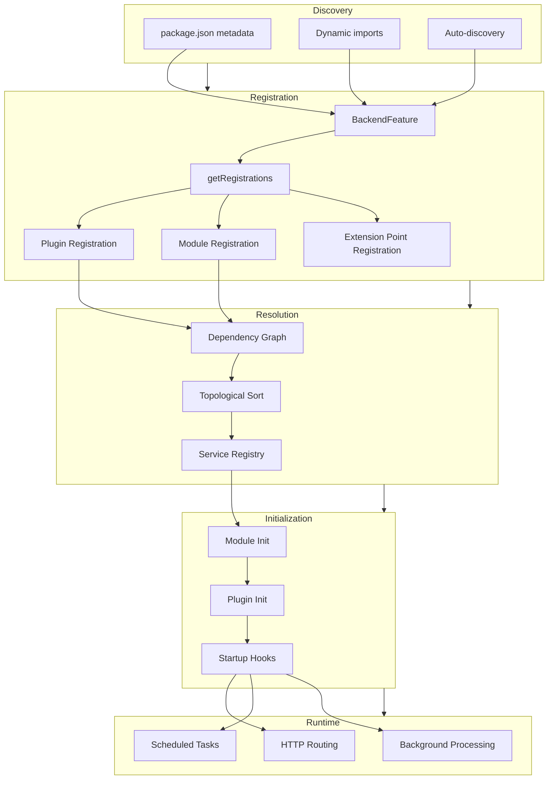

# Backstage Plugin Architecture - Comprehensive Technical Report

## 1. High-Level Summary

### Architecture Type

Backstage employs a **hybrid multi-layer plugin architecture** combining:

- **Dependency Injection Container Pattern** (backend)
- **Service Locator Pattern** (service registry)
- **Extension Point Pattern** (plugin extensibility)
- **Factory Pattern** (plugin/service creation)
- **Registry-Based Discovery** (package.json metadata)

### Problem Statement

The plugin system solves the fundamental challenge of building a modular, extensible developer portal platform where:

- **Frontend plugins** provide UI components, pages, and client-side functionality
- **Backend plugins** expose APIs, process data, and integrate with external systems
- **Backend modules** extend existing plugins without modifying their code
- **Core services** are shared across all plugins via dependency injection
- **Configuration** drives plugin behavior without code changes
- **Lifecycle management** ensures proper initialization and shutdown sequences

### Architectural Philosophy

Backstage's architecture enforces **explicit contracts** and **loose coupling** through:

1. Static typing for all plugin interfaces
2. Declarative dependency specification
3. Automatic dependency resolution
4. Extension points for controlled extensibility
5. Metadata-driven discovery

---

## 2. Plugin Discovery & Loading

### Discovery Mechanisms

#### 2.1 Frontend Discovery (Static Import)

**Location**: `packages/app/src/App.tsx`

Frontend plugins are **statically imported** at build time:

```typescript
import { createApp } from '@backstage/app-defaults';
import { CatalogEntityPage, CatalogIndexPage } from '@backstage/plugin-catalog';
import { ScaffolderPage } from '@backstage/plugin-scaffolder';
import { TechDocsIndexPage } from '@backstage/plugin-techdocs';

const app = createApp({
  apis,
  components: {
    SignInPage: props => <SignInPage {...props} />,
  },
  bindRoutes({ bind }) {
    bind(catalogPlugin.externalRoutes, {
      createComponent: scaffolderPlugin.routes.root,
      viewTechDoc: techdocsPlugin.routes.docRoot,
    });
  },
});

const routes = (
  <FlatRoutes>
    <Route path="/catalog" element={<CatalogIndexPage />} />
    <Route path="/catalog/:namespace/:kind/:name" element={<CatalogEntityPage />} />
    <Route path="/create" element={<ScaffolderPage />} />
  </FlatRoutes>
);
```

**Characteristics**:

- Webpack bundles all frontend plugins at build time
- No runtime discovery mechanism
- Tree-shaking eliminates unused code
- Type-safe imports

#### 2.2 Backend Discovery (Dynamic Import)

**Location**: `packages/backend/src/index.ts`

Backend plugins use **dynamic import syntax** for modular loading:

```typescript
import { createBackend } from '@backstage/backend-defaults';

const backend = createBackend();

// Dynamic imports - each returns a BackendFeature
backend.add(import('@backstage/plugin-app-backend'));
backend.add(import('@backstage/plugin-auth-backend'));
backend.add(import('@backstage/plugin-catalog-backend'));
backend.add(import('@backstage/plugin-scaffolder-backend'));
backend.add(import('@backstage/plugin-scaffolder-backend-module-github'));
backend.add(import('@backstage/plugin-search-backend'));
backend.add(import('@backstage/plugin-techdocs-backend'));

backend.start();
```

**Characteristics**:

- Promise-based dynamic imports
- Plugins loaded asynchronously
- Each plugin exports default `BackendFeature`
- Lazy loading potential (though not utilized by default)

#### 2.3 Automatic Package Discovery

**Location**: `packages/backend-defaults/src/discoveryFeatureLoader.ts`

**Package.json Metadata** drives automatic discovery:

```json
{
  "name": "@backstage/plugin-catalog-backend",
  "backstage": {
    "role": "backend-plugin",
    "pluginId": "catalog"
  }
}
```

**Recognized Roles**:

- `frontend-plugin` - UI components
- `backend-plugin` - Backend service
- `backend-plugin-module` - Extends a backend plugin
- `node-library` - Shared libraries
- `backend` - Backend application

**Configuration** (`app-config.yaml`):

```yaml
# Enable automatic discovery
app:
  packages: all

# Or selective loading
backend:
  packages:
    include:
      - '@backstage/plugin-catalog-backend'
      - '@backstage/plugin-scaffolder-backend'
    exclude:
      - '@backstage/plugin-kubernetes-backend'
```

**Discovery Algorithm** (`discoveryFeatureLoader.ts:50-150`):

```typescript
async function getBackendFeatures(): Promise<{
  features: Array<BackendFeature>;
}> {
  const packageRoles = new Set(['node-library', 'backend', 'backend-plugin', 'backend-plugin-module']);

  // 1. Find nearest package.json
  const packagePath = findNearestPackageJson(__dirname);
  const packageData = JSON.parse(fs.readFileSync(packagePath));

  // 2. Extract dependencies
  const dependencies = {
    ...packageData.dependencies,
    ...packageData.devDependencies,
  };

  // 3. Filter by backstage.role
  const packages = Object.keys(dependencies).filter((name) => {
    const depPackageJson = require(`${name}/package.json`);
    return packageRoles.has(depPackageJson.backstage?.role);
  });

  // 4. Dynamically require and validate
  const features = await Promise.all(
    packages.map(async (pkg) => {
      const module = await import(pkg);
      const feature = module.default;

      if (!isBackendFeature(feature)) {
        throw new Error(`Package ${pkg} does not export a BackendFeature`);
      }

      return feature;
    }),
  );

  return { features };
}
```

### Loading Mechanisms

#### Backend Feature Validation

**Location**: `packages/backend-plugin-api/src/wiring/createBackendFeatureLoader.ts`

All backend features must conform to:

```typescript
export interface BackendFeature {
  $$type: '@backstage/BackendFeature';
  version: 'v1';
  getRegistrations(): Array<{
    type: 'plugin' | 'module' | 'extension-point';
    pluginId: string;
    moduleId?: string;
    init: {
      deps: Record<string, ServiceRef | ExtensionPoint>;
      func: (deps: any) => Promise<void>;
    };
  }>;
}

function isBackendFeature(obj: unknown): obj is BackendFeature {
  return typeof obj === 'object' && obj !== null && '$$type' in obj && obj.$$type === '@backstage/BackendFeature';
}
```

---

## 3. Plugin Registration

### 3.1 Frontend Plugin Registration

**API**: `packages/core-plugin-api/src/plugin/Plugin.tsx`

```typescript
export function createPlugin<Routes, ExternalRoutes>(
  config: PluginConfig<Routes, ExternalRoutes>,
): BackstagePlugin<Routes, ExternalRoutes> {
  const plugin = new PluginImpl(config);

  // Register plugin globally (for dev tools, diagnostics)
  pluginCollectorContext.addPlugin(plugin);

  return plugin;
}

class PluginImpl<Routes, ExternalRoutes> implements BackstagePlugin<Routes, ExternalRoutes> {
  constructor(private config: PluginConfig<Routes, ExternalRoutes>) {}

  getId(): string {
    return this.config.id;
  }

  getApis(): Iterable<AnyApiFactory> {
    return this.config.apis ?? [];
  }

  getFeatureFlags(): Iterable<PluginFeatureFlagConfig> {
    return this.config.featureFlags ?? [];
  }

  provide<T>(extension: Extension<T>): T {
    return extension.expose(this);
  }

  get routes(): Routes {
    return this.config.routes as Routes;
  }

  get externalRoutes(): ExternalRoutes {
    return this.config.externalRoutes as ExternalRoutes;
  }
}
```

**Example**: `plugins/catalog/src/plugin.ts`

```typescript
export const catalogPlugin = createPlugin({
  id: 'catalog',

  // API factories
  apis: [
    createApiFactory({
      api: catalogApiRef,
      deps: {
        discoveryApi: discoveryApiRef,
        fetchApi: fetchApiRef,
      },
      factory: ({ discoveryApi, fetchApi }) => new CatalogClient({ discoveryApi, fetchApi }),
    }),
  ],

  // Internal routes
  routes: {
    catalogIndex: rootRouteRef,
    catalogEntity: entityRouteRef,
  },

  // External route dependencies
  externalRoutes: {
    createComponent: createComponentRouteRef,
    viewTechDoc: viewTechDocRouteRef,
  },

  // Feature flags
  featureFlags: [{ name: 'catalog-react-use-new-entity-picker' }],
});
```

### 3.2 Backend Plugin Registration

**API**: `packages/backend-plugin-api/src/wiring/createBackendPlugin.ts`

```typescript
export function createBackendPlugin(options: CreateBackendPluginOptions): BackendFeature {
  validatePluginId(options.pluginId);

  return {
    $$type: '@backstage/BackendFeature',
    version: 'v1',
    featureType: 'registrations',

    getRegistrations() {
      const registrations: BackendRegistration[] = [];
      const extensionPoints = new Map<string, any>();

      // Registration callback
      options.register({
        registerExtensionPoint(ref, impl) {
          extensionPoints.set(ref.id, impl);
          registrations.push({
            type: 'extension-point',
            extensionPoint: ref,
            impl,
          });
        },

        registerInit(regInit) {
          registrations.push({
            type: 'plugin',
            pluginId: options.pluginId,
            init: regInit,
          });
        },
      });

      return registrations;
    },
  };
}
```

**Example**: `plugins/catalog-backend/src/service/CatalogPlugin.ts`

```typescript
export const catalogPlugin = createBackendPlugin({
  pluginId: 'catalog',

  register(env) {
    // 1. Create extension point implementations
    const processingExtensions = new CatalogProcessingExtensionPointImpl();
    const modelExtensions = new CatalogModelExtensionPointImpl();

    // 2. Register extension points for modules
    env.registerExtensionPoint(catalogProcessingExtensionPoint, processingExtensions);
    env.registerExtensionPoint(catalogModelExtensionPoint, modelExtensions);

    // 3. Register plugin initialization
    env.registerInit({
      deps: {
        logger: coreServices.logger,
        config: coreServices.rootConfig,
        database: coreServices.database,
        httpRouter: coreServices.httpRouter,
        scheduler: coreServices.scheduler,
        permissions: coreServices.permissions,
        discovery: coreServices.discovery,
        lifecycle: coreServices.rootLifecycle,
      },
      async init({ logger, config, database, httpRouter, scheduler, permissions, discovery, lifecycle }) {
        // Build catalog engine
        const builder = await CatalogBuilder.create({
          logger,
          config,
          database,
          scheduler,
          permissions,
        });

        // Apply extensions from modules
        builder.addProcessor(...processingExtensions.processors);
        builder.addEntityProvider(...processingExtensions.entityProviders);
        builder.setFieldFormatValidators(modelExtensions.fieldFormatValidators);

        const { processingEngine, router } = await builder.build();

        // Mount HTTP routes
        httpRouter.use(router);
        httpRouter.addAuthPolicy({
          path: '/refresh',
          allow: 'user-cookie',
        });

        // Lifecycle hooks
        lifecycle.addStartupHook(() => processingEngine.start());
        lifecycle.addShutdownHook(() => processingEngine.stop());
      },
    });
  },
});
```

### 3.3 Backend Module Registration

**API**: `packages/backend-plugin-api/src/wiring/createBackendModule.ts`

```typescript
export function createBackendModule(options: CreateBackendModuleOptions): BackendFeature {
  validatePluginId(options.pluginId);
  validateModuleId(options.moduleId);

  return {
    $$type: '@backstage/BackendFeature',
    version: 'v1',
    featureType: 'registrations',

    getRegistrations() {
      const registrations: BackendRegistration[] = [];

      options.register({
        registerExtensionPoint(ref, impl) {
          registrations.push({
            type: 'extension-point',
            extensionPoint: ref,
            impl,
          });
        },

        registerInit(regInit) {
          registrations.push({
            type: 'module',
            pluginId: options.pluginId,
            moduleId: options.moduleId,
            init: regInit,
          });
        },
      });

      return registrations;
    },
  };
}
```

**Example**: `plugins/catalog-backend-module-github/src/module.ts`

```typescript
export const githubCatalogModule = createBackendModule({
  pluginId: 'catalog', // Must match parent plugin
  moduleId: 'github',

  register(env) {
    env.registerInit({
      deps: {
        // Request parent plugin's extension point
        catalogProcessing: catalogProcessingExtensionPoint,

        // Standard services
        config: coreServices.rootConfig,
        logger: coreServices.logger,
        scheduler: coreServices.scheduler,
      },

      async init({ catalogProcessing, config, logger, scheduler }) {
        // Extend plugin via extension point
        const githubConfig = readGithubIntegrationConfigs(config.getOptionalConfigArray('integrations.github') ?? []);

        githubConfig.forEach((integration) => {
          catalogProcessing.addEntityProvider(
            GithubEntityProvider.fromConfig(integration, {
              logger,
              scheduler,
            }),
          );

          catalogProcessing.addProcessor(new GithubOrgReaderProcessor({ integration }));
        });
      },
    });
  },
});
```

---

## 4. Plugin Interface / Contract

### 4.1 Frontend Plugin Contract

**Type Definitions**: `packages/core-plugin-api/src/plugin/types.ts`

```typescript
export interface PluginConfig<Routes, ExternalRoutes> {
  /**
   * The ID of the plugin. Must be unique and kebab-case.
   * Examples: 'catalog', 'scaffolder', 'tech-docs'
   */
  id: string;

  /**
   * API factories that this plugin provides.
   * Dependencies are automatically resolved.
   */
  apis?: Iterable<AnyApiFactory>;

  /**
   * Route definitions internal to this plugin.
   * Used for navigation and deep linking.
   */
  routes?: Routes;

  /**
   * Routes that this plugin depends on from other plugins.
   * Bound at app initialization time.
   */
  externalRoutes?: ExternalRoutes;

  /**
   * Feature flags that this plugin supports.
   * Can be toggled via app configuration.
   */
  featureFlags?: PluginFeatureFlagConfig[];
}

export interface BackstagePlugin<Routes = {}, ExternalRoutes = {}> {
  getId(): string;
  getApis(): Iterable<AnyApiFactory>;
  getFeatureFlags(): Iterable<PluginFeatureFlagConfig>;
  provide<T>(extension: Extension<T>): T;
  readonly routes: Routes;
  readonly externalRoutes: ExternalRoutes;
}

export interface Extension<T> {
  expose(plugin: BackstagePlugin): T;
  $$type: '@backstage/Extension';
}
```

**Required Fields**: `id`
**Optional Fields**: `apis`, `routes`, `externalRoutes`, `featureFlags`

### 4.2 Backend Plugin Contract

**Type Definitions**: `packages/backend-plugin-api/src/wiring/types.ts`

```typescript
export interface CreateBackendPluginOptions {
  /**
   * Unique plugin identifier (kebab-case).
   * Examples: 'catalog', 'scaffolder', 'auth'
   */
  pluginId: string;

  /**
   * Registration callback invoked during plugin loading.
   */
  register(env: BackendPluginRegistrationPoints): void;
}

export interface BackendPluginRegistrationPoints {
  /**
   * Register an extension point for modules to extend this plugin.
   */
  registerExtensionPoint<TExtensionPoint>(ref: ExtensionPoint<TExtensionPoint>, impl: TExtensionPoint): void;

  /**
   * Register plugin initialization logic with dependencies.
   */
  registerInit<TDeps extends { [name in string]: ServiceRef<unknown> }>(options: {
    deps: TDeps;
    init(deps: ServiceRefToInstance<TDeps>): Promise<void>;
  }): void;
}
```

**Required Methods**: `register(env)`
**Initialization**: Must call `env.registerInit()` at least once

### 4.3 Backend Module Contract

```typescript
export interface CreateBackendModuleOptions {
  /**
   * ID of the parent plugin to extend.
   */
  pluginId: string;

  /**
   * Unique identifier for this module within the plugin.
   */
  moduleId: string;

  /**
   * Registration callback.
   */
  register(env: BackendModuleRegistrationPoints): void;
}

export interface BackendModuleRegistrationPoints {
  /**
   * Register extension point (rare - modules usually consume, not provide).
   */
  registerExtensionPoint<TExtensionPoint>(ref: ExtensionPoint<TExtensionPoint>, impl: TExtensionPoint): void;

  /**
   * Register module initialization with dependencies.
   * Can include ServiceRef OR ExtensionPoint as dependencies.
   */
  registerInit<
    TDeps extends {
      [name in string]: ServiceRef<unknown> | ExtensionPoint<unknown>;
    },
  >(options: {
    deps: TDeps;
    init(deps: DepsToInstances<TDeps>): Promise<void>;
  }): void;
}
```

**Required Fields**: `pluginId`, `moduleId`, `register`
**Parent Relationship**: Must match existing plugin's ID

### 4.4 Package.json Manifest

All plugins must include metadata:

```json
{
  "name": "@backstage/plugin-example",
  "version": "1.0.0",
  "backstage": {
    "role": "backend-plugin",
    "pluginId": "example",
    "pluginPackages": [
      "@backstage/plugin-example",
      "@backstage/plugin-example-backend",
      "@backstage/plugin-example-common"
    ]
  }
}
```

**Required Metadata**:

- `backstage.role`: Plugin type
- `backstage.pluginId`: Unique identifier

**Optional Metadata**:

- `backstage.pluginPackages`: Related packages in the plugin family

---

## 5. Plugin Lifecycle

### 5.1 Frontend Plugin Lifecycle

Frontend plugins follow **React component lifecycle**:

```
┌─────────────────────────────────────────────────────┐
│ 1. BUILD TIME                                       │
├─────────────────────────────────────────────────────┤
│ • Static import                                     │
│ • createPlugin() called                             │
│ • Plugin registered globally                        │
│ • API factories collected                           │
└─────────────────────────────────────────────────────┘
                      ↓
┌─────────────────────────────────────────────────────┐
│ 2. APP INITIALIZATION                               │
├─────────────────────────────────────────────────────┤
│ • createApp() called                                │
│ • API dependency graph built                        │
│ • Route bindings established                        │
│ • ApiRegistry created                               │
└─────────────────────────────────────────────────────┘
                      ↓
┌─────────────────────────────────────────────────────┐
│ 3. RUNTIME - Route Navigation                       │
├─────────────────────────────────────────────────────┤
│ • User navigates to plugin route                    │
│ • Component lazy-loaded (if using lazy())           │
│ • React renders component tree                      │
│ • useApi() hooks resolve from ApiRegistry           │
└─────────────────────────────────────────────────────┘
                      ↓
┌─────────────────────────────────────────────────────┐
│ 4. COMPONENT LIFECYCLE                              │
├─────────────────────────────────────────────────────┤
│ • ComponentDidMount / useEffect                     │
│ • Data fetching via APIs                            │
│ • User interactions                                 │
│ • ComponentWillUnmount / cleanup                    │
└─────────────────────────────────────────────────────┘
```

**Code Example**: `packages/core-plugin-api/src/extensions/extensions.tsx`

```typescript
export function createRoutableExtension<T>(options: {
  component: () => Promise<T>;
  mountPoint: RouteRef;
}): Extension<T> {
  return createReactExtension({
    component: {
      lazy: () => options.component().then(InnerComponent => {
        const RoutableExtensionWrapper = (props) => {
          const analytics = useAnalytics();

          // Mount effect
          useEffect(() => {
            analytics.captureEvent('screen_view', options.mountPoint.id);
          }, [analytics]);

          return <InnerComponent {...props} />;
        };
        return RoutableExtensionWrapper;
      })
    }
  });
}
```

### 5.2 Backend Plugin Lifecycle

Backend plugins have **explicit lifecycle phases**:

```
┌─────────────────────────────────────────────────────┐
│ 1. DISCOVERY                                        │
├─────────────────────────────────────────────────────┤
│ • Package.json scanned                              │
│ • Dynamic import executed                           │
│ • BackendFeature validated                          │
└─────────────────────────────────────────────────────┘
                      ↓
┌─────────────────────────────────────────────────────┐
│ 2. REGISTRATION                                     │
├─────────────────────────────────────────────────────┤
│ • getRegistrations() called                         │
│ • Extension points registered                       │
│ • Plugin init callbacks registered                  │
│ • Module init callbacks registered                  │
└─────────────────────────────────────────────────────┘
                      ↓
┌─────────────────────────────────────────────────────┐
│ 3. DEPENDENCY RESOLUTION                            │
├─────────────────────────────────────────────────────┤
│ • Build dependency graph (ServiceRegistry)          │
│ • Detect circular dependencies                      │
│ • Topological sort for initialization order         │
│ • Resolve service instances                         │
└─────────────────────────────────────────────────────┘
                      ↓
┌─────────────────────────────────────────────────────┐
│ 4. MODULE INITIALIZATION (per plugin)               │
├─────────────────────────────────────────────────────┤
│ • For each module of pluginId:                      │
│   - Inject dependencies (services + extension pts)  │
│   - Call module.init(deps)                          │
│   - Catch errors (permitted failure optional)       │
└─────────────────────────────────────────────────────┘
                      ↓
┌─────────────────────────────────────────────────────┐
│ 5. PLUGIN INITIALIZATION                            │
├─────────────────────────────────────────────────────┤
│ • Inject dependencies (services)                    │
│ • Apply module extensions (processors, providers)   │
│ • Call plugin.init(deps)                            │
│ • Mount HTTP routes                                 │
│ • Register scheduled tasks                          │
└─────────────────────────────────────────────────────┘
                      ↓
┌─────────────────────────────────────────────────────┐
│ 6. STARTUP                                          │
├─────────────────────────────────────────────────────┤
│ • Call lifecycle.addStartupHook() callbacks         │
│ • Start background processing                       │
│ • Mark plugin as ready                              │
└─────────────────────────────────────────────────────┘
                      ↓
┌─────────────────────────────────────────────────────┐
│ 7. RUNTIME                                          │
├─────────────────────────────────────────────────────┤
│ • Handle HTTP requests                              │
│ • Execute scheduled tasks                           │
│ • Process events                                    │
│ • Inter-plugin communication                        │
└─────────────────────────────────────────────────────┘
                      ↓
┌─────────────────────────────────────────────────────┐
│ 8. SHUTDOWN                                         │
├─────────────────────────────────────────────────────┤
│ • SIGTERM/SIGINT signal received                    │
│ • Call lifecycle.addShutdownHook() callbacks        │
│ • Stop background tasks                             │
│ • Close database connections                        │
│ • Flush logs                                        │
└─────────────────────────────────────────────────────┘
```

**Implementation**: `packages/backend-app-api/src/wiring/BackendInitializer.ts`

```typescript
async function initialize(): Promise<void> {
  // Phase 3: Dependency Resolution
  const dependencyGraph = this.#buildDependencyGraph();
  const initOrder = topologicalSort(dependencyGraph);

  // Phase 4 & 5: Initialization
  for (const pluginId of initOrder) {
    const modules = this.#getModules(pluginId);

    // Initialize modules first
    for (const module of modules) {
      try {
        const moduleDeps = await this.#getInitDeps(module.init.deps, pluginId, module.moduleId);

        await module.init.func(moduleDeps).catch((error) => {
          throw new ForwardedError(`Module '${module.moduleId}' for plugin '${pluginId}' startup failed`, error);
        });
      } catch (error) {
        if (isModuleBootFailurePermitted) {
          this.#logger.warn(`Module ${module.moduleId} failed, continuing...`);
        } else {
          throw error;
        }
      }
    }

    // Initialize plugin
    const plugin = this.#getPlugin(pluginId);
    if (plugin) {
      const pluginDeps = await this.#getInitDeps(plugin.init.deps, pluginId);
      await plugin.init.func(pluginDeps);
    }

    // Phase 6: Startup hooks
    const lifecycleService = await this.#getPluginLifecycleImpl(pluginId);
    await lifecycleService.startup();
  }
}

// Phase 8: Shutdown
process.on('SIGTERM', async () => {
  for (const lifecycle of this.#lifecycleServices.values()) {
    await lifecycle.shutdown();
  }
  process.exit(0);
});
```

**Lifecycle Service API**: `packages/backend-plugin-api/src/services/definitions/RootLifecycleService.ts`

```typescript
export interface RootLifecycleService {
  addStartupHook(hook: () => void | Promise<void>): void;
  addShutdownHook(hook: () => void | Promise<void>): void;
}

// Example usage in plugin
env.registerInit({
  deps: { lifecycle: coreServices.rootLifecycle },
  async init({ lifecycle }) {
    const processingEngine = createEngine();

    lifecycle.addStartupHook(async () => {
      await processingEngine.start();
    });

    lifecycle.addShutdownHook(async () => {
      await processingEngine.stop();
    });
  },
});
```

---

## 6. Extension Points

### 6.1 Extension Point Pattern

Extension points enable **Open-Closed Principle**: plugins are open for extension but closed for modification.

**Architecture**:

```
Plugin (provides)  →  Extension Point  ←  Module (consumes)
      |                     ↑                    |
      |                     |                    |
      +--> registerExtensionPoint()              |
      |         (impl)                           |
      |                                          |
      +--> use extension point data   <---------+
              in plugin logic            module.init()
```

### 6.2 Extension Point Definition

**API**: `packages/backend-plugin-api/src/wiring/createExtensionPoint.ts`

```typescript
export interface ExtensionPoint<T> {
  id: string;
  T: T; // Type-only field for TypeScript inference
  $$type: '@backstage/ExtensionPoint';
}

export function createExtensionPoint<T>(options: { id: string }): ExtensionPoint<T> {
  return {
    id: options.id,
    get T(): T {
      throw new Error(`ExtensionPoint.T is type-only`);
    },
    toString() {
      return `extensionPoint{${options.id}}`;
    },
    $$type: '@backstage/ExtensionPoint',
  };
}
```

### 6.3 Catalog Extension Points

**Definition**: `plugins/catalog-node/src/alpha.ts`

```typescript
export interface CatalogProcessingExtensionPoint {
  /**
   * Add entity processors that transform/validate entities.
   */
  addProcessor(...processors: CatalogProcessor[]): void;

  /**
   * Add entity providers that ingest entities from external sources.
   */
  addEntityProvider(...providers: EntityProvider[]): void;

  /**
   * Add placeholder resolvers for entity YAML substitution.
   */
  addPlaceholderResolver(key: string, resolver: PlaceholderResolver): void;

  /**
   * Set error handler for processing failures.
   */
  setOnProcessingErrorHandler(handler: (event: ProcessingErrorEvent) => Promise<void>): void;
}

export const catalogProcessingExtensionPoint = createExtensionPoint<CatalogProcessingExtensionPoint>({
  id: 'catalog.processing',
});

export interface CatalogModelExtensionPoint {
  /**
   * Set custom field format validators.
   */
  setFieldFormatValidators(validators: Record<string, z.ZodSchema>): void;
}

export const catalogModelExtensionPoint = createExtensionPoint<CatalogModelExtensionPoint>({
  id: 'catalog.model',
});

export interface CatalogPermissionExtensionPoint {
  /**
   * Set authorization rules for catalog operations.
   */
  setPermissionRules(rules: CatalogPermissionRule[]): void;
}

export const catalogPermissionExtensionPoint = createExtensionPoint<CatalogPermissionExtensionPoint>({
  id: 'catalog.permission',
});
```

**Implementation**:

```typescript
class CatalogProcessingExtensionPointImpl implements CatalogProcessingExtensionPoint {
  public readonly processors: CatalogProcessor[] = [];
  public readonly entityProviders: EntityProvider[] = [];
  private readonly placeholderResolvers = new Map<string, PlaceholderResolver>();
  private errorHandler?: (event: ProcessingErrorEvent) => Promise<void>;

  addProcessor(...processors: CatalogProcessor[]): void {
    this.processors.push(...processors);
  }

  addEntityProvider(...providers: EntityProvider[]): void {
    this.entityProviders.push(...providers);
  }

  addPlaceholderResolver(key: string, resolver: PlaceholderResolver): void {
    this.placeholderResolvers.set(key, resolver);
  }

  setOnProcessingErrorHandler(handler: (event: ProcessingErrorEvent) => Promise<void>): void {
    this.errorHandler = handler;
  }
}
```

### 6.4 Scaffolder Extension Points

**Definition**: `plugins/scaffolder-node/src/extensions.ts`

```typescript
export interface ScaffolderActionsExtensionPoint {
  /**
   * Add custom template actions.
   */
  addActions(...actions: TemplateAction<any, any, any>[]): void;
}

export const scaffolderActionsExtensionPoint = createExtensionPoint<ScaffolderActionsExtensionPoint>({
  id: 'scaffolder.actions',
});
```

**Usage Pattern**:

```typescript
// 1. Plugin registers extension point
const actionsExtension = new ScaffolderActionsExtensionPointImpl();
env.registerExtensionPoint(scaffolderActionsExtensionPoint, actionsExtension);

// 2. Module extends plugin
env.registerInit({
  deps: {
    scaffolderActions: scaffolderActionsExtensionPoint,
  },
  async init({ scaffolderActions }) {
    scaffolderActions.addActions(createPublishGithubAction(), createPublishGitlabAction(), createFetchTemplateAction());
  },
});

// 3. Plugin uses extension data
const actionRunner = new ActionRunner({
  actions: actionsExtension.actions,
});
```

### 6.5 Permission Extension Points

**Definition**: `plugins/permission-node/src/extensions.ts`

```typescript
export interface PermissionPolicyExtensionPoint {
  setPolicy(policy: PermissionPolicy): void;
}

export const permissionPolicyExtensionPoint = createExtensionPoint<PermissionPolicyExtensionPoint>({
  id: 'permission.policy',
});
```

### 6.6 Search Extension Points

**Definition**: `plugins/search-backend-node/src/extensions.ts`

```typescript
export interface SearchIndexExtensionPoint {
  addCollator(collator: DocumentCollator): void;
  addDecorator(decorator: DocumentDecorator): void;
}

export const searchIndexExtensionPoint = createExtensionPoint<SearchIndexExtensionPoint>({
  id: 'search.index',
});
```

### 6.7 Complete Extension Point Flow Example

**Catalog Plugin** (provides extension point):

```typescript
export const catalogPlugin = createBackendPlugin({
  pluginId: 'catalog',
  register(env) {
    const processingExtensions = new CatalogProcessingExtensionPointImpl();

    env.registerExtensionPoint(catalogProcessingExtensionPoint, processingExtensions);

    env.registerInit({
      deps: { database: coreServices.database },
      async init({ database }) {
        const builder = CatalogBuilder.create({ database });

        // Apply all processors added by modules
        builder.addProcessor(...processingExtensions.processors);
        builder.addEntityProvider(...processingExtensions.entityProviders);

        const catalog = await builder.build();
        // ... rest of initialization
      },
    });
  },
});
```

**GitHub Module** (consumes extension point):

```typescript
export const githubCatalogModule = createBackendModule({
  pluginId: 'catalog',
  moduleId: 'github',
  register(env) {
    env.registerInit({
      deps: {
        catalogProcessing: catalogProcessingExtensionPoint, // Dependency!
        config: coreServices.rootConfig,
        scheduler: coreServices.scheduler,
      },
      async init({ catalogProcessing, config, scheduler }) {
        const githubIntegrations = readGithubIntegrationConfigs(config);

        githubIntegrations.forEach((integration) => {
          // Extend plugin via extension point
          catalogProcessing.addEntityProvider(GithubEntityProvider.fromConfig(integration, { scheduler }));

          catalogProcessing.addProcessor(new GithubOrgReaderProcessor({ integration }));
        });
      },
    });
  },
});
```

---

## 7. Configuration & Metadata

### 7.1 Configuration System

**File**: `app-config.yaml`

Backstage uses a **hierarchical YAML configuration** system with environment overrides.

**Configuration Files**:

- `app-config.yaml` - Default configuration
- `app-config.local.yaml` - Local overrides (gitignored)
- `app-config.production.yaml` - Production settings

**Example**:

```yaml
app:
  title: Backstage Example
  baseUrl: http://localhost:3000
  packages: all # Auto-discovery

backend:
  baseUrl: http://localhost:7007
  listen:
    port: 7007
    host: 0.0.0.0

  database:
    client: pg
    connection:
      host: ${POSTGRES_HOST}
      port: ${POSTGRES_PORT}
      user: ${POSTGRES_USER}
      password: ${POSTGRES_PASSWORD}

  cors:
    origin: http://localhost:3000
    methods: [GET, POST, PUT, DELETE]
    credentials: true

catalog:
  # Rules define which entity kinds are allowed
  rules:
    - allow: [Component, System, API, Resource, Location]

  # Locations define entity sources
  locations:
    - type: file
      target: ./catalog-model/examples/all.yaml

    - type: url
      target: https://github.com/backstage/backstage/blob/master/packages/catalog-model/examples/all.yaml

  # Processors configuration
  processors:
    githubOrg:
      providers:
        - organization: 'backstage'
          catalogPath: '/catalog-info.yaml'

scaffolder:
  defaultAuthor:
    name: Scaffolder
    email: scaffolder@backstage.io

  defaultCommitMessage: 'Initial commit'

auth:
  providers:
    github:
      development:
        clientId: ${GITHUB_CLIENT_ID}
        clientSecret: ${GITHUB_CLIENT_SECRET}

integrations:
  github:
    - host: github.com
      token: ${GITHUB_TOKEN}

    - host: github.enterprise.example.com
      apiBaseUrl: https://github.enterprise.example.com/api/v3
      token: ${GITHUB_ENTERPRISE_TOKEN}
```

### 7.2 Accessing Configuration in Plugins

**Backend Plugins**:

```typescript
env.registerInit({
  deps: {
    config: coreServices.rootConfig,
    logger: coreServices.logger,
  },
  async init({ config, logger }) {
    // Read required string
    const baseUrl = config.getString('backend.baseUrl');

    // Read optional string
    const title = config.getOptionalString('app.title') ?? 'Backstage';

    // Read config array
    const integrations = config.getOptionalConfigArray('integrations.github') ?? [];

    // Read entire config object
    const catalogConfig = config.getConfig('catalog');
    const rules = catalogConfig.getOptionalConfigArray('rules') ?? [];

    logger.info(`Loaded ${integrations.length} GitHub integrations`);
  },
});
```

**Frontend Plugins**:

```typescript
createApiFactory({
  api: catalogApiRef,
  deps: {
    discoveryApi: discoveryApiRef,
    configApi: configApiRef,
  },
  factory({ discoveryApi, configApi }) {
    const allowedKinds = configApi.getOptionalStringArray('catalog.allowedKinds');
    return new CatalogClient({ discoveryApi, allowedKinds });
  },
});
```

### 7.3 Configuration Schema

Plugins can define TypeScript schemas in `config.d.ts`:

```typescript
export interface Config {
  catalog?: {
    /**
     * Rules for which entity kinds to allow
     */
    rules?: Array<{
      /**
       * Entity kinds to allow
       * @visibility frontend
       */
      allow: string[];
    }>;

    /**
     * Entity source locations
     * @visibility backend
     */
    locations?: Array<{
      type: 'file' | 'url';
      target: string;
    }>;

    /**
     * Processing configuration
     * @deepVisibility secret
     */
    processors?: {
      githubOrg?: {
        providers?: Array<{
          organization: string;
          catalogPath?: string;
        }>;
      };
    };
  };
}
```

**Visibility Modifiers**:

- `@visibility frontend` - Available to frontend
- `@visibility backend` - Backend only
- `@visibility secret` - Redacted in logs
- `@deepVisibility secret` - Recursively redacted

### 7.4 Package.json Metadata

**Standard Fields**:

```json
{
  "name": "@backstage/plugin-catalog-backend",
  "version": "1.14.0",
  "description": "The Backstage backend plugin that provides the Catalog",
  "backstage": {
    "role": "backend-plugin",
    "pluginId": "catalog",
    "pluginPackages": [
      "@backstage/plugin-catalog",
      "@backstage/plugin-catalog-backend",
      "@backstage/plugin-catalog-common",
      "@backstage/plugin-catalog-node",
      "@backstage/plugin-catalog-react"
    ]
  },
  "publishConfig": {
    "access": "public"
  },
  "keywords": ["backstage", "plugin"]
}
```

**Role Types**:

- `frontend-plugin` - UI plugin
- `backend-plugin` - Backend service plugin
- `backend-plugin-module` - Extends backend plugin
- `frontend-plugin-module` - Extends frontend plugin (experimental)
- `node-library` - Shared library
- `web-library` - Browser library
- `common-library` - Isomorphic library

### 7.5 Hot Reload / Dynamic Reconfiguration

**Current State**: **Not supported** for core configuration.

**Workarounds**:

1. **Scheduled config refresh**: Plugins can poll config files
2. **Environment variables**: Can be changed without code reload
3. **Feature flags**: Runtime toggles via config

**Future Direction**: Experimental support for dynamic plugin loading/unloading in development.

---

## 8. Security, Isolation & Error Handling

### 8.1 Security Model

#### Authentication & Authorization

**Service-to-Service Authentication**:

```typescript
export interface AuthService {
  /**
   * Verify and decode a token.
   */
  authenticate(token: string): Promise<BackstageCredentials>;

  /**
   * Get credentials representing the current service.
   */
  getOwnServiceCredentials(): Promise<BackstageCredentials<BackstageServicePrincipal>>;

  /**
   * Issue a token for calling another plugin.
   */
  getPluginRequestToken(options: {
    onBehalfOf: BackstageCredentials;
    targetPluginId: string;
  }): Promise<{ token: string }>;
}
```

**Usage**:

```typescript
env.registerInit({
  deps: {
    auth: coreServices.auth,
    httpAuth: coreServices.httpAuth,
    httpRouter: coreServices.httpRouter,
  },
  async init({ auth, httpAuth, httpRouter }) {
    httpRouter.use('/entities', async (req, res) => {
      // Extract and verify credentials
      const credentials = await httpAuth.credentials(req);

      // Check if user principal
      if (!auth.isPrincipal(credentials, 'user')) {
        res.status(403).json({ error: 'User authentication required' });
        return;
      }

      // Make authenticated request to another plugin
      const { token } = await auth.getPluginRequestToken({
        onBehalfOf: credentials,
        targetPluginId: 'catalog',
      });

      const response = await fetch('http://catalog/api/entities', {
        headers: { Authorization: `Bearer ${token}` },
      });
    });
  },
});
```

**Permission System**:

```typescript
env.registerInit({
  deps: {
    permissions: coreServices.permissions,
    httpAuth: coreServices.httpAuth,
  },
  async init({ permissions, httpAuth }) {
    router.delete('/entities/:id', async (req, res) => {
      const credentials = await httpAuth.credentials(req);

      // Check permissions
      const decision = await permissions.authorize(
        [{ permission: catalogEntityDeletePermission, resourceRef: req.params.id }],
        { credentials },
      );

      if (decision[0].result === 'DENY') {
        res.status(403).json({ error: 'Permission denied' });
        return;
      }

      // Proceed with deletion
      await catalog.deleteEntity(req.params.id);
      res.status(204).send();
    });
  },
});
```

**Principal Types**:

```typescript
export type BackstageUserPrincipal = {
  type: 'user';
  userEntityRef: string; // e.g., 'user:default/john.doe'
  actor?: BackstageServicePrincipal; // Service acting on behalf
};

export type BackstageServicePrincipal = {
  type: 'service';
  subject: string; // e.g., 'plugin:catalog'
  accessRestrictions?: {
    permissionNames?: string[];
    permissionAttributes?: {
      action?: Array<'create' | 'read' | 'update' | 'delete'>;
    };
  };
};

export type BackstageNonePrincipal = {
  type: 'none'; // Unauthenticated
};
```

### 8.2 Isolation

**Process Isolation**: **None** - All plugins run in the same Node.js process.

**Module Isolation**: Enforced via:

1. **Dependency injection**: Plugins only access explicitly requested services
2. **Extension points**: Controlled API surface for extending plugins
3. **TypeScript visibility**: Private vs. public APIs

**HTTP Isolation**: Each plugin gets its own router:

```typescript
env.registerInit({
  deps: { httpRouter: coreServices.httpRouter },
  async init({ httpRouter }) {
    // Plugin-scoped router at /api/catalog
    const router = Router();
    router.get('/entities', handler);
    httpRouter.use(router);

    // Authentication policies
    httpRouter.addAuthPolicy({
      path: '/refresh',
      allow: 'user-cookie', // Only allow authenticated users
    });
  },
});
```

**Database Isolation**: Logical isolation via naming conventions:

```typescript
env.registerInit({
  deps: { database: coreServices.database },
  async init({ database }) {
    // Plugin gets isolated database connection
    // Tables prefixed with plugin ID automatically
    const knex = await database.getClient();

    // Creates table 'catalog_entities' (not just 'entities')
    await knex.schema.createTable('entities', (table) => {
      table.string('id').primary();
      table.jsonb('data');
    });
  },
});
```

**No Sandboxing**: Plugins are **trusted code**. No VM isolation or capability restrictions.

### 8.3 Error Handling

#### Plugin Initialization Errors

**File**: `packages/backend-app-api/src/wiring/BackendInitializer.ts:392-449`

```typescript
async function initializePlugins(): Promise<void> {
  for (const pluginId of initOrder) {
    try {
      // Initialize modules
      for (const module of modules) {
        try {
          const moduleDeps = await this.#getInitDeps(module.init.deps, pluginId, module.moduleId);

          await module.init.func(moduleDeps).catch((error) => {
            throw new ForwardedError(`Module '${module.moduleId}' for plugin '${pluginId}' startup failed`, error);
          });
        } catch (error: unknown) {
          assertError(error);

          // Check if module failure is permitted
          if (isModuleBootFailurePermitted) {
            initLogger.onPermittedPluginModuleFailure(pluginId, module.moduleId, error);
            continue; // Skip this module, continue with others
          } else {
            initLogger.onPluginModuleFailed(pluginId, module.moduleId, error);
            throw error; // Fatal error, stop initialization
          }
        }
      }

      // Initialize plugin
      const pluginDeps = await this.#getInitDeps(plugin.init.deps, pluginId);
      await plugin.init.func(pluginDeps).catch((error) => {
        throw new ForwardedError(`Plugin '${pluginId}' startup failed`, error);
      });
    } catch (error: unknown) {
      assertError(error);

      // Check if plugin failure is permitted
      if (isBootFailurePermitted) {
        initLogger.onPermittedPluginFailure(pluginId, error);
        continue; // Continue loading other plugins
      } else {
        initLogger.onPluginFailed(pluginId, error);
        throw error; // Fatal error, exit process
      }
    }
  }
}
```

**Configuration**:

```yaml
backend:
  pluginFailurePolicy: 'stop' # or 'continue'
```

#### Runtime Error Handling

Plugins must handle their own runtime errors:

```typescript
env.registerInit({
  deps: { logger: coreServices.logger },
  async init({ logger }) {
    router.get('/entities', async (req, res) => {
      try {
        const entities = await catalog.getEntities();
        res.json(entities);
      } catch (error) {
        logger.error('Failed to fetch entities', error);
        res.status(500).json({
          error: {
            name: error.name,
            message: error.message,
          },
        });
      }
    });
  },
});
```

#### Error Forwarding

Custom error class preserves stack traces:

```typescript
class ForwardedError extends Error {
  constructor(message: string, cause: Error) {
    super(message);
    this.name = 'ForwardedError';
    this.cause = cause;
    this.stack = `${this.stack}\nCaused by: ${cause.stack}`;
  }
}
```

#### Logging Errors

```typescript
env.registerInit({
  deps: { logger: coreServices.logger },
  async init({ logger }) {
    try {
      await riskyOperation();
    } catch (error) {
      logger.error('Operation failed', {
        operation: 'riskyOperation',
        error: error.message,
        stack: error.stack,
      });
      throw error; // Re-throw after logging
    }
  },
});
```

### 8.4 Input Validation

Plugins validate inputs using schemas:

```typescript
import { z } from 'zod';

const CreateEntitySchema = z.object({
  apiVersion: z.string(),
  kind: z.enum(['Component', 'API', 'Resource']),
  metadata: z.object({
    name: z.string().regex(/^[a-z0-9-]+$/),
    namespace: z.string().optional(),
  }),
  spec: z.record(z.unknown()),
});

router.post('/entities', async (req, res) => {
  try {
    const entity = CreateEntitySchema.parse(req.body);
    const created = await catalog.addEntity(entity);
    res.status(201).json(created);
  } catch (error) {
    if (error instanceof z.ZodError) {
      res.status(400).json({ errors: error.errors });
    } else {
      throw error;
    }
  }
});
```

### 8.5 Security Best Practices

1. **Always verify credentials**:

```typescript
const credentials = await httpAuth.credentials(req);
```

2. **Check permissions before operations**:

```typescript
const decision = await permissions.authorize([...], { credentials });
```

3. **Use parameterized queries**:

```typescript
await knex('entities').where({ id: entityId }); // Safe
// NOT: await knex.raw(`SELECT * FROM entities WHERE id = ${entityId}`)  // SQL injection!
```

4. **Validate all inputs**:

```typescript
const input = schema.parse(req.body);
```

5. **Never trust user input in URLs**:

```typescript
// Validate URLs before fetching
const url = new URL(req.query.url);
if (!allowedHosts.includes(url.hostname)) {
  throw new Error('Host not allowed');
}
```

---

## 9. Dependency Management

### 9.1 Service-Based Dependency Injection

Backstage uses **service references** for type-safe dependency injection.

**Service Reference**: `packages/backend-plugin-api/src/services/system/types.ts`

```typescript
export interface ServiceRef<TService> {
  id: string;
  scope: 'root' | 'plugin';
  T: TService; // Type-only field
  $$type: '@backstage/ServiceRef';
}

export function createServiceRef<TService>(options: {
  id: string;
  scope?: 'root' | 'plugin';
  defaultFactory?: (service: ServiceRef<TService>) => ServiceFactory;
}): ServiceRef<TService> {
  return {
    id: options.id,
    scope: options.scope ?? 'plugin',
    get T(): TService {
      throw new Error('ServiceRef.T is type-only');
    },
    $$type: '@backstage/ServiceRef',
  };
}
```

### 9.2 Core Services

**Location**: `packages/backend-plugin-api/src/services/definitions/coreServices.ts`

```typescript
export const coreServices = {
  // Root-scoped (shared across all plugins)
  rootConfig: createServiceRef<RootConfigService>({
    id: 'core.rootConfig',
    scope: 'root',
  }),

  rootLogger: createServiceRef<RootLoggerService>({
    id: 'core.rootLogger',
    scope: 'root',
  }),

  rootLifecycle: createServiceRef<RootLifecycleService>({
    id: 'core.rootLifecycle',
    scope: 'root',
  }),

  rootHealth: createServiceRef<RootHealthService>({
    id: 'core.rootHealth',
    scope: 'root',
  }),

  // Plugin-scoped (one instance per plugin)
  logger: createServiceRef<LoggerService>({
    id: 'core.logger',
    scope: 'plugin',
  }),

  database: createServiceRef<DatabaseService>({
    id: 'core.database',
    scope: 'plugin',
  }),

  httpRouter: createServiceRef<HttpRouterService>({
    id: 'core.httpRouter',
    scope: 'plugin',
  }),

  discovery: createServiceRef<DiscoveryService>({
    id: 'core.discovery',
    scope: 'plugin',
  }),

  scheduler: createServiceRef<SchedulerService>({
    id: 'core.scheduler',
    scope: 'plugin',
  }),

  permissions: createServiceRef<PermissionsService>({
    id: 'core.permissions',
    scope: 'plugin',
  }),

  auth: createServiceRef<AuthService>({
    id: 'core.auth',
    scope: 'plugin',
  }),

  httpAuth: createServiceRef<HttpAuthService>({
    id: 'core.httpAuth',
    scope: 'plugin',
  }),

  cache: createServiceRef<CacheService>({
    id: 'core.cache',
    scope: 'plugin',
  }),

  lifecycle: createServiceRef<LifecycleService>({
    id: 'core.lifecycle',
    scope: 'plugin',
  }),
};
```

### 9.3 Dependency Declaration

Plugins declare dependencies via `deps` object:

```typescript
env.registerInit({
  deps: {
    logger: coreServices.logger, // ServiceRef
    config: coreServices.rootConfig, // ServiceRef
    database: coreServices.database, // ServiceRef
    httpRouter: coreServices.httpRouter, // ServiceRef
    scheduler: coreServices.scheduler, // ServiceRef
    permissions: coreServices.permissions, // ServiceRef
  },
  async init(deps) {
    // deps is fully typed!
    deps.logger.info('Initializing plugin');
    const dbClient = await deps.database.getClient();
    // ...
  },
});
```

**Type Safety**: TypeScript infers the exact type of `deps`:

```typescript
type DepsToInstances<T> = {
  [K in keyof T]: T[K] extends ServiceRef<infer TService>
    ? TService
    : T[K] extends ExtensionPoint<infer TExtension>
      ? TExtension
      : never;
};
```

### 9.4 Service Registry & Resolution

**Location**: `packages/backend-app-api/src/wiring/ServiceRegistry.ts`

```typescript
class ServiceRegistry {
  private rootServices = new Map<string, unknown>();
  private pluginServices = new Map<string, Map<string, unknown>>();

  async get<T>(ref: ServiceRef<T>, pluginId: string): Promise<T | undefined> {
    if (ref.scope === 'root') {
      // Root-scoped: shared instance
      if (!this.rootServices.has(ref.id)) {
        const factory = this.getFactory(ref);
        const instance = await factory.create();
        this.rootServices.set(ref.id, instance);
      }
      return this.rootServices.get(ref.id) as T;
    } else {
      // Plugin-scoped: one instance per plugin
      if (!this.pluginServices.has(pluginId)) {
        this.pluginServices.set(pluginId, new Map());
      }
      const pluginScope = this.pluginServices.get(pluginId)!;

      if (!pluginScope.has(ref.id)) {
        const factory = this.getFactory(ref);
        const instance = await factory.create({ pluginId });
        pluginScope.set(ref.id, instance);
      }
      return pluginScope.get(ref.id) as T;
    }
  }
}
```

### 9.5 Custom Plugin Services

Plugins can expose their own services for other plugins to consume:

**Define Service**:

```typescript
// packages/catalog-node/src/api/CatalogService.ts
export interface CatalogService {
  getEntities(filter?: EntityFilter): Promise<Entity[]>;
  getEntity(ref: string): Promise<Entity | undefined>;
}

export const catalogServiceRef = createServiceRef<CatalogService>({
  id: 'catalog.service',
  scope: 'root', // Shared across all plugins
});
```

**Implement Service**:

```typescript
// plugins/catalog-backend/src/service/CatalogPlugin.ts
export const catalogPlugin = createBackendPlugin({
  pluginId: 'catalog',
  register(env) {
    env.registerInit({
      deps: { database: coreServices.database },
      async init({ database }) {
        const catalogService = new CatalogServiceImpl(database);

        // Register service for other plugins
        env.registerService(catalogServiceRef, catalogService);
      },
    });
  },
});
```

**Consume Service**:

```typescript
// Another plugin
env.registerInit({
  deps: {
    catalog: catalogServiceRef, // Dependency on catalog service
    logger: coreServices.logger,
  },
  async init({ catalog, logger }) {
    const entities = await catalog.getEntities();
    logger.info(`Found ${entities.length} entities`);
  },
});
```

### 9.6 Extension Point Dependencies

Modules can depend on extension points:

```typescript
env.registerInit({
  deps: {
    // Mix of services and extension points
    catalogProcessing: catalogProcessingExtensionPoint, // ExtensionPoint
    config: coreServices.rootConfig, // ServiceRef
    logger: coreServices.logger, // ServiceRef
  },
  async init({ catalogProcessing, config, logger }) {
    // catalogProcessing is the extension point implementation
    catalogProcessing.addProcessor(new MyProcessor());
  },
});
```

### 9.7 Dependency Graph & Initialization Order

**File**: `packages/backend-app-api/src/wiring/BackendInitializer.ts`

```typescript
#buildDependencyGraph(): Map<string, Set<string>> {
  const graph = new Map<string, Set<string>>();

  for (const [pluginId, plugin] of this.plugins) {
    const deps = new Set<string>();

    // Analyze plugin dependencies
    for (const depRef of Object.values(plugin.init.deps)) {
      if (isServiceRef(depRef)) {
        // Service dependencies
        const providingPlugin = this.#findServiceProvider(depRef);
        if (providingPlugin) {
          deps.add(providingPlugin);
        }
      } else if (isExtensionPoint(depRef)) {
        // Extension point dependencies
        const providingPlugin = this.#findExtensionPointProvider(depRef);
        deps.add(providingPlugin);
      }
    }

    graph.set(pluginId, deps);
  }

  // Detect cycles
  const cycles = detectCycles(graph);
  if (cycles.length > 0) {
    throw new Error(`Circular dependencies: ${cycles.join(', ')}`);
  }

  return graph;
}

#getInitializationOrder(): string[] {
  const graph = this.#buildDependencyGraph();
  return topologicalSort(graph);
}
```

**Initialization Order Example**:

```
Database Service → Catalog Plugin → Scaffolder Plugin → Scaffolder GitHub Module
                                  → TechDocs Plugin
                → Auth Plugin → Auth GitHub Provider Module
```

### 9.8 Version Constraints

**Package Dependencies** (package.json):

```json
{
  "dependencies": {
    "@backstage/backend-plugin-api": "^0.6.0",
    "@backstage/plugin-catalog-node": "^1.4.0"
  },
  "peerDependencies": {
    "@backstage/backend-plugin-api": "^0.6.0"
  }
}
```

**API Version Compatibility**: Enforced via semantic versioning:

- Major version: Breaking changes
- Minor version: New features, backward compatible
- Patch version: Bug fixes

**Runtime Version Checks**: None - compatibility assumed via package manager.

---

## 10. Architecture Diagram

### High-Level System Architecture

```
┌─────────────────────────────────────────────────────────────────────────┐
│                           BACKSTAGE PLATFORM                            │
├────────────────────────────────┬────────────────────────────────────────┤
│         FRONTEND APP           │          BACKEND APP                   │
├────────────────────────────────┼────────────────────────────────────────┤
│                                │                                        │
│  ┌──────────────────────────┐  │  ┌──────────────────────────────────┐  │
│  │   App Initialization     │  │  │   Backend Initialization         │  │
│  │   (createApp)            │  │  │   (createBackend)                │  │
│  └────────────┬─────────────┘  │  └──────────────┬───────────────────┘  │
│               │                │                 │                      │
│               ↓                │                 ↓                      │
│  ┌──────────────────────────┐  │  ┌──────────────────────────────────┐  │
│  │   API Registry           │  │  │   Service Registry               │  │
│  │   - Resolve dependencies │  │  │   - Resolve service instances    │  │
│  │   - Instantiate APIs     │  │  │   - Root vs plugin scope         │  │
│  └──────────────────────────┘  │  └──────────────────────────────────┘  │
│               │                │                 │                      │
│               ↓                │                 ↓                      │
│  ┌──────────────────────────┐  │  ┌──────────────────────────────────┐  │
│  │   Frontend Plugins       │  │  │   Backend Plugins                │  │
│  │   ┌────────────────────┐ │  │  │   ┌────────────────────────────┐ │  │
│  │   │ Catalog Plugin     │ │  │  │   │ Catalog Backend Plugin     │ │  │
│  │   │ - Routes           │ │  │  │   │ - Extension Points         │ │  │
│  │   │ - Components       │ │  │  │   │ - HTTP Router              │ │  │
│  │   │ - API Factories    │ │  │  │   │ - Processing Engine        │ │  │
│  │   └────────────────────┘ │  │  │   └────────────────────────────┘ │  │
│  │   ┌────────────────────┐ │  │  │   ┌────────────────────────────┐ │  │
│  │   │ Scaffolder Plugin  │ │  │  │   │ Scaffolder Backend Plugin  │ │  │
│  │   │ - Template UI      │ │  │  │   │ - Extension Points         │ │  │
│  │   │ - Workflow Forms   │ │  │  │   │ - Template Actions         │ │  │
│  │   └────────────────────┘ │  │  │   └────────────────────────────┘ │  │
│  │   ┌────────────────────┐ │  │  │   ┌────────────────────────────┐ │  │
│  │   │ TechDocs Plugin    │ │  │  │   │ Auth Backend Plugin        │ │  │
│  │   │ - Doc Viewer       │ │  │  │   │ - Token Management         │ │  │
│  │   └────────────────────┘ │  │  │   │ - OAuth Providers          │ │  │
│  └──────────────────────────┘  │  │   └────────────────────────────┘ │  │
│               │                │  │                 │                  │  │
│               │                │  │                 ↑                  │  │
│               │                │  │   ┌─────────────┴────────────────┐ │  │
│               │                │  │   │   Backend Modules            │ │  │
│               │                │  │   │   ┌────────────────────────┐ │ │  │
│               │                │  │   │   │ GitHub Catalog Module  │ │ │  │
│               │                │  │   │   │ - Extends catalog via  │ │ │  │
│               │                │  │   │   │   extension point      │ │ │  │
│               │                │  │   │   └────────────────────────┘ │ │  │
│               │                │  │   │   ┌────────────────────────┐ │ │  │
│               │                │  │   │   │ GitHub Actions Module  │ │ │  │
│               │                │  │   │   │ - Extends scaffolder   │ │ │  │
│               │                │  │   │   └────────────────────────┘ │ │  │
│               │                │  │   └──────────────────────────────┘ │  │
│               │                │  └────────────────────────────────────┘  │
│               │                │                 │                        │
│               │ HTTP Requests  │                 │ HTTP API               │
│               └────────────────┼─────────────────┘                        │
│                                │                                          │
└────────────────────────────────┴──────────────────────────────────────────┘
                                 │
                ┌────────────────┴────────────────┐
                │   Shared Infrastructure         │
                ├─────────────────────────────────┤
                │ - Database (PostgreSQL/SQLite)  │
                │ - Cache (Redis)                 │
                │ - Search Index (Elasticsearch)  │
                │ - Object Storage (S3)           │
                └─────────────────────────────────┘
```

### Backend Plugin System Architecture



### Extension Point Pattern

```
┌───────────────────────────────────────────────────────────────────┐
│                     CATALOG BACKEND PLUGIN                        │
├───────────────────────────────────────────────────────────────────┤
│                                                                   │
│  1. Register Extension Point Implementation                      │
│  ┌─────────────────────────────────────────────────────────┐     │
│  │ const processingExt = new CatalogProcessingExtensionImpl│     │
│  │                                                         │     │
│  │ env.registerExtensionPoint(                             │     │
│  │   catalogProcessingExtensionPoint,                      │     │
│  │   processingExt                                         │     │
│  │ )                                                       │     │
│  └─────────────────────────────────────────────────────────┘     │
│                           ↓                                       │
│  2. Plugin Initialization                                        │
│  ┌─────────────────────────────────────────────────────────┐     │
│  │ env.registerInit({                                      │     │
│  │   deps: { database, logger, ... },                      │     │
│  │   async init(deps) {                                    │     │
│  │     const builder = CatalogBuilder.create(deps);        │     │
│  │                                                         │     │
│  │     // Apply extensions from modules                   │     │
│  │     builder.addProcessor(                               │     │
│  │       ...processingExt.processors  ◄────────────┐       │     │
│  │     );                                          │       │     │
│  │     builder.addEntityProvider(                  │       │     │
│  │       ...processingExt.entityProviders ◄────────┼───┐   │     │
│  │     );                                          │   │   │     │
│  │                                                 │   │   │     │
│  │     const catalog = await builder.build();     │   │   │     │
│  │   }                                             │   │   │     │
│  │ })                                              │   │   │     │
│  └─────────────────────────────────────────────────┘   │   │     │
│                                                         │   │     │
└─────────────────────────────────────────────────────────┼───┼─────┘
                                                          │   │
                                            Extension     │   │
                                            Point         │   │
                                                          │   │
┌─────────────────────────────────────────────────────────┼───┼─────┐
│                  GITHUB CATALOG MODULE                  │   │     │
├─────────────────────────────────────────────────────────┘   │     │
│                                                             │     │
│  Module consumes extension point                            │     │
│  ┌───────────────────────────────────────────────────────┐  │     │
│  │ env.registerInit({                                    │  │     │
│  │   deps: {                                             │  │     │
│  │     catalogProcessing: catalogProcessingExtensionPoint│  │     │
│  │   },                                                  │  │     │
│  │   async init({ catalogProcessing }) {                 │  │     │
│  │                                                       │  │     │
│  │     catalogProcessing.addProcessor( ─────────────────┼──┘     │
│  │       new GithubOrgReaderProcessor()                 │        │
│  │     );                                                │        │
│  │                                                       │        │
│  │     catalogProcessing.addEntityProvider( ────────────┼────────┘
│  │       new GithubEntityProvider()                     │
│  │     );                                                │
│  │   }                                                   │
│  │ })                                                    │
│  └───────────────────────────────────────────────────────┘
│                                                           │
└───────────────────────────────────────────────────────────┘
```

### Service Dependency Injection

```
┌─────────────────────────────────────────────────────────────┐
│                    Core Services (Root Scope)               │
├─────────────────────────────────────────────────────────────┤
│  rootConfig │ rootLogger │ rootLifecycle │ database         │
└────────┬─────────┬─────────────┬─────────────┬──────────────┘
         │         │             │             │
         │ Injected│into plugins │via         │ServiceRegistry
         │         │             │             │
         ↓         ↓             ↓             ↓
┌────────────────────────────────────────────────────────────────┐
│                    Plugin Initialization                       │
├────────────────────────────────────────────────────────────────┤
│  env.registerInit({                                            │
│    deps: {                                                     │
│      logger: coreServices.logger,        ← ServiceRef          │
│      config: coreServices.rootConfig,    ← ServiceRef          │
│      database: coreServices.database,    ← ServiceRef          │
│      processing: catalogProcessingExt,   ← ExtensionPoint      │
│    },                                                          │
│    async init(deps) {                                          │
│      // deps.logger: LoggerService                             │
│      // deps.config: RootConfigService                         │
│      // deps.database: DatabaseService                         │
│      // deps.processing: CatalogProcessingExtensionPoint       │
│      deps.logger.info('Initializing...');                      │
│    }                                                           │
│  })                                                            │
└────────────────────────────────────────────────────────────────┘
```

---

## 11. Improvement Recommendations

### 11.1 Performance Optimizations

#### 1. Lazy Plugin Loading (Backend)

**Current**: All plugins loaded at startup
**Improvement**: Load plugins on-demand based on request routing

```typescript
const backend = createBackend({
  lazyLoading: true,
  plugins: {
    catalog: () => import('@backstage/plugin-catalog-backend'),
    scaffolder: () => import('@backstage/plugin-scaffolder-backend'),
  },
});

// Load when first request hits /api/catalog
router.use('/api/catalog', async (req, res, next) => {
  await backend.loadPlugin('catalog');
  next();
});
```

**Benefits**: Faster startup, lower memory for unused plugins

#### 2. Service Instance Caching

**Current**: Services created per plugin synchronously
**Improvement**: Parallel service initialization with memoization

```typescript
class ServiceRegistry {
  private initPromises = new Map<string, Promise<unknown>>();

  async get<T>(ref: ServiceRef<T>): Promise<T> {
    const key = `${ref.id}:${ref.scope}`;

    if (!this.initPromises.has(key)) {
      this.initPromises.set(key, this.createService(ref));
    }

    return this.initPromises.get(key) as Promise<T>;
  }
}
```

#### 3. Incremental Build for Frontend

**Current**: Full rebuild on any plugin change
**Improvement**: Per-plugin bundling with module federation

```typescript
// webpack.config.js
module.exports = {
  optimization: {
    moduleIds: 'deterministic',
    runtimeChunk: 'single',
    splitChunks: {
      cacheGroups: {
        vendor: {
          test: /[\\/]node_modules[\\/]/,
          name: 'vendors',
          chunks: 'all',
        },
        plugins: {
          test: /[\\/]plugins[\\/]/,
          name(module) {
            const match = module.context.match(/plugins[\\/](.+?)[\\/]/);
            return match ? `plugin-${match[1]}` : 'plugins';
          },
          chunks: 'all',
        },
      },
    },
  },
};
```

### 11.2 Stability Improvements

#### 1. Plugin Isolation (Process-Level)

**Current**: All plugins in same Node.js process
**Improvement**: Worker thread isolation for critical plugins

```typescript
const backend = createBackend({
  isolation: {
    catalog: 'process', // Run in separate process
    auth: 'process',
    scaffolder: 'thread', // Run in worker thread
  },
});
```

**Benefits**: One plugin crash doesn't kill entire backend

#### 2. Circuit Breaker for Plugin Communication

**Current**: No failure protection
**Improvement**: Automatic retry with backoff

```typescript
class PluginCommunicator {
  private circuitBreaker = new CircuitBreaker({
    failureThreshold: 5,
    resetTimeout: 30000,
  });

  async call(pluginId: string, endpoint: string) {
    return this.circuitBreaker.execute(async () => {
      const { token } = await auth.getPluginRequestToken({ targetPluginId });
      return fetch(`http://${pluginId}${endpoint}`, {
        headers: { Authorization: `Bearer ${token}` },
      });
    });
  }
}
```

#### 3. Health Checks per Plugin

**Current**: Basic /healthcheck endpoint
**Improvement**: Per-plugin health with auto-recovery

```typescript
env.registerInit({
  deps: { health: coreServices.rootHealth },
  async init({ health }) {
    health.addReadinessCheck('database', async () => {
      const result = await database.raw('SELECT 1');
      return { status: result ? 'ok' : 'error' };
    });

    health.addLivenessCheck('processing-engine', async () => {
      return { status: processingEngine.isRunning() ? 'ok' : 'error' };
    });
  },
});

// Auto-restart unhealthy plugins
if (healthCheck.status === 'error') {
  await backend.restartPlugin(pluginId);
}
```

### 11.3 Cleaner Extension Points

#### 1. Typed Extension Point Events

**Current**: Extension points are imperative APIs
**Improvement**: Event-driven extension points

```typescript
export interface CatalogProcessingExtensionPoint {
  // Current (imperative)
  addProcessor(processor: CatalogProcessor): void;

  // Improved (event-driven)
  on(event: 'beforeProcess', handler: (entity: Entity) => Promise<Entity>): void;
  on(event: 'afterProcess', handler: (entity: Entity) => Promise<void>): void;
  on(event: 'error', handler: (error: Error, entity: Entity) => Promise<void>): void;
}

// Usage
catalogProcessing.on('beforeProcess', async (entity) => {
  if (entity.kind === 'Component') {
    return enrichComponentMetadata(entity);
  }
  return entity;
});
```

#### 2. Middleware-Style Extension Points

**Current**: Array accumulation
**Improvement**: Composable middleware chain

```typescript
export interface MiddlewareExtensionPoint {
  use(middleware: Middleware): void;
}

// Catalog example
catalogProcessing.use(async (entity, next) => {
  console.log('Before:', entity.metadata.name);
  const result = await next(entity);
  console.log('After:', result.metadata.name);
  return result;
});
```

#### 3. Declarative Extension Points

**Current**: Programmatic registration
**Improvement**: Metadata-driven extensions

```yaml
# catalog-extensions.yaml
extensions:
  - type: processor
    class: GithubOrgReaderProcessor
    config:
      organization: backstage

  - type: entity-provider
    class: GithubEntityProvider
    schedule: '0 */6 * * *'
```

### 11.4 Better Lifecycle APIs

#### 1. Dependency-Aware Shutdown

**Current**: Shutdown hooks called in registration order
**Improvement**: Reverse dependency order shutdown

```typescript
// Plugins initialized: A → B → C
// Shutdown should be: C → B → A

lifecycle.addShutdownHook(
  async () => {
    await database.destroy();
  },
  { priority: 10 },
); // Higher priority = earlier shutdown
```

#### 2. Graceful Degradation

**Current**: Hard failures
**Improvement**: Fallback modes

```typescript
env.registerInit({
  deps: {
    database: coreServices.database,
    cache: coreServices.cache.optional(), // Optional dependency
  },
  async init({ database, cache }) {
    if (cache) {
      return new CachedCatalog(database, cache);
    } else {
      logger.warn('Cache unavailable, using direct database access');
      return new DirectCatalog(database);
    }
  },
});
```

#### 3. Hot Reload (Development)

**Current**: Restart required for config changes
**Improvement**: Watch and reload

```typescript
if (process.env.NODE_ENV === 'development') {
  lifecycle.addConfigWatcher(async (changedKeys) => {
    if (changedKeys.includes('catalog.rules')) {
      await catalog.reloadRules();
    }
  });
}
```

### 11.5 Safer Plugin Execution

#### 1. Resource Limits

**Current**: No limits
**Improvement**: CPU/memory quotas

```typescript
const backend = createBackend({
  plugins: {
    scaffolder: {
      loader: () => import('@backstage/plugin-scaffolder-backend'),
      limits: {
        cpu: '1 core',
        memory: '512MB',
        timeout: '30s',
      },
    },
  },
});
```

#### 2. Permission Manifest

**Current**: Implicit permissions
**Improvement**: Explicit capability declaration

```json
{
  "backstage": {
    "role": "backend-plugin",
    "pluginId": "catalog",
    "capabilities": {
      "http": ["GET /api/*", "POST /api/entities"],
      "database": ["catalog_*"],
      "services": ["auth", "permissions"]
    }
  }
}
```

#### 3. Audit Logging

**Current**: Manual logging
**Improvement**: Automatic audit trail

```typescript
env.registerInit({
  deps: { auditor: coreServices.auditor },
  async init({ auditor }) {
    router.delete('/entities/:id', async (req, res) => {
      const entity = await catalog.getEntity(req.params.id);

      await auditor.log({
        action: 'catalog.entity.delete',
        actor: req.user,
        resource: entity.metadata.name,
        outcome: 'success',
      });

      await catalog.deleteEntity(req.params.id);
    });
  },
});
```

### 11.6 Developer Experience

#### 1. Plugin Scaffolding

**Current**: Manual file creation
**Improvement**: CLI generator

```bash
backstage-cli create-plugin my-plugin \
  --type backend \
  --extension-points catalog.processing
```

#### 2. Type-Safe Extension Points

**Current**: Runtime validation
**Improvement**: Compile-time checks

```typescript
// Generate types from extension point definitions
import type { CatalogProcessingExtensionPoint } from '@backstage/plugin-catalog-node';

declare module '@backstage/backend-plugin-api' {
  interface ExtensionPointRegistry {
    'catalog.processing': CatalogProcessingExtensionPoint;
  }
}

// Now TypeScript knows about all extension points
deps: {
  processing: extensionPoint('catalog.processing'); // Autocomplete!
}
```

#### 3. Plugin Documentation Generator

**Current**: Manual docs
**Improvement**: Auto-generated from code

````typescript
/**
 * Catalog processing extension point
 *
 * @extensionPoint catalog.processing
 * @providedBy @backstage/plugin-catalog-backend
 */
export interface CatalogProcessingExtensionPoint {
  /**
   * Add an entity processor
   *
   * @param processor - The processor to add
   * @example
   * ```typescript
   * catalogProcessing.addProcessor(new MyProcessor());
   * ```
   */
  addProcessor(processor: CatalogProcessor): void;
}

// Generates: docs/extension-points/catalog-processing.md
````

---

## Summary

Backstage implements a **sophisticated, multi-layered plugin architecture** that successfully balances:

✅ **Modularity**: Clear separation between frontend/backend, plugins/modules
✅ **Extensibility**: Extension points enable safe plugin augmentation
✅ **Type Safety**: Full TypeScript support with compile-time validation
✅ **Dependency Injection**: Service-based DI with automatic resolution
✅ **Developer Experience**: Intuitive APIs, clear conventions
✅ **Lifecycle Management**: Explicit initialization and shutdown phases

**Key Strengths**:

1. Extension point pattern prevents plugin modification
2. Service registry enables clean dependency management
3. Metadata-driven discovery reduces boilerplate
4. Dual frontend/backend architecture serves different needs
5. Strong typing catches errors early

**Areas for Improvement**:

1. Performance (lazy loading, parallel initialization)
2. Stability (isolation, circuit breakers, health checks)
3. Safety (resource limits, permission manifests)
4. Developer tooling (scaffolding, auto-docs)
5. Configuration (hot reload, validation)

Overall, Backstage's plugin architecture demonstrates **production-grade design** suitable for large-scale developer portals.
