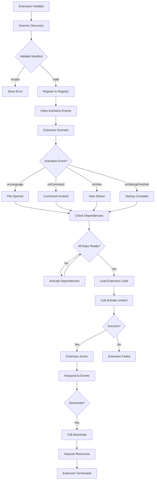

# VS Code Plugin Architecture - Comprehensive Analysis

## 1. High-Level Summary

### Architecture Type

VS Code employs a **sophisticated multi-layered extension architecture** that combines several architectural patterns:

- **Registry-based architecture**: Extensions are discovered, validated, and registered in a central `ExtensionDescriptionRegistry`
- **Event-driven activation**: Extensions are lazily loaded based on declarative activation events
- **RPC-based isolation**: Extensions run in isolated processes/workers and communicate with the main process via Remote Procedure Call (RPC) protocol
- **Contribution point system**: Extensions declaratively contribute functionality through a well-defined contribution points schema
- **Dependency injection**: Extension API is built on dependency injection patterns for service management

### Problem Solved

The VS Code extension system solves several critical challenges:

1. **Performance & Scalability**: Lazy activation and process isolation ensure the editor remains fast even with hundreds of extensions installed
2. **Security & Stability**: Process/worker isolation prevents extensions from crashing the main editor or accessing unauthorized resources
3. **Cross-platform Compatibility**: Supports extensions in multiple environments (Node.js, Web Worker, Remote SSH/WSL/Containers)
4. **Developer Experience**: Provides rich, type-safe APIs with excellent tooling support
5. **Marketplace Ecosystem**: Enables a thriving extension marketplace with standardized packaging and distribution
6. **Backward Compatibility**: Semantic versioning ensures extensions work across VS Code versions

---

## 2. Plugin Discovery & Loading

### Discovery Mechanisms

**File System Scanning**
Extensions are discovered by scanning predefined directories:

```typescript
// Key locations scanned:
// 1. Built-in extensions: environmentService.builtinExtensionsPath
// 2. User extensions: environmentService.extensionsPath
// 3. Additional user extensions in home directory

export const enum ExtensionType {
	System, // Built-in extensions shipped with VS Code
	User, // User-installed extensions from marketplace or local
}
```

**Responsible Files:**

- `src/vs/workbench/services/extensions/electron-browser/extensionsScannerService.ts` - Main scanner service
- `src/vs/platform/extensionManagement/common/extensionsScannerService.js` - Platform-level scanning
- `src/vs/workbench/services/extensionManagement/browser/webExtensionsScannerService.ts` - Web-based extension scanning

### Loading Mechanism

**Multi-Stage Loading Pipeline:**

1. **Scanner Phase**:

   - `ExtensionsScannerService` scans directories
   - Reads and parses `package.json` manifest files
   - Categorizes extensions by type (System/User)

2. **Validation Phase**:

   - Each manifest validated via `validateExtensionManifest()`
   - Version compatibility checked against current VS Code version
   - Path security validated to prevent directory traversal attacks
   - API proposal usage validated

3. **Registry Phase**:

   - Valid extensions added to `ExtensionDescriptionRegistry`
   - Extension metadata indexed for fast lookup
   - Activation events registered for lazy loading

4. **Enablement Check**:

   - Extensions filtered by `IWorkbenchExtensionEnablementService`
   - Respects user preferences (disabled extensions)
   - Checks workspace trust and virtual workspace compatibility

5. **Extension Host Assignment**:
   - Extensions assigned to appropriate extension host (Node.js, Web Worker, Remote)
   - Based on `extensionKind` and `main`/`browser` entry points

**Loading Code Reference:**

```typescript
// src/vs/workbench/services/extensions/common/abstractExtensionService.ts

class AbstractExtensionService {
	private async _scanAndHandleExtensions(): Promise<void> {
		// 1. Scan for extensions
		const extensions = await this._extensionsScannerService.scanExtensions();

		// 2. Validate extensions
		const validated = extensions.filter((ext) => this._validateExtension(ext));

		// 3. Register in registry
		this._registry = new ExtensionDescriptionRegistry(validated);

		// 4. Create extension hosts
		await this._createExtensionHosts();

		// 5. Activate startup extensions
		await this._activateByEvent("*", true);
	}
}
```

**Dynamic Import Strategy:**
Extensions are loaded dynamically at activation time using Node.js `require()` or ES module imports:

```typescript
// src/vs/workbench/api/common/extHostExtensionActivator.ts

private async _loadExtensionModule(extension: IExtensionDescription): Promise<IExtensionModule> {
    // For Node.js extensions
    if (extension.main) {
        return require(extension.main);
    }

    // For browser extensions
    if (extension.browser) {
        return await import(extension.browser);
    }
}
```

---

## 3. Plugin Registration

### Registry Architecture

**Central Registry Object:**

```typescript
// src/vs/workbench/services/extensions/common/extensionDescriptionRegistry.ts

export class ExtensionDescriptionRegistry {
	private _extensionsMap: Map<string, IExtensionDescription>;
	private _extensionsArr: IExtensionDescription[];
	private _activationMap: Map<string, IExtensionDescription[]>;

	// Fast lookup by extension ID
	public getExtensionDescription(
		extensionId: ExtensionIdentifier
	): IExtensionDescription | null;

	// Get extensions interested in an activation event
	public getExtensionDescriptionsForActivationEvent(
		activationEvent: string
	): IExtensionDescription[];
}
```

### Registration Process

**Step 1: Manifest Declaration**
Extensions register themselves via `package.json`:

```json
{
	"name": "my-extension",
	"publisher": "my-publisher",
	"version": "1.0.0",
	"engines": {
		"vscode": "^1.75.0"
	},
	"main": "./out/extension.js",
	"browser": "./dist/browser/extension.js",
	"activationEvents": [
		"onLanguage:javascript",
		"onCommand:myextension.command"
	],
	"contributes": {
		"commands": [
			{
				"command": "myextension.command",
				"title": "My Command"
			}
		],
		"languages": [
			{
				"id": "mylang",
				"extensions": [".mylang"]
			}
		]
	}
}
```

**Step 2: Contribution Point Registration**
The system processes contributions through extension points:

```typescript
// src/vs/workbench/services/extensions/common/extensionsRegistry.ts

export class ExtensionPoint<T> implements IExtensionPoint<T> {
	public readonly name: string;
	private _handler: IExtensionPointHandler<T> | null;

	// Core method: handler receives all extensions contributing to this point
	setHandler(handler: IExtensionPointHandler<T>): IDisposable {
		if (this._handler !== null) {
			throw new Error("Handler already set!");
		}
		this._handler = handler;
		this._handle(); // Process existing contributions

		return {
			dispose: () => {
				this._handler = null;
			},
		};
	}

	// Accept contributions from extensions
	acceptUsers(users: IExtensionPointUser<T>[]): void {
		this._delta = ExtensionPointUserDelta.compute(this._users, users);
		this._users = users;
		this._handle(); // Notify handler of changes
	}
}
```

**Step 3: Code-based Registration**
Extensions register programmatic contributions in their `activate()` function:

```typescript
// Extension code
export function activate(context: vscode.ExtensionContext) {
	// Register command
	const disposable = vscode.commands.registerCommand(
		"myextension.command",
		() => {
			vscode.window.showInformationMessage("Hello from my extension!");
		}
	);

	context.subscriptions.push(disposable);

	// Register language features
	context.subscriptions.push(
		vscode.languages.registerCompletionItemProvider("javascript", {
			provideCompletionItems(document, position) {
				return [new vscode.CompletionItem("myCompletion")];
			},
		})
	);
}
```

### Naming Conventions

**Extension ID Format:**

- Pattern: `publisher.extensionName`
- Example: `ms-vscode.typescript-language-features`
- Case-insensitive for marketplace compatibility, but case-preserving for API

**Command Naming:**

- Convention: `extensionName.commandName`
- Example: `editor.action.formatDocument`

**Activation Event Naming:**

- `onLanguage:{languageId}` - File language activation
- `onCommand:{commandId}` - Command invocation
- `onView:{viewId}` - View visibility
- `onFileSystem:{scheme}` - File system scheme
- `workspaceContains:{pattern}` - File pattern match
- `onStartupFinished` - After startup completes
- `*` - Immediate activation (discouraged)

---

## 4. Plugin Interface / Contract

### Required Extension Structure

**Manifest Requirements (package.json):**

```typescript
export interface IExtensionManifest {
	// REQUIRED FIELDS
	name: string; // Extension name (lowercase, no spaces)
	publisher: string; // Publisher ID
	version: string; // Semantic version (e.g., "1.2.3")
	engines: {
		// VS Code version compatibility
		readonly vscode: string; // e.g., "^1.75.0"
	};

	// OPTIONAL BUT RECOMMENDED
	displayName?: string; // Human-readable name
	description?: string; // Short description
	icon?: string; // Extension icon path
	categories?: string[]; // Marketplace categories

	// ENTRY POINTS (at least one required for code extensions)
	main?: string; // Node.js entry point
	browser?: string; // Web Worker entry point

	// ACTIVATION
	activationEvents?: readonly string[]; // When to activate

	// CONTRIBUTIONS
	contributes?: IExtensionContributions; // Declarative contributions

	// DEPENDENCIES
	extensionDependencies?: string[]; // Required extensions
	extensionPack?: string[]; // Bundled extensions

	// CAPABILITIES
	capabilities?: IExtensionCapabilities; // Workspace support
	enabledApiProposals?: readonly string[]; // Experimental APIs
}
```

### Required Methods

**Activation Function (Required):**

```typescript
// Extension entry point
export function activate(
	context: vscode.ExtensionContext
): Thenable<IExtensionAPI> | IExtensionAPI | void {
	// Extension initialization code
	// Must return quickly (< 500ms recommended)
	// Heavy work should be deferred or async

	// Return public API (optional)
	return {
		// Exposed API for other extensions
		myPublicFunction() {
			// ...
		},
	};
}
```

**Deactivation Function (Optional but Recommended):**

```typescript
// Cleanup function called on extension deactivation
export function deactivate(): Thenable<void> | void {
	// Clean up resources
	// Close connections
	// Dispose of subscriptions
}
```

### Extension Context Interface

**Provided to activate() function:**

```typescript
interface ExtensionContext {
	// LIFECYCLE
	subscriptions: Disposable[]; // Auto-disposed on deactivation

	// STORAGE
	workspaceState: Memento; // Workspace-specific storage
	globalState: Memento & {
		// Global storage across workspaces
		setKeysForSync(keys: string[]): void;
	};
	secrets: SecretStorage; // Secure credential storage

	// PATHS
	extensionUri: Uri; // Extension root URI
	extensionPath: string; // Extension root path
	storagePath?: string; // Workspace storage path
	globalStoragePath: string; // Global storage path
	logPath: string; // Log file path

	// UTILITIES
	asAbsolutePath(relativePath: string): string;
	extensionMode: ExtensionMode; // Production/Development/Test

	// ENVIRONMENT
	environmentVariableCollection: EnvironmentVariableCollection;
}
```

### Expected Data Structures

**Contribution Schema Example (Commands):**

```typescript
interface ICommand {
	command: string; // Unique command ID
	title: string | ILocalizedString; // Display title
	category?: string | ILocalizedString; // Command category
	icon?: string | { light: string; dark: string }; // Icon path
	enablement?: string; // When clause for enablement
}
```

**Menu Contribution Schema:**

```typescript
interface IMenu {
	command: string; // Command to execute
	alt?: string; // Alternative command (alt+click)
	when?: string; // Context condition
	group?: string; // Menu group (e.g., "navigation@1")
}
```

---

## 5. Plugin Lifecycle

### Lifecycle Phases

```
┌─────────────────────────────────────────────────────────────┐
│                    Extension Lifecycle                      │
└─────────────────────────────────────────────────────────────┘

    1. DISCOVERY
         ↓
    Scan file system for extensions
    Parse package.json manifests
    File: extensionsScannerService.ts

    2. VALIDATION
         ↓
    Validate manifest schema
    Check version compatibility
    Verify security constraints
    File: extensionValidator.ts

    3. REGISTRATION
         ↓
    Add to ExtensionDescriptionRegistry
    Index activation events
    Register contribution points
    File: extensionDescriptionRegistry.ts

    4. AWAITING ACTIVATION
         ↓
    Extension is registered but dormant
    Waiting for activation event

    5. ACTIVATION TRIGGERED
         ↓
    Activation event fires (e.g., onLanguage:javascript)
    Extension host receives activation request
    File: extHostExtensionActivator.ts

    6. DEPENDENCY RESOLUTION
         ↓
    Check extensionDependencies
    Activate dependencies first
    Handle missing dependencies

    7. CODE LOADING
         ↓
    require(main) or import(browser)
    Measure code loading time

    8. ACTIVATE() CALL
         ↓
    Call activate(context) function
    Measure activation time
    Capture returned API

    9. RUNNING STATE
         ↓
    Extension is active
    Can use VS Code APIs
    Receives events and invocations

    10. DEACTIVATION TRIGGERED
         ↓
    VS Code shutdown or extension disable
    Call deactivate() function
    Dispose subscriptions
    Clean up resources

    11. TERMINATED
         ↓
    Extension is no longer active
    Extension host may be terminated
```

### Detailed Phase Implementation

**Phase 5-8: Activation Process**

```typescript
// src/vs/workbench/api/common/extHostExtensionActivator.ts

class ActivationOperation {
	private async _waitForDepsThenActivate(): Promise<void> {
		// Wait for all dependencies to activate
		while (this._deps.length > 0) {
			for (let i = 0; i < this._deps.length; i++) {
				const dep = this._deps[i];

				if (dep.value && !dep.value.activationFailed) {
					// Dependency activated successfully
					this._deps.splice(i, 1);
					i--;
				} else if (dep.value && dep.value.activationFailed) {
					// Dependency failed - fail this extension too
					const error = new Error(
						`Cannot activate '${this.friendlyName}' because ` +
							`dependency '${dep.friendlyName}' failed to activate`
					);
					this._value = new FailedExtension(error);
					this._host.onExtensionActivationError(this._id, error, null);
					return;
				}
			}

			if (this._deps.length > 0) {
				await Promise.race(this._deps.map((dep) => dep.wait()));
			}
		}

		// All dependencies ready - activate this extension
		await this._activate();
	}

	private async _activate(): Promise<void> {
		try {
			this._value = await this._host.actualActivateExtension(
				this._id,
				this._reason
			);
		} catch (err) {
			// Handle activation failure
			const error = new Error(
				`Activating extension '${this._id.value}' failed: ${err.message}`
			);
			this._value = new FailedExtension(error);
			this._host.onExtensionActivationError(this._id, error, null);
		}
	}
}
```

**Activation Time Tracking:**

```typescript
export class ExtensionActivationTimes {
	public readonly startup: boolean; // Activated during startup
	public readonly codeLoadingTime: number; // Time to load module
	public readonly activateCallTime: number; // Time in activate() sync portion
	public readonly activateResolvedTime: number; // Time for async activation
}
```

### Lifecycle Events

Extensions can react to lifecycle events:

```typescript
// In extension code
export function activate(context: vscode.ExtensionContext) {
	// React to workspace changes
	context.subscriptions.push(
		vscode.workspace.onDidChangeWorkspaceFolders(() => {
			// Workspace folders changed
		})
	);

	// React to configuration changes
	context.subscriptions.push(
		vscode.workspace.onDidChangeConfiguration((e) => {
			if (e.affectsConfiguration("myextension")) {
				// Configuration changed
			}
		})
	);
}
```

---

## 6. Extension Points

VS Code exposes **30+ extension points** through the contribution system:

### Core Extension Points

#### 1. Commands

**Purpose**: Register executable commands

```typescript
"contributes": {
    "commands": [{
        "command": "extension.doSomething",
        "title": "Do Something",
        "category": "Extension",
        "icon": "$(symbol-method)"
    }]
}
```

**Implementation**: `src/vs/workbench/services/actions/common/menusExtensionPoint.ts`

#### 2. Menus

**Purpose**: Add commands to VS Code menus

```typescript
"contributes": {
    "menus": {
        "editor/context": [{
            "command": "extension.doSomething",
            "when": "editorHasSelection",
            "group": "modification"
        }],
        "commandPalette": [{
            "command": "extension.doSomething",
            "when": "editorIsOpen"
        }]
    }
}
```

**Menu Locations**:

- `editor/context` - Editor right-click menu
- `explorer/context` - File explorer context menu
- `view/title` - View toolbar
- `commandPalette` - Command palette (Cmd+Shift+P)
- `editor/title` - Editor title bar
- Many more...

#### 3. Languages

**Purpose**: Register new programming languages

```typescript
"contributes": {
    "languages": [{
        "id": "mylanguage",
        "extensions": [".mylang"],
        "aliases": ["MyLanguage", "mylang"],
        "configuration": "./language-configuration.json"
    }]
}
```

**Extension API**:

```typescript
vscode.languages.registerCompletionItemProvider("mylanguage", provider);
vscode.languages.registerHoverProvider("mylanguage", provider);
vscode.languages.registerDefinitionProvider("mylanguage", provider);
// 30+ language feature providers available
```

#### 4. Grammars (Syntax Highlighting)

**Purpose**: TextMate grammar for syntax highlighting

```typescript
"contributes": {
    "grammars": [{
        "language": "mylanguage",
        "scopeName": "source.mylang",
        "path": "./syntaxes/mylang.tmLanguage.json"
    }]
}
```

#### 5. Views and View Containers

**Purpose**: Custom sidebar panels and views

```typescript
"contributes": {
    "viewsContainers": {
        "activitybar": [{
            "id": "myContainer",
            "title": "My Container",
            "icon": "resources/icon.svg"
        }]
    },
    "views": {
        "myContainer": [{
            "id": "myView",
            "name": "My View"
        }]
    }
}
```

**Extension API**:

```typescript
vscode.window.createTreeView("myView", {
	treeDataProvider: myDataProvider,
});
```

#### 6. Configuration

**Purpose**: Extension settings

```typescript
"contributes": {
    "configuration": {
        "title": "My Extension",
        "properties": {
            "myext.setting1": {
                "type": "boolean",
                "default": true,
                "description": "Enable feature"
            }
        }
    }
}
```

**Access in code**:

```typescript
const config = vscode.workspace.getConfiguration("myext");
const value = config.get("setting1");
```

#### 7. Keybindings

**Purpose**: Keyboard shortcuts

```typescript
"contributes": {
    "keybindings": [{
        "command": "extension.doSomething",
        "key": "ctrl+shift+r",
        "mac": "cmd+shift+r",
        "when": "editorTextFocus"
    }]
}
```

#### 8. Debuggers

**Purpose**: Debug adapter protocol implementation

```typescript
"contributes": {
    "debuggers": [{
        "type": "mylang",
        "label": "MyLanguage Debug",
        "runtime": "node",
        "configurationAttributes": {
            "launch": {
                "required": ["program"],
                "properties": {
                    "program": {
                        "type": "string",
                        "description": "Path to program"
                    }
                }
            }
        }
    }]
}
```

#### 9. Themes

**Purpose**: Color themes

```typescript
"contributes": {
    "themes": [{
        "label": "My Dark Theme",
        "uiTheme": "vs-dark",
        "path": "./themes/dark.json"
    }]
}
```

#### 10. Icon Themes

**Purpose**: File icon themes

```typescript
"contributes": {
    "iconThemes": [{
        "id": "myIcons",
        "label": "My Icons",
        "path": "./icons/theme.json"
    }]
}
```

### Advanced Extension Points

#### 11. Authentication Providers

```typescript
"contributes": {
    "authentication": [{
        "id": "myauth",
        "label": "My Auth Provider"
    }]
}
```

#### 12. Source Control Providers

```typescript
vscode.scm.createSourceControl("myScm", "My SCM");
```

#### 13. Task Providers

```typescript
vscode.tasks.registerTaskProvider("mytasks", taskProvider);
```

#### 14. Terminal Profiles

```typescript
vscode.window.registerTerminalProfileProvider("myterm", provider);
```

#### 15. Webview Editors

```typescript
"contributes": {
    "customEditors": [{
        "viewType": "myCustomEditor",
        "displayName": "My Editor",
        "selector": [{"filenamePattern": "*.myfile"}]
    }]
}
```

#### 16. Notebook Renderers & Kernels

```typescript
"contributes": {
    "notebookRenderer": [{
        "id": "myRenderer",
        "displayName": "My Notebook Renderer",
        "mimeTypes": ["application/x-myformat"]
    }]
}
```

#### 17. Testing API

```typescript
vscode.tests.createTestController("myTests", "My Tests");
```

#### 18. Chat Participants (AI/Copilot)

```typescript
"contributes": {
    "chatParticipants": [{
        "id": "myagent",
        "name": "myagent",
        "description": "My AI agent"
    }]
}
```

#### 19. Language Model Tools

```typescript
"contributes": {
    "languageModelTools": [{
        "name": "myTool",
        "displayName": "My Tool",
        "modelDescription": "Does something useful"
    }]
}
```

### Extension Point Registration Pattern

All extension points follow a common pattern:

```typescript
// 1. Define extension point
const extensionPoint =
	ExtensionsRegistry.registerExtensionPoint<ContributionType>({
		extensionPoint: "pointName",
		jsonSchema: contributionSchema,
	});

// 2. Set handler
extensionPoint.setHandler((extensions) => {
	for (const ext of extensions) {
		// Process contribution from ext.value
		registerContribution(ext.value);
	}
});
```

**File Reference**: `src/vs/workbench/services/extensions/common/extensionsRegistry.ts`

---

## 7. Configuration & Metadata

### Configuration Sources

#### 1. Extension Manifest (package.json)

Primary source of extension metadata and declarative configuration.

**Location**: Extension root directory

**Schema Validation**: Against `vscode://schemas/vscode-extensions`

**Key Sections**:

```json
{
	"name": "extension-name",
	"publisher": "publisher-id",
	"version": "1.0.0",
	"engines": { "vscode": "^1.75.0" },
	"categories": ["Programming Languages", "Linters"],
	"keywords": ["typescript", "linting"],
	"license": "MIT",
	"repository": {
		"type": "git",
		"url": "https://github.com/user/repo"
	},
	"bugs": {
		"url": "https://github.com/user/repo/issues"
	}
}
```

#### 2. Extension Configuration Contribution

Extensions define their own settings:

```typescript
"contributes": {
    "configuration": {
        "type": "object",
        "title": "My Extension Configuration",
        "properties": {
            "myext.feature.enabled": {
                "type": "boolean",
                "default": true,
                "description": "Enable the feature",
                "scope": "window"  // or "resource", "machine", "application"
            },
            "myext.advanced.timeout": {
                "type": "number",
                "default": 5000,
                "minimum": 1000,
                "maximum": 30000,
                "description": "Timeout in milliseconds"
            }
        }
    }
}
```

**Configuration Scopes**:

- `application` - Applies to all VS Code instances
- `machine` - Machine-specific, not synced
- `window` - Per-window setting
- `resource` - Per-file/folder (most specific)

#### 3. Runtime Configuration Storage

**Workspace State** (per-workspace):

```typescript
await context.workspaceState.update("key", value);
const value = context.workspaceState.get("key", defaultValue);
```

**Global State** (across workspaces):

```typescript
await context.globalState.update("key", value);
const value = context.globalState.get("key", defaultValue);

// Enable settings sync
context.globalState.setKeysForSync(["key1", "key2"]);
```

**Secrets Storage** (secure):

```typescript
await context.secrets.store("apiKey", "secret-value");
const apiKey = await context.secrets.get("apiKey");
await context.secrets.delete("apiKey");
```

### Metadata Storage

**Extension Metadata Cache**:

- Location: `USER_DATA/extensions.user.cache` (user extensions)
- Location: `USER_DATA/extensions.builtin.cache` (built-in extensions)
- Format: Binary-serialized extension descriptions
- Purpose: Fast startup without re-parsing all package.json files

**Extension Storage Paths**:

```typescript
interface ExtensionContext {
	// Workspace-specific storage (deleted when workspace closes)
	storageUri: Uri | undefined;
	storagePath: string | undefined;

	// Global storage (persists across workspaces)
	globalStorageUri: Uri;
	globalStoragePath: string;

	// Logs
	logUri: Uri;
	logPath: string;
}
```

### Hot Reload Support

**Development Mode**:
Extensions in development can be reloaded without restarting VS Code:

1. Press `Ctrl+R` / `Cmd+R` in Extension Development Host
2. Extension host process restarts
3. Extensions re-scanned and re-activated
4. State is lost (unless persisted to storage)

**Production Mode**:

- Extensions cannot be hot-reloaded
- Requires "Reload Window" command
- State preserved through `globalState` and `workspaceState`

### Configuration Monitoring

Extensions can react to configuration changes:

```typescript
vscode.workspace.onDidChangeConfiguration((event) => {
	if (event.affectsConfiguration("myext")) {
		// Re-read configuration
		const config = vscode.workspace.getConfiguration("myext");
		updateBehavior(config);
	}
});
```

### Localization (l10n)

**Bundle-based Localization**:

```json
// package.json
{
  "l10n": "./l10n"
}

// l10n/bundle.l10n.json
{
  "hello": "Hello",
  "goodbye": "Goodbye"
}

// l10n/bundle.l10n.ja.json  (Japanese)
{
  "hello": "こんにちは",
  "goodbye": "さようなら"
}
```

**In Extension Code**:

```typescript
import * as l10n from "@vscode/l10n";

l10n.t("hello"); // Returns localized string
```

---

## 8. Security, Isolation & Error Handling

### Process Isolation Architecture

VS Code uses **multi-process architecture** to isolate extensions from the core editor:

```
┌──────────────────────────────────────────────────────────┐
│                    Main Process                          │
│  - UI Rendering (Electron/Browser)                      │
│  - Core Editor Logic                                     │
│  - File System Access                                    │
│  - Window Management                                     │
└─────────────────┬────────────────────────────────────────┘
                  │ IPC/RPC Communication
        ┌─────────┴─────────┬───────────────┬─────────────┐
        ▼                   ▼               ▼             ▼
┌─────────────────┐ ┌─────────────┐ ┌─────────┐ ┌──────────────┐
│ Extension Host  │ │  Extension  │ │Extension│ │   Remote     │
│  (Node.js)      │ │    Host     │ │  Host   │ │  Extension   │
│                 │ │(Web Worker) │ │(Worker) │ │    Host      │
│ - Local Process │ │             │ │         │ │ (SSH/WSL/    │
│ - Full Node API │ │ - Sandboxed │ │- Multi- │ │  Container)  │
│ - File access   │ │ - No FS     │ │ threaded│ │              │
│ - Native modules│ │ - Browser   │ │         │ │ - Remote     │
└─────────────────┘ └─────────────┘ └─────────┘ └──────────────┘
```

### Extension Host Types & Isolation

#### 1. Local Process Extension Host

**File**: `src/vs/workbench/services/extensions/electron-browser/localProcessExtensionHost.ts`

**Isolation Mechanisms**:

- Runs in separate Node.js process
- Cannot directly access main process memory
- Limited to VS Code API surface
- Cannot manipulate DOM directly

**Process Creation**:

```typescript
class NativeLocalProcessExtensionHost {
	private async _start(): Promise<IMessagePassingProtocol> {
		// Create isolated Node.js process
		const opts: IExtensionHostProcessOptions = {
			env: this._createSanitizedEnvironment(),
			detached: !!platform.isWindows,
			execArgv: this._computeExecArgs(),
			silent: true, // No stdio inheritance
		};

		this._extensionHostProcess = fork(
			FileAccess.asFileUri("bootstrap-fork").fsPath,
			["--type=extensionHost"],
			opts
		);
	}
}
```

#### 2. Web Worker Extension Host

**File**: `src/vs/workbench/services/extensions/browser/webWorkerExtensionHost.ts`

**Stronger Isolation**:

- Runs in Web Worker thread
- No access to file system
- No access to Node.js APIs
- Cross-origin isolated
- Sandboxed iframe container

**Security Attributes**:

```typescript
class WebWorkerExtensionHost {
	private async _startInsideIframe(): Promise<IMessagePassingProtocol> {
		const iframe = document.createElement("iframe");
		iframe.setAttribute("sandbox", "allow-scripts allow-same-origin");
		iframe.setAttribute("allow", "usb; serial; hid; cross-origin-isolated;");

		// Create worker inside isolated iframe
		const worker = new iframe.contentWindow.Worker(workerUrl);
	}
}
```

### Security Mechanisms

#### 1. Manifest Validation

**Path Security**:

```typescript
// src/vs/platform/extensions/common/extensionValidator.ts

export function validateExtensionManifest(
	extensionLocation: URI,
	extensionManifest: IExtensionManifest
): readonly [Severity, string][] {
	const validations: [Severity, string][] = [];

	// Ensure main entry point is inside extension folder
	if (extensionManifest.main) {
		const mainLocation = joinPath(extensionLocation, extensionManifest.main);
		if (!isEqualOrParent(mainLocation, extensionLocation)) {
			validations.push([
				Severity.Warning,
				"Expected `main` to be included inside extension's folder",
			]);
		}
	}

	// Similar checks for browser, icon, etc.
	return validations;
}
```

#### 2. API Proposal Gating

Experimental APIs require explicit enablement:

```typescript
// In package.json
{
  "enabledApiProposals": [
    "fileSearchProvider",
    "textSearchProvider"
  ]
}

// In code - automatically checked
// src/vs/workbench/api/common/extHost.api.impl.ts

export function checkProposedApiEnabled(
    extension: IExtensionDescription,
    proposal: ApiProposalName
): void {
    if (!isProposedApiEnabled(extension, proposal)) {
        throw new Error(
            `Extension '${extension.identifier.value}' ` +
            `CANNOT use API proposal: ${proposal}`
        );
    }
}
```

#### 3. Workspace Trust

Extensions declare trust requirements:

```typescript
// package.json
{
  "capabilities": {
    "untrustedWorkspaces": {
      "supported": "limited",
      "description": "Some features disabled in untrusted workspaces",
      "restrictedConfigurations": [
        "myext.executablePath"
      ]
    }
  }
}
```

**Runtime Enforcement**:

```typescript
if (!vscode.workspace.isTrusted) {
	// Disable sensitive features
	return;
}

// Listen for trust changes
vscode.workspace.onDidGrantWorkspaceTrust(() => {
	// Re-enable features
});
```

#### 4. Virtual Workspace Support

```typescript
{
  "capabilities": {
    "virtualWorkspaces": {
      "supported": false,
      "description": "Extension requires local file system access"
    }
  }
}
```

### Error Handling

#### Extension Activation Errors

**Error Categories**:

1. **Unknown Extension** - Extension ID not found
2. **Missing Dependency** - Required extension not installed
3. **Dependency Activation Failed** - Dependency failed to activate
4. **Code Loading Error** - Module require/import failed
5. **Activation Function Error** - activate() threw exception

**Error Handling Code**:

```typescript
// src/vs/workbench/api/common/extHostExtensionActivator.ts

class ActivationOperation {
	private async _activate(): Promise<void> {
		try {
			this._value = await this._host.actualActivateExtension(
				this._id,
				this._reason
			);
		} catch (err) {
			const error = new Error(
				`Activating extension '${this._id.value}' failed: ${err.message}`
			);
			error.stack = err.stack;

			// Mark extension as failed
			this._value = new FailedExtension(error);

			// Report error to main process
			this._host.onExtensionActivationError(this._id, error, null);

			// Log error
			this._logService.error(`Activating extension ${this._id.value} failed:`);
			this._logService.error(err);
		}
	}
}
```

**Error Reporting**:

```typescript
// src/vs/workbench/api/browser/mainThreadExtensionService.ts

async $onExtensionActivationError(
    extensionId: ExtensionIdentifier,
    data: SerializedError,
    missingExtensionDependency: MissingExtensionDependency | null
): Promise<void> {
    // Show error notification to user
    const error = errors.deserialize(data);
    this._notificationService.notify({
        severity: Severity.Error,
        message: `Extension '${extensionId.value}' failed to activate`,
        actions: {
            primary: [
                new Action('showExtension', 'Show Extension', () => {
                    this._extensionsWorkbenchService.open(extensionId);
                })
            ]
        }
    });

    // Log to extension host log
    this._extensionService.onExtensionActivationError(extensionId, error);
}
```

#### Runtime Error Isolation

**Extension Host Crash Recovery**:

```typescript
// Extension host crashes don't crash main process
// Automatic restart attempt

private _onExtensionHostCrashed(exitCode: number): void {
    this._logService.error(`Extension host terminated unexpectedly. Code: ${exitCode}`);

    if (this._restartAttempts < MAX_RESTART_ATTEMPTS) {
        this._restartAttempts++;
        this._startExtensionHost(); // Restart
    } else {
        // Too many crashes - give up
        this._notificationService.error(
            'Extension host crashed too many times. Extensions disabled.'
        );
    }
}
```

**Unhandled Promise Rejections**:

```typescript
// Extensions' unhandled rejections are caught and logged
// Don't crash extension host

process.on("unhandledRejection", (reason, promise) => {
	console.error("Unhandled promise rejection in extension:", reason);
	// Continue running
});
```

### Sandboxing Summary

| Feature            | Local Process       | Web Worker          | Remote              |
| ------------------ | ------------------- | ------------------- | ------------------- |
| Process Isolation  | ✅ Separate process | ✅ Worker thread    | ✅ Remote machine   |
| File System Access | ✅ Full access      | ❌ No direct access | ✅ Remote FS        |
| Node.js APIs       | ✅ Full Node.js     | ❌ Browser only     | ✅ Full Node.js     |
| Native Modules     | ✅ Supported        | ❌ Not supported    | ✅ Supported        |
| DOM Access         | ❌ No direct access | ❌ No access        | ❌ No access        |
| Crash Isolation    | ✅ Won't crash main | ✅ Won't crash main | ✅ Won't crash main |
| Performance        | High                | Medium              | Network-dependent   |

---

## 9. Dependency Management

### Extension Dependencies

#### Declaring Dependencies

**In package.json**:

```json
{
	"extensionDependencies": [
		"ms-vscode.vscode-typescript-next",
		"dbaeumer.vscode-eslint"
	],
	"extensionPack": ["ms-vscode.js-debug", "ms-vscode.vscode-json"]
}
```

**Difference**:

- `extensionDependencies`: **Hard dependencies** - must be installed and activated before this extension
- `extensionPack`: **Soft bundle** - recommended extensions, installed together but not required

#### Dependency Resolution

**Activation Order**:

```typescript
// src/vs/workbench/api/common/extHostExtensionActivator.ts

private _handleActivationRequest(currentActivation: ActivationIdAndReason): ActivationOperation {
    const currentExtension = this._registry.getExtensionDescription(currentActivation.id);
    const deps: ActivationOperation[] = [];

    // Get declared dependencies
    const depIds = currentExtension.extensionDependencies || [];

    for (const depId of depIds) {
        // Check if dependency is already resolved (no code to activate)
        if (this._isResolvedExtension(depId)) {
            continue;
        }

        // Get or create activation operation for dependency
        const depDesc = this._registry.getExtensionDescription(depId);
        if (depDesc) {
            // Recursively activate dependency first
            deps.push(this._handleActivationRequest({
                id: depDesc.identifier,
                reason: currentActivation.reason
            }));
        } else {
            // ERROR: Missing dependency
            const error = new Error(
                `Cannot activate extension because it depends on ` +
                `unknown extension '${depId}'`
            );
            this._host.onExtensionActivationError(
                currentExtension.identifier,
                error,
                new MissingExtensionDependency(depId)
            );
            return new FailedOperation(error);
        }
    }

    // Wait for all dependencies before activating this extension
    return new ActivationOperation(currentActivation, deps);
}
```

**Dependency Graph**:
VS Code builds a dependency graph and activates extensions in topological order:

```
Extension A
    ↓ depends on
Extension B
    ↓ depends on
Extension C

Activation order: C → B → A
```

**Circular Dependency Handling**:
The registry detects and breaks circular dependencies during registration phase.

#### Missing Dependency Handling

```typescript
export class MissingExtensionDependency {
	constructor(public readonly dependency: string) {}
}

// When dependency is missing:
interface IExtensionActivationError {
	extensionId: ExtensionIdentifier;
	error: Error;
	missingDependency: MissingExtensionDependency | null;
}

// User is prompted to install missing dependency
if (missingDependency) {
	const action = new Action("install", "Install Dependency", async () => {
		await this._extensionManagementService.installFromGallery(
			missingDependency.dependency
		);
	});

	this._notificationService.prompt(
		Severity.Warning,
		`Extension requires '${missingDependency.dependency}'`,
		[action]
	);
}
```

### API Dependencies (No Explicit Declaration)

Extensions depend on VS Code API version through `engines.vscode`:

```json
{
	"engines": {
		"vscode": "^1.75.0" // Requires VS Code 1.75.0 or higher
	}
}
```

**Version Checking**:

```typescript
// src/vs/platform/extensions/common/extensionValidator.ts

function validateEngineVersion(
	currentVersion: string,
	requiredVersion: string
): boolean {
	// Semantic version comparison
	// ^1.75.0 means >=1.75.0 <2.0.0
	return semver.satisfies(currentVersion, requiredVersion);
}
```

### Implicit Service Dependencies (Dependency Injection)

Extension host uses DI container for service resolution:

```typescript
// src/vs/workbench/api/common/extHostExtensionService.ts

class ExtHostExtensionService {
	constructor(
		@IInstantiationService
		private readonly _instaService: IInstantiationService,
		@IExtHostRpcService private readonly _extHostRpc: IExtHostRpcService,
		@ILogService private readonly _logService: ILogService
	) // ... more services injected
	{
		// Services automatically resolved by DI container
	}
}
```

**Service Locator Pattern**:
Extensions don't directly declare service dependencies. Services are resolved through:

1. Extension context (for extension-facing APIs)
2. RPC proxies (for main-thread services)
3. DI container (internal services)

### Extension Pack Management

**Installation**:
When installing an extension pack, all packaged extensions are installed together.

**Enablement**:

- Packed extensions can be individually enabled/disabled
- Disabling pack doesn't disable packed extensions
- Uninstalling pack offers to uninstall packed extensions

**Code Reference**:

```typescript
// src/vs/workbench/services/extensionManagement/common/extensionManagementService.ts

private async _installExtensionPack(
    extension: IGalleryExtension
): Promise<void> {
    if (extension.properties.extensionPack) {
        const packedExtensions = await this._galleryService.getExtensions(
            extension.properties.extensionPack.map(id => ({ id }))
        );

        // Install all packed extensions
        await Promise.all(
            packedExtensions.map(ext =>
                this.installFromGallery(ext)
            )
        );
    }
}
```

### No Version Constraints

**Current Limitation**: Extensions cannot specify version constraints for dependencies:

```json
// NOT SUPPORTED:
{
  "extensionDependencies": {
    "other-extension": "^1.2.0"  // ❌ Not supported
  }
}

// Only extension ID allowed:
{
  "extensionDependencies": [
    "other-extension"  // ✅ Any version
  ]
}
```

This is a known limitation. Extensions must handle API compatibility at runtime.

---

## 10. Architecture Diagram

### High-Level Architecture

```
┌─────────────────────────────────────────────────────────────────────────────┐
│                            VS Code Architecture                             │
└─────────────────────────────────────────────────────────────────────────────┘

┌─────────────────────────────────────────────────────────────────────────────┐
│                              Main Process                                   │
│  ┌─────────────────────────────────────────────────────────────────────┐   │
│  │                       Electron Main / Browser                       │   │
│  └─────────────────────────────────────────────────────────────────────┘   │
│                                                                             │
│  ┌──────────────────────────────────────────────────────────────────────┐  │
│  │                    Workbench (Renderer Process)                      │  │
│  │  ┌────────────────────────────────────────────────────────────────┐ │  │
│  │  │  Editor UI │ Sidebar │ Panel │ Statusbar │ Activity Bar      │ │  │
│  │  └────────────────────────────────────────────────────────────────┘ │  │
│  │  ┌────────────────────────────────────────────────────────────────┐ │  │
│  │  │                  Core Services Layer                           │ │  │
│  │  │  - File Service                                                │ │  │
│  │  │  - Configuration Service                                       │ │  │
│  │  │  - Extension Service  ← [Extension Management]                │ │  │
│  │  │  - Command Service                                             │ │  │
│  │  │  - Language Service                                            │ │  │
│  │  └────────────────────────────────────────────────────────────────┘ │  │
│  │  ┌────────────────────────────────────────────────────────────────┐ │  │
│  │  │              Extension Management Layer                        │ │  │
│  │  │  - ExtensionsScannerService    [Discovery]                    │ │  │
│  │  │  - ExtensionDescriptionRegistry [Registration]                │ │  │
│  │  │  - ExtensionsRegistry          [Contribution Points]          │ │  │
│  │  │  - ExtensionService            [Lifecycle Management]         │ │  │
│  │  └────────────────────────────────────────────────────────────────┘ │  │
│  └──────────────────────────────────────────────────────────────────────┘  │
│                                  │                                          │
│                                  │ RPC Protocol (MessagePort/IPC)           │
│                                  ↓                                          │
└─────────────────────────────────────────────────────────────────────────────┘

┌─────────────────────────────────────────────────────────────────────────────┐
│                         Extension Host Layer                                │
│  ┌──────────────────┐  ┌──────────────────┐  ┌──────────────────┐          │
│  │ Local Process    │  │  Web Worker      │  │  Remote          │          │
│  │ Extension Host   │  │  Extension Host  │  │  Extension Host  │          │
│  │                  │  │                  │  │                  │          │
│  │ (Node.js)        │  │  (Worker Thread) │  │  (SSH/WSL/etc)   │          │
│  └──────────────────┘  └──────────────────┘  └──────────────────┘          │
│           │                      │                      │                   │
│           └──────────────────────┴──────────────────────┘                   │
│                                  │                                          │
│                    ┌─────────────▼─────────────┐                            │
│                    │   ExtHost Services        │                            │
│                    │  - ExtHostExtensionService│                            │
│                    │  - ExtHostCommands        │                            │
│                    │  - ExtHostDocuments       │                            │
│                    │  - ExtHostLanguages       │                            │
│                    │  - ExtHostWorkspace       │                            │
│                    │  - [50+ ExtHost* services]│                            │
│                    └─────────────┬─────────────┘                            │
│                                  │                                          │
│                    ┌─────────────▼─────────────┐                            │
│                    │  Extension Activator      │                            │
│                    │  - Manages activation     │                            │
│                    │  - Resolves dependencies  │                            │
│                    │  - Calls activate()       │                            │
│                    └─────────────┬─────────────┘                            │
│                                  │                                          │
│           ┌──────────────────────┼──────────────────────┐                   │
│           │                      │                      │                   │
│      ┌────▼─────┐          ┌────▼─────┐          ┌────▼─────┐             │
│      │Extension │          │Extension │          │Extension │             │
│      │    A     │          │    B     │          │    C     │             │
│      │          │          │          │          │          │             │
│      │activate()│          │activate()│          │activate()│             │
│      │          │          │          │          │          │             │
│      └──────────┘          └──────────┘          └──────────┘             │
└─────────────────────────────────────────────────────────────────────────────┘
```

### Extension Lifecycle Flow



### RPC Communication Architecture

```
┌─────────────────────────────────────────────────────────────────────────┐
│                         RPC Protocol Layer                              │
└─────────────────────────────────────────────────────────────────────────┘

Main Process                                           Extension Host
─────────────                                          ──────────────

┌──────────────────┐        MessagePort/IPC         ┌─────────────────┐
│ MainThreadCommands├────────────────────────────────►ExtHostCommands  │
│  (Proxy)         │◄────────────────────────────────┤  (Impl)         │
└──────────────────┘                                 └─────────────────┘
        │                                                      │
        │ $registerCommand(id, title)                         │
        │────────────────────────────────────────────────────►│
        │                                                      │ Store command
        │                                                      │
        │◄────────────────────────────────────────────────────┤ ACK
        │                                                      │
        │                                                      │
        │ $executeCommand(id, args)                           │
        │────────────────────────────────────────────────────►│
        │                                                      │ Find handler
        │                                                      │ Execute
        │◄────────────────────────────────────────────────────┤ Return result
        │                                                      │

┌──────────────────┐                                 ┌─────────────────┐
│MainThreadDocuments├────────────────────────────────►ExtHostDocuments │
│  (Impl)          │◄────────────────────────────────┤  (Proxy)        │
└──────────────────┘                                 └─────────────────┘
        │                                                      │
        │ $acceptModelChanged(uri, changes)                   │
        │────────────────────────────────────────────────────►│
        │                                                      │ Update model
        │                                                      │ Fire event
        │◄────────────────────────────────────────────────────┤ ACK
        │                                                      │

All communication is:
- Asynchronous (Promise-based)
- Type-safe (TypeScript interfaces)
- Bidirectional (both sides can initiate)
- Serialized (JSON-serializable data only)
```

### Contribution Points System

```
Extension Manifest                 Extension Points                Core System
──────────────────                ────────────────                ───────────

package.json
  contributes:
    commands: [...]  ──────────►  CommandsExtensionPoint  ──────► CommandService
                                        │                            │
                                        │ Register handlers          │ Execute
                                        ▼                            ▼
                                   Command Registry            Command Execution

    languages: [...]  ──────────►  LanguagesExtensionPoint ───► LanguageService
                                        │                            │
                                        │ Register language          │ Tokenize
                                        ▼                            │ Highlight
                                   Language Registry               ▼
                                                              Language Features

    views: [...]  ───────────────►  ViewsExtensionPoint  ──────► ViewsService
                                        │                            │
                                        │ Create view                │ Render UI
                                        ▼                            ▼
                                   View Descriptors            View Containers

    configuration: {...} ─────────►  ConfigurationExtensionPoint
                                        │
                                        │ Merge schemas
                                        ▼
                                   Configuration Registry
                                        │
                                        ▼
                                   Configuration Service

    [30+ more contribution points]
```

---

## 11. Improvement Recommendations

### Performance Improvements

#### 1. Parallel Extension Activation

**Current State**: Extensions with no dependencies activate sequentially within their activation event.

**Recommendation**:

```typescript
// Group extensions by dependency level
const levels = groupByDependencyLevel(extensions);

// Activate each level in parallel
for (const level of levels) {
	await Promise.all(level.map((ext) => activateExtension(ext)));
}
```

**Benefits**:

- Faster startup time
- Better utilization of multi-core processors
- Reduced time-to-interactive

#### 2. Lazy Contribution Point Processing

**Current State**: All contribution points processed at extension registration.

**Recommendation**: Defer processing until first use:

```typescript
class LazyExtensionPoint<T> {
	private _processed = false;

	private _ensureProcessed(): void {
		if (!this._processed) {
			this._processContributions();
			this._processed = true;
		}
	}

	public get contributions(): T[] {
		this._ensureProcessed(); // Process on first access
		return this._contributions;
	}
}
```

#### 3. Extension Code Splitting

**Recommendation**: Allow extensions to split code by feature:

```json
{
	"main": "./out/extension.js",
	"contributes": {
		"commands": [
			{
				"command": "ext.heavy",
				"title": "Heavy Operation",
				"lazy": "./out/heavy.js" // Load only when command executed
			}
		]
	}
}
```

#### 4. Smarter Activation Events

**Recommendation**: Add more granular activation events:

- `onFileOpen:pattern` - Activate only when specific file pattern opened
- `onCommandPalette` - Activate only when command palette opened
- `onSettingChanged:key` - Activate when specific setting changes

### Stability Improvements

#### 1. Extension Sandboxing

**Current State**: Local process extensions have full Node.js access.

**Recommendation**: Introduce permission model:

```json
{
	"permissions": {
		"filesystem": ["read", "write"],
		"network": ["fetch"],
		"shell": ["execute"],
		"clipboard": ["read", "write"]
	}
}
```

**Benefits**:

- Users know what extensions can access
- Malicious extensions contained
- Fine-grained security control

#### 2. Extension Health Monitoring

**Recommendation**: Track and report extension health metrics:

```typescript
interface ExtensionHealth {
    activationTime: number;
    memoryUsage: number;
    cpuUsage: number;
    errorCount: number;
    crashCount: number;
    apiCallFrequency: number;
}

// Warn users about problematic extensions
if (health.memoryUsage > 500MB || health.cpuUsage > 80%) {
    notifyUser(`Extension ${id} is using excessive resources`);
}
```

#### 3. Automatic Extension Recovery

**Current State**: Failed extensions stay failed until reload.

**Recommendation**: Implement retry with backoff:

```typescript
class ExtensionRecovery {
	private async activateWithRetry(
		id: ExtensionIdentifier,
		maxRetries: number = 3
	): Promise<void> {
		for (let i = 0; i < maxRetries; i++) {
			try {
				await this.activate(id);
				return;
			} catch (err) {
				if (i === maxRetries - 1) throw err;
				await sleep(Math.pow(2, i) * 1000); // Exponential backoff
			}
		}
	}
}
```

#### 4. Extension Isolation Levels

**Recommendation**: Multiple isolation levels based on trust:

```typescript
enum IsolationLevel {
	Trusted, // Full access (current behavior)
	Sandboxed, // Permission-based access
	WebWorker, // No file system or Node.js access
	Remote, // Run on remote server
}

// User chooses isolation level per extension
// Based on publisher reputation, review, source
```

### Cleaner Extension Points

#### 1. Typed Contribution Points

**Current State**: Contribution schemas validated at runtime.

**Recommendation**: Generate TypeScript types from schemas:

```typescript
// Auto-generated from JSON schema
import { CommandContribution } from "vscode-contributions";

export const commands: CommandContribution[] = [
	{
		command: "ext.cmd",
		title: "My Command",
		// TypeScript ensures correctness
	},
];
```

#### 2. Programmatic Contribution Registration

**Recommendation**: Allow runtime contribution registration:

```typescript
export function activate(context: vscode.ExtensionContext) {
	// Register command contribution dynamically
	context.contributions.registerCommand({
		command: "ext.dynamic",
		title: "Dynamic Command",
		when: "customCondition",
	});
}
```

**Benefits**:

- Conditional contributions based on runtime state
- More flexible than static JSON
- Reduced manifest complexity

#### 3. Extension Point Versioning

**Recommendation**: Version extension points independently:

```typescript
// In package.json
{
  "contributes": {
    "commands@v2": [{  // Specify extension point version
      "command": "ext.cmd",
      "title": "Command",
      "icon": { "codicon": "symbol-method" }  // v2 feature
    }]
  }
}
```

### Better Lifecycle APIs

#### 1. Granular Lifecycle Hooks

**Recommendation**: Add more lifecycle hooks:

```typescript
export function onBeforeActivate(context: vscode.ExtensionContext): void {
	// Prepare for activation (async work)
}

export function activate(context: vscode.ExtensionContext): void {
	// Synchronous activation
}

export function onAfterActivate(context: vscode.ExtensionContext): void {
	// Post-activation tasks
}

export function onBeforeDeactivate(): void {
	// Start cleanup
}

export function deactivate(): void {
	// Finish cleanup
}
```

#### 2. Incremental Activation

**Recommendation**: Allow extensions to activate incrementally:

```typescript
export function activate(context: vscode.ExtensionContext) {
	// Core features activate immediately
	registerCoreFeatures();

	// Advanced features activate later
	context.defer(() => {
		registerAdvancedFeatures();
	});
}
```

#### 3. Shared Extension State

**Recommendation**: Allow extensions to share state:

```typescript
// Extension A exports shared service
export function activate(context: vscode.ExtensionContext) {
	return {
		sharedService: new MyService(),
	};
}

// Extension B uses shared service
export async function activate(context: vscode.ExtensionContext) {
	const extA = vscode.extensions.getExtension("publisher.extA");
	const api = await extA.activate();
	api.sharedService.doSomething();
}
```

**Better Alternative**: Official extension API export registry:

```typescript
// Extension A
context.exports.register("myService", myServiceImpl);

// Extension B
const myService = await vscode.imports.get("publisher.extA", "myService");
```

### Safer Plugin Execution

#### 1. Compute Budget Limits

**Recommendation**: Limit CPU/memory per extension:

```typescript
interface ExtensionBudget {
	maxActivationTime: number; // Max activation duration
	maxMemory: number; // Max memory usage
	maxCpuPercent: number; // Max CPU usage
	maxApiCallsPerSecond: number; // Rate limiting
}

// Enforce budgets
if (extension.memoryUsage > budget.maxMemory) {
	pauseExtension(extension.id);
	notifyUser(`Extension ${extension.id} exceeded memory budget`);
}
```

#### 2. API Call Auditing

**Recommendation**: Log and analyze API usage:

```typescript
class ApiAuditor {
	logApiCall(extension: string, api: string, args: any[]): void {
		// Track which APIs are used how often
		// Detect suspicious patterns (e.g., excessive file reads)
		// Generate reports for extension developers
	}
}
```

#### 3. Content Security Policy for Webviews

**Current State**: Webviews have CSP but may be bypassed.

**Recommendation**: Stricter CSP enforcement:

```typescript
const webview = vscode.window.createWebviewPanel(
	"myView",
	"My View",
	vscode.ViewColumn.One,
	{
		enableScripts: true,
		contentSecurityPolicy: {
			"default-src": ["none"],
			"script-src": ["nonce-12345"], // Only nonce-tagged scripts
			"style-src": ["unsafe-inline"], // Required for inline styles
			"img-src": ["https:", "data:"],
			"connect-src": ["https://api.example.com"], // Whitelist domains
		},
	}
);
```

#### 4. Extension Signing

**Recommendation**: Require code signing for marketplace extensions:

```typescript
interface ExtensionSignature {
	publisher: string;
	signature: string;
	certificate: string;
	timestamp: Date;
}

// Verify signature before activation
function verifyExtension(extension: IExtension): boolean {
	const valid = crypto.verify(
		extension.signature,
		extension.code,
		extension.certificate
	);

	if (!valid) {
		throw new Error("Extension signature invalid");
	}

	return true;
}
```

### Developer Experience Improvements

#### 1. Better Extension Debugging

**Recommendation**:

- Live extension reload without restarting extension host
- Extension performance profiler built into Extension Development Host
- API call tracing and visualization

#### 2. Extension Templates

**Recommendation**: Official templates for common extension types:

```bash
npm create vscode-extension -- --template language-server
npm create vscode-extension -- --template webview-ui
npm create vscode-extension -- --template test-provider
```

#### 3. Extension Testing Framework

**Recommendation**: First-class testing support:

```typescript
import { test, expect } from "@vscode/test-framework";

test("command execution", async () => {
	await vscode.commands.executeCommand("extension.command");
	expect(result).toBe(expected);
});

test("language features", async () => {
	const completions = await vscode.languages.getCompletionItems(uri, position);
	expect(completions).toContain(expectedItem);
});
```

---

## Conclusion

VS Code's extension architecture is a **mature, production-grade plugin system** that successfully balances:

✅ **Performance** - Lazy loading, process isolation, efficient RPC
✅ **Security** - Process isolation, sandboxing, API gating
✅ **Developer Experience** - Rich APIs, excellent tooling, type safety
✅ **Ecosystem** - Thriving marketplace with 40,000+ extensions
✅ **Cross-Platform** - Works on desktop, web, and remote environments

**Key Architectural Strengths**:

1. Multi-process isolation prevents extension crashes from affecting the editor
2. Event-driven activation ensures fast startup even with many extensions
3. Rich contribution point system enables declarative extensibility
4. RPC-based architecture enables multiple extension host types
5. Strong TypeScript typing catches errors at development time

**Areas for Future Enhancement**:

1. More granular security/permissions model
2. Better resource management and monitoring
3. Enhanced lifecycle hooks and activation strategies
4. Improved developer tooling and debugging experience

The architecture serves as an **excellent reference implementation** for building plugin systems in large-scale applications.
