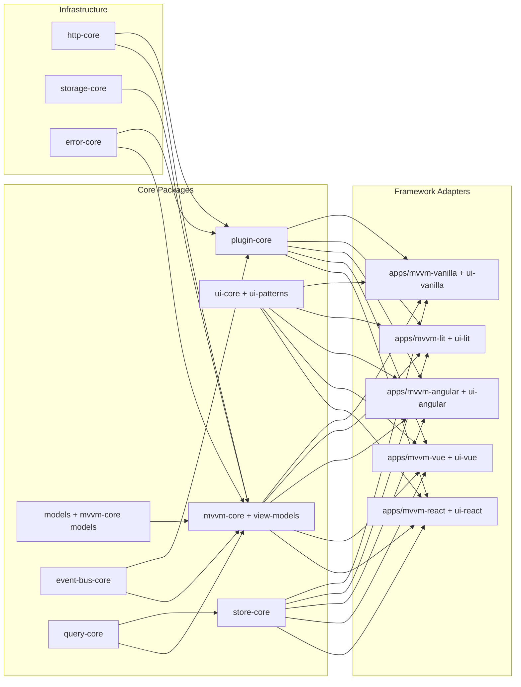

# Architecture Overview

```mermaid
graph LR
    subgraph Core Packages
        MVVM["mvvm-core + view-models"]
        Model["models + mvvm-core models"]
        UI["ui-core + ui-patterns"]
        Event["event-bus-core"]
        Plugin["plugin-core"]
        Store["store-core"]
        Query["query-core"]
    end

    subgraph Framework Adapters
        React["apps/mvvm-react + ui-react"]
        Vue["apps/mvvm-vue + ui-vue"]
        Angular["apps/mvvm-angular + ui-angular"]
        Lit["apps/mvvm-lit + ui-lit"]
        Vanilla["apps/mvvm-vanilla + ui-vanilla"]
    end

    MVVM --> React
    MVVM --> Vue
    MVVM --> Angular
    MVVM --> Lit
    MVVM --> Vanilla

    UI --> React
    UI --> Vue
    UI --> Angular
    UI --> Lit
    UI --> Vanilla

    Model --> MVVM
    Event --> MVVM
    Event --> Plugin
    Plugin --> React
    Plugin --> Vue
    Plugin --> Angular
    Plugin --> Lit
    Plugin --> Vanilla

    Store --> React
    Store --> Vue
    Store --> Angular
    Store --> Lit
    Store --> Vanilla

    Query --> MVVM
    Query --> Store

    subgraph Infrastructure
        HTTP["http-core"]
        Storage["storage-core"]
        Error["error-core"]
    end

    HTTP --> MVVM
    Storage --> MVVM
    Error --> MVVM
    HTTP --> Plugin
    Error --> Plugin
```
