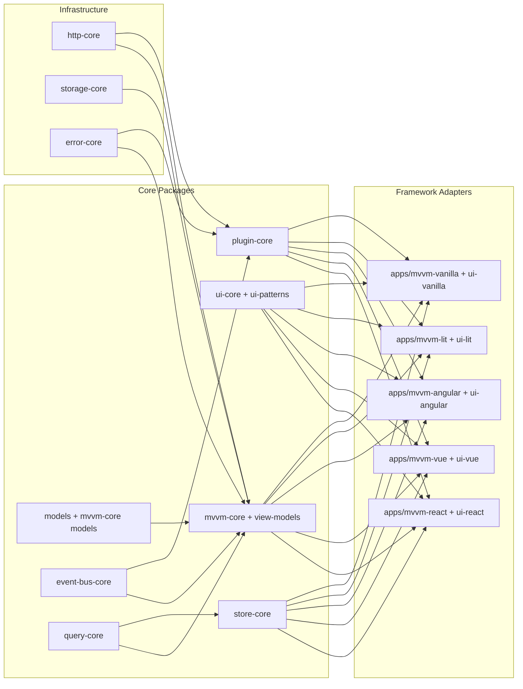
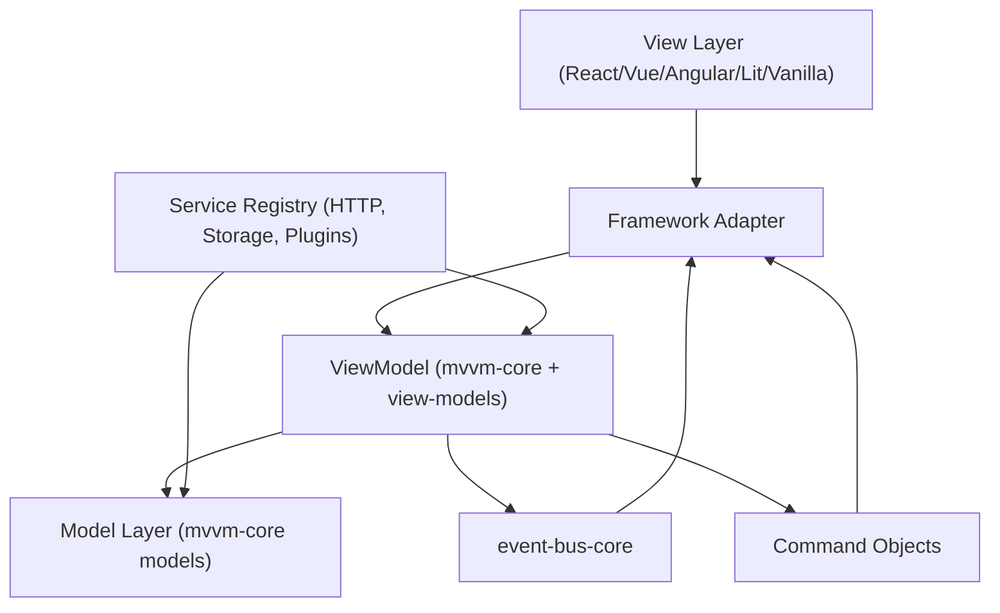
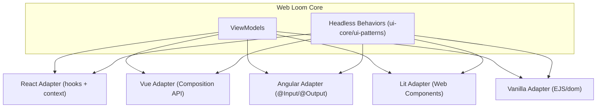
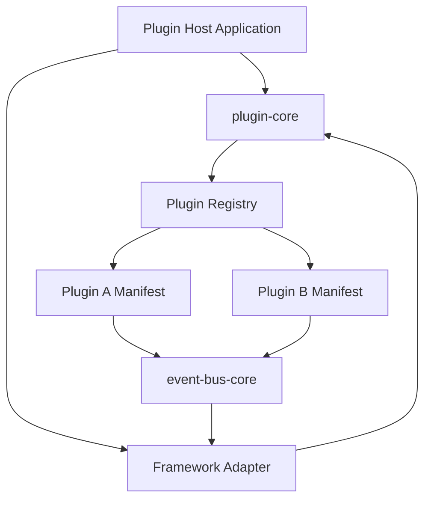
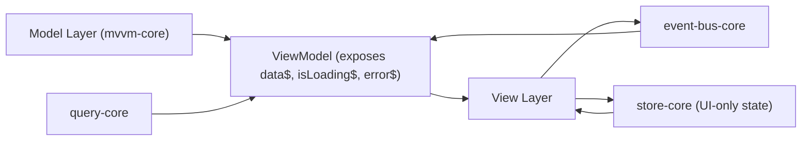

# Web Loom - Complete Documentation
# Framework-Agnostic UI Architecture Toolkit

**Generated:** $(date)
**Purpose:** Consolidated documentation for LLM consumption

---


<!-- ============================================ -->
<!-- SOURCE FILE: executive-summary.md -->
<!-- ============================================ -->

# Executive Summary

Modern frontend development has grown increasingly complex: proliferating frameworks, heavy tooling, and tightly coupled rendering logic have created an environment where teams spend disproportionate time managing framework APIs instead of solving domain problems. Most modern libraries, at their core, act as reactive template engines that update the DOM in response to state changes but still bury business logic inside rendering concerns. This coupling accelerates technical debt, introduces migration headaches, and makes cross-framework collaboration difficult for organizations striving for long-lived products.

This paper argues that frontend engineers would benefit from rediscovering proven architectural patterns from desktop development—particularly Model-View-ViewModel (MVVM)—and combining them with framework-agnostic primitives for state, communication, and modularity. Web Loom is presented not as another framework but as an experimental meta-framework and toolkit that layers MVVM-inspired structure on top of any rendering surface. By decoupling view definitions from view models, introducing an event bus for module communication, and exposing adapter points for React, Vue, Angular, and Vanilla JS, Web Loom demonstrates how to achieve the same developer productivity of reactive UIs with dramatically improved separation of concerns.

Key findings include:

- **Current State:** Teams face decision fatigue from choosing between framework ecosystems while managing redundant solutions for state, messaging, and component composition. Most libraries encourage mixing rendering logic with business rules, which makes testing harder and encourages reimplementation when the underlying framework evolves or requires replacement.
- **MVVM Advantage:** Borrowing from desktop platforms, MVVM gives clear boundaries between view models (the orchestrators of state and behavior) and views (rendering concerns), letting teams reason about business logic independently of UI frameworks. This pattern provides natural hooks for dependency injection, test doubles, and composable command patterns.
- **Framework-Agnostic Infrastructure:** Web Loom consolidates reusable primitives—observable state containers, plugin lifecycle management, and an event-driven communication bus—that can be consumed consistently regardless of the rendering library. When combined with adapter implementations for popular frameworks, this infrastructure unlocks incremental migration paths and makes it easier to build experiences that span multiple ecosystems.
- **Business Impact:** Organizations can reduce lock-in risk, shorten onboarding on new teams, and accelerate feature development by treating frontend architecture as a platform instead of a single library. By implementing MVVM with clean separation, teams achieve more testable code, predictable state transitions, and improved maintainability, all of which contribute to lower long-term costs and faster response to market changes.

Recommendations:

1. Adopt MVVM-style boundaries for new UI projects, keeping view models framework-agnostic and implementing views through thin adapters tailored to the chosen rendering library.
2. Invest in meta-framework building blocks—state containers, plugin managers, and event buses—that can be reused across applications to avoid reinventing core infrastructure for every framework shift.
3. Evaluate Web Loom’s reference implementations for guidance on command-pattern bindings, plugin lifecycles, and dependency injection strategies that keep behavior consistent across multiple clients.
4. Encourage cross-functional teams to document architectural trade-offs and migration strategies, ensuring that the benefits of separation of concerns are preserved as products scale.

Web Loom stands as a proof of concept that front-end architecture can be principled, portable, and resilient without sacrificing the reactivity developers expect today. This paper will detail how to realize that vision, providing both strategic recommendations for leadership and practical guidance for engineering teams.


<!-- ============================================ -->
<!-- SOURCE FILE: architecture-overview.md -->
<!-- ============================================ -->

# Architecture Overview




<!-- ============================================ -->
<!-- SOURCE FILE: mvvm-pattern.md -->
<!-- ============================================ -->

# MVVM Pattern




<!-- ============================================ -->
<!-- SOURCE FILE: framework-adapters.md -->
<!-- ============================================ -->

# Framework Adapters




<!-- ============================================ -->
<!-- SOURCE FILE: plugin-system.md -->
<!-- ============================================ -->

# Plugin System




<!-- ============================================ -->
<!-- SOURCE FILE: state-management.md -->
<!-- ============================================ -->

# State Management




<!-- ============================================ -->
<!-- SOURCE FILE: prompt.md -->
<!-- ============================================ -->

# White Paper: "Beyond Reactive Templates: A Framework-Agnostic Approach to Modern Frontend Architecture"

## Project Overview

Write a comprehensive white paper analyzing frontend architecture patterns and presenting Web Loom as an experimental meta-framework that addresses current limitations in frontend development. You can create architecture diagrams in mermaid format in this paper directory.

## Paper Premise and Direction

**Core Thesis**: Most modern frontend frameworks are merely reactive template engines that couple business logic too tightly with rendering concerns. Frontend engineers would benefit from adopting proven architectural patterns like MVVM from desktop development, combined with framework-agnostic approaches to state management, communication, and modularity.

**Web Loom Positioning**: An experimental toolkit/meta-framework demonstrating how to achieve:

- MVVM architectural patterns in web development
- Framework-agnostic state management
- Event bus communication between modules
- Modular plugin-based design
- Adapter pattern for rendering library abstraction
- Separation of UI behavior from rendering framework concerns

This approach aligns with existing open source trends (design tokens, design systems, headless UI) but provides a comprehensive architectural foundation.

## Task-by-Task Breakdown for LLM Implementation

### Task 1: Executive Summary and Abstract (500-750 words)

**Deliverable**: Write an executive summary that:

- Defines the current problem with frontend architecture
- States the thesis about frameworks being reactive template engines
- Introduces Web Loom as a solution demonstration
- Summarizes key findings and recommendations
- Targets both technical and non-technical stakeholders

**Key Points to Cover**:

- Current state of frontend development complexity
- Benefits of MVVM and framework-agnostic approaches
- Business impact of better architectural patterns
- Preview of solution architecture

### Task 2: Introduction and Problem Statement (1000-1500 words)

**Deliverable**: Comprehensive introduction covering:

**2.1 Current Frontend Landscape Analysis**

- Evolution of frontend frameworks (jQuery → Angular → React → Vue → Modern era)
- Proliferation of tooling and decision fatigue
- Common patterns across frameworks (reactive updates, component trees, state management)

**2.2 Problem Definition**

- Framework lock-in and migration challenges
- Tight coupling between business logic and rendering
- Lack of architectural patterns from established domains
- Reinventing solutions for common problems (state, communication, modularity)

**2.3 Research Questions**

- How can desktop architectural patterns improve web development?
- What benefits does framework-agnostic architecture provide?
- How can we maintain separation of concerns in reactive systems?

### Task 3: Literature Review and Background (1500-2000 words)

**Deliverable**: Academic-style literature review covering:

**3.1 Desktop Architecture Patterns**

- MVVM pattern origins and benefits (Martin Fowler, Microsoft WPF/Silverlight)
- Model-View-Presenter and Model-View-Controller evolution
- Dependency injection and inversion of control principles

**3.2 Web Architecture Evolution**

- Server-side MVC frameworks influence
- Single Page Application emergence
- Component-based architecture adoption
- State management solutions (Flux, Redux, MobX, Zustand)

**3.3 Framework-Agnostic Approaches**

- Headless UI libraries and design systems
- Web Components and custom elements
- Micro-frontend architecture patterns
- Design token systems and CSS-in-JS evolution

**3.4 Current Research Gaps**

- Lack of comprehensive architectural guidance
- Limited framework portability studies
- Insufficient separation of concerns analysis

### Task 4: Architecture Analysis and Design (2000-2500 words)

**Deliverable**: Technical architecture analysis with diagrams

**4.1 Web Loom Architecture Overview**
Create mermaid diagram showing:

- Core packages and their relationships
- MVVM layer separation
- Framework adapter pattern
- Plugin system architecture

**4.2 Core Architectural Components**
Analyze each package with technical details:

- `mvvm-core`: Reactive view model implementation
- `plugin-core`: Plugin system and lifecycle management
- `event-bus-core`: Inter-module communication
- Framework adapters (React, Vue, Angular, Vanilla JS)
- UI pattern libraries and design systems

**4.3 Design Patterns Implementation**

- Observer pattern for reactive data binding
- Adapter pattern for framework abstraction
- Command pattern for user actions
- Factory pattern for plugin instantiation
- Dependency injection for service management

**4.4 Architecture Diagrams Required**:

```
architecture-overview.md - High-level system architecture
mvvm-pattern.md - MVVM layer separation
plugin-system.md - Plugin lifecycle and communication
framework-adapters.md - Multi-framework support
state-management.md - Reactive data flow
```

### Task 5: Comparative Analysis (1500-2000 words)

**Deliverable**: Comparative study of architectural approaches

**5.1 Framework Comparison Matrix**
Create comparison table analyzing:

- React (with Redux/Zustand)
- Vue (with Pinia/Vuex)
- Angular (with RxJS/NgRx)
- Svelte/SvelteKit
- Web Loom approach

Compare on:

- Learning curve
- Framework lock-in risk
- Testability
- Maintainability
- Performance implications
- Developer experience

**5.2 Architecture Pattern Comparison**

- Traditional MVC vs MVVM vs Component-based
- Benefits and drawbacks analysis
- Use case suitability
- Team skill requirements

**5.3 Migration Path Analysis**

- Cost of switching frameworks
- Incremental adoption strategies
- Legacy system integration

### Task 6: Case Study Implementation (1500-2000 words)

**Deliverable**: Detailed case study of Web Loom implementation

**6.1 Greenhouse Management System**
Document the demo application showing:

- Business requirements and domain modeling
- MVVM implementation with reactive view models
- Multi-framework deployment (React, Vue, Angular variants)
- Plugin architecture for feature modularity

**6.2 Technical Implementation Details**

- Code organization and package structure
- Build system and tooling choices
- Testing strategies across frameworks
- Performance benchmarking results

**6.3 Developer Experience Metrics**

- Lines of code comparison
- Build time analysis
- Bundle size optimization
- Development velocity measurements

### Task 7: Benefits and Challenges Analysis (1000-1500 words)

**Deliverable**: Honest assessment of the approach

**7.1 Demonstrated Benefits**

- Framework portability and reduced lock-in
- Improved separation of concerns
- Better testability through MVVM
- Plugin system flexibility
- Code reuse across frameworks

**7.2 Implementation Challenges**

- Additional abstraction complexity
- Learning curve for MVVM patterns
- Tooling ecosystem maturity
- Performance overhead considerations
- Team adoption resistance

**7.3 Trade-off Analysis**

- When to use vs traditional approaches
- Team size and skill level considerations
- Project timeline implications

### Task 8: Future Work and Recommendations (800-1200 words)

**Deliverable**: Forward-looking analysis

**8.1 Research Directions**

- Empirical studies on developer productivity
- Performance benchmarking at scale
- Long-term maintainability studies
- Framework evolution impact analysis

**8.2 Industry Recommendations**

- Adoption strategies for teams
- Educational curriculum updates
- Tooling ecosystem development needs
- Standards and best practices

**8.3 Technology Evolution**

- Web Components integration potential
- Server-side rendering considerations
- Edge computing implications
- AI-assisted development integration

### Task 9: Conclusion and Call to Action (600-800 words)

**Deliverable**: Strong conclusion that:

- Summarizes key findings
- Reinforces the thesis
- Provides actionable recommendations
- Calls for industry collaboration
- Suggests next steps for adoption

### Task 10: Technical Appendices and References

**Deliverable**: Supporting materials

**10.1 Code Examples**

- MVVM implementation samples
- Plugin development templates
- Framework adapter implementations

**10.2 Performance Benchmarks**

- Bundle size comparisons
- Runtime performance metrics
- Build time measurements

**10.3 Academic References**

- Proper citation of architectural patterns
- Industry reports and surveys
- Open source project references

## Writing Guidelines

**Academic Rigor**:

- Use proper citations and references
- Include quantitative analysis where possible
- Maintain objective tone while advocating position
- Back claims with evidence from the codebase

**Technical Accuracy**:

- Reference actual Web Loom implementation
- Include working code examples
- Validate architectural claims against real code
- Test all mermaid diagrams for correctness

**Audience Consideration**:

- Balance technical depth with accessibility
- Define technical terms clearly
- Provide context for architectural concepts
- Include both strategic and tactical guidance

**Length Target**: 10,000-15,000 words total
**Format**: Academic paper structure with proper headings, diagrams, and references
**Deliverables**: Main paper + 5 mermaid architecture diagrams + code appendices


<!-- ============================================ -->
<!-- SOURCE FILE: ../README.md -->
<!-- ============================================ -->

<div align="center">
  

# Web Loom - A Production-Ready, Framework-Agnostic UI Architecture Toolkit

Welcome to Web Loom, a growing ecosystem of framework-agnostic patterns for the web. Our mission is to provide a comprehensive toolkit for building sustainable, maintainable, and scalable UI applications that stand the test of time.

</div>

## Vision

In an ever-evolving landscape of frontend frameworks, Web Loom champions a timeless approach to UI architecture. Inspired by the robust patterns of C#'s Prism framework, we have adapted and enhanced these concepts for the modern web. Our goal is to empower developers to build applications whose core logic is independent of any specific framework, ensuring that your investment in code pays dividends for years to come.

## Production-Ready Packages

All published npm packages are considered production-ready and are actively maintained. These packages form the stable foundation of the Web Loom ecosystem.

## Packages Under Development

We are constantly innovating and expanding the Web Loom ecosystem. Packages that are not yet published to npm are under active development and represent the future of our toolkit. We encourage the community to explore these packages and provide feedback to help shape their evolution.

## Core Principles

- **Framework-Agnostic**: Our core libraries are designed to work with any frontend framework, or even with vanilla JavaScript.
- **MVVM Architecture**: We provide a complete Model-View-ViewModel implementation, enabling a clean separation of concerns and testable business logic.
- **Headless UI**: Our UI patterns are headless, meaning they provide the logic and behavior for common UI components without imposing any specific styling.
- **Plugin System**: A dynamic plugin architecture allows for the creation of modular and extensible applications.
- **Type-Safe**: The entire ecosystem is written in TypeScript, ensuring type safety and improved developer experience.

## Getting Started

To get started with Web Loom, simply clone the repository and install the dependencies:

```bash
npm install
```

Then, you can run the development servers for all the applications:

```bash
npm run dev
```

## Learn More

To learn more about the Web Loom ecosystem, please refer to the documentation in each individual package. You can also read more about our philosophy and architecture in the following documents:

- [Prism to Web Loom Feature Mapping](docs/PRISM-WEBLOOM-COMPARISON.md)
- [MVVM-Core Enhancement Roadmap](docs/MVVM-CORE-PRISM-ENHANCEMENTS.md)

We are excited to have you on this journey with us. Welcome to the future of UI architecture. Welcome to Web Loom.

## Core Libraries

| Package                     | Description                                                          |
| --------------------------- | -------------------------------------------------------------------- |
| `@web-loom/mvvm-core`       | Core MVVM architecture library                                       |
| `@web-loom/ui-core`         | Headless UI behaviors                                                |
| `@web-loom/ui-patterns`     | Composed UI patterns                                                 |
| `@web-loom/store-core`      | Reactive state management                                            |
| `@web-loom/query-core`      | Data fetching & caching                                              |
| `@web-loom/signals-core`    | Framework-agnostic reactive signals with computed values and effects |
| `@web-loom/event-bus-core`  | Event bus for cross-component communication                          |
| `@web-loom/plugin-core`     | Plugin architecture                                                  |
| `@web-loom/typography-core` | Typography and coloring utilities                                    |
| `@web-loom/design-core`     | Theme and CSS variable utilities                                     |

## Architecture

Web Loom is built on a solid foundation of architectural patterns that have been adapted and enhanced for the modern web. Our architecture is heavily inspired by the C# Prism framework, but has been reimagined to leverage the power of reactive signals (@web-loom/signals-core) and TypeScript.

### MVVM (Model-View-ViewModel)

The core of our architecture is the Model-View-ViewModel (MVVM) pattern. This pattern provides a clean separation of concerns between the UI (View), the presentation logic (ViewModel), and the data and business logic (Model).

```
┌─────────────────────────────────────────────────────────┐
│                         View Layer                       │
│  (React / Angular / Vue / Vanilla JS - Framework UI)    │
└────────────────────┬────────────────────────────────────┘
                     │ Binds to signals
                     ▼
┌─────────────────────────────────────────────────────────┐
│                      ViewModel Layer                     │
│    (packages/view-models - Shared Business Logic)       │
│    • Exposes data$ / isLoading$ / error$ signals        │
│    • Handles user interactions                          │
│    • Framework-agnostic                                 │
└────────────────────┬────────────────────────────────────┘
                     │ Uses
                     ▼
┌─────────────────────────────────────────────────────────┐
│                       Model Layer                        │
│         (packages/mvvm-core - Data & Logic)             │
│    • BaseModel / RestfulApiModel                        │
│    • Zod validation                                     │
│    • Signal-based reactive state                        │
└─────────────────────────────────────────────────────────┘
```

### Headless UI Patterns

Our UI patterns are headless, meaning they provide the logic and behavior for common UI components without imposing any specific styling. This allows you to build a design system that is truly your own, while still leveraging our powerful UI logic.

```
Atomic Behaviors (@web-loom/ui-core)
       ↓
Composed Patterns (@web-loom/ui-patterns)
       ↓
Framework-Specific Components (Your App)
```

### Plugin Architecture

Web Loom features a dynamic plugin architecture that allows you to build modular and extensible applications. Plugins can contribute new routes, UI components, and even new application logic.

```
┌────────────────────────────────────────┐
│         Plugin Host Application         │
│  (Loads and manages plugins at runtime) │
└──────────────┬─────────────────────────┘
               │
        ┌──────┴──────┐
        │ Plugin Core │ (Framework-agnostic registry)
        └──────┬──────┘
               │
    ┌──────────┼──────────┐
    ▼          ▼          ▼
┌─────────┐ ┌─────────┐ ┌─────────┐
│React    │ │Angular  │ │Vue      │
│Adapter  │ │Adapter  │ │Adapter  │
└─────────┘ └─────────┘ └─────────┘
```


---

# End of Combined Documentation

This document combines all Web Loom architectural documentation for comprehensive understanding.
For the latest version, see: https://github.com/yourusername/web-loom

