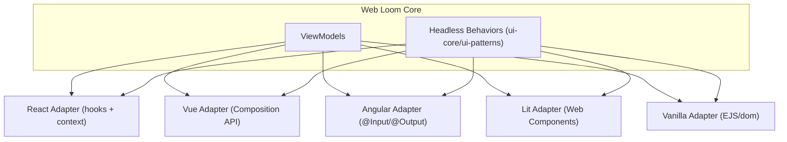

# Framework Adapters

```mermaid
graph TB
    subgraph Web Loom Core
        ViewModel["ViewModels"]
        Behaviors["Headless Behaviors (ui-core/ui-patterns)"]
    end
    React["React Adapter (hooks + context)"]
    Vue["Vue Adapter (Composition API)"]
    Angular["Angular Adapter (@Input/@Output)"]
    Lit["Lit Adapter (Web Components)"]
    Vanilla["Vanilla Adapter (EJS/dom)"]

    ViewModel --> React
    ViewModel --> Vue
    ViewModel --> Angular
    ViewModel --> Lit
    ViewModel --> Vanilla
    Behaviors --> React
    Behaviors --> Vue
    Behaviors --> Angular
    Behaviors --> Lit
    Behaviors --> Vanilla
```
