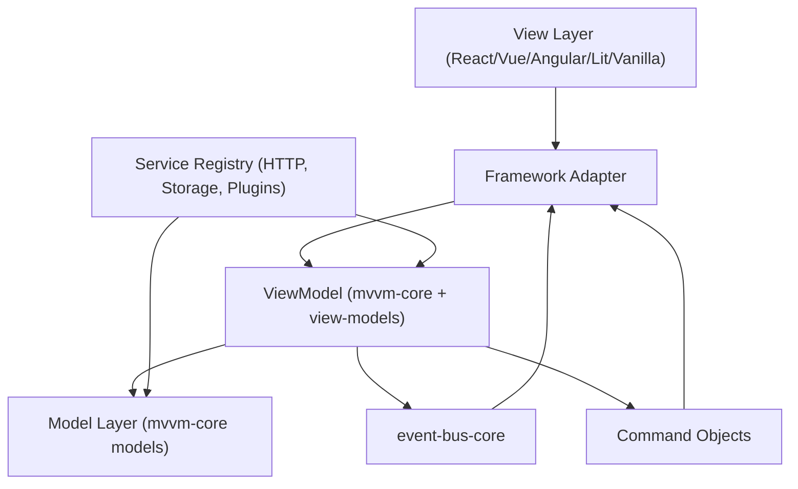

# MVVM Pattern

```mermaid
graph TD
    View["View Layer (React/Vue/Angular/Lit/Vanilla)"]
    Adapter["Framework Adapter"]
    ViewModel["ViewModel (mvvm-core + view-models)"]
    Model["Model Layer (mvvm-core models)"]
    EventBus["event-bus-core"]
    Service["Service Registry (HTTP, Storage, Plugins)"]
    Command["Command Objects"]

    View --> Adapter
    Adapter --> ViewModel
    ViewModel --> Model
    ViewModel --> EventBus
    ViewModel --> Command
    Service --> ViewModel
    Service --> Model
    EventBus --> Adapter
    Command --> Adapter
```
