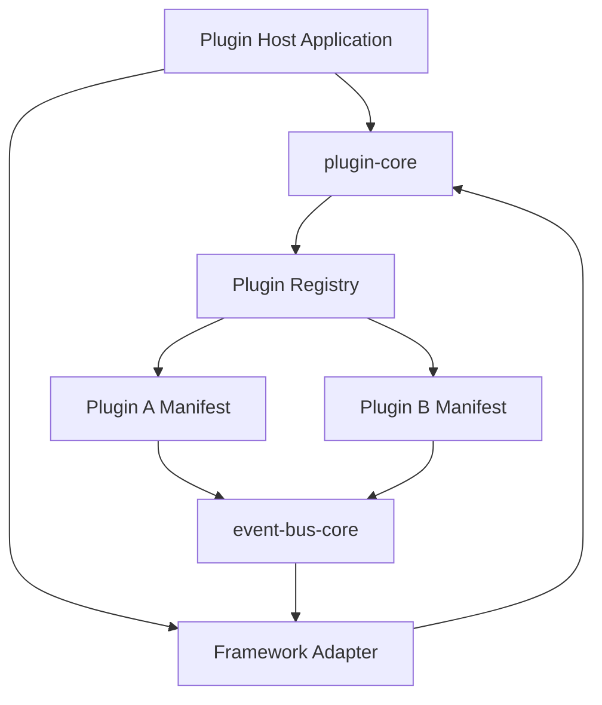

# Plugin System

```mermaid
graph TD
    Host["Plugin Host Application"]
    PluginCore["plugin-core"]
    Registry["Plugin Registry"]
    PluginA["Plugin A Manifest"]
    PluginB["Plugin B Manifest"]
    EventBus["event-bus-core"]
    Adapter["Framework Adapter"]

    Host --> PluginCore
    PluginCore --> Registry
    Registry --> PluginA
    Registry --> PluginB
    PluginA --> EventBus
    PluginB --> EventBus
    Host --> Adapter
    Adapter --> PluginCore
    EventBus --> Adapter
```
