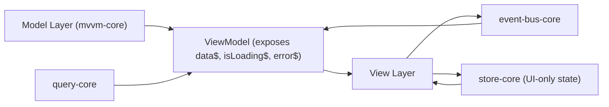

# State Management

```mermaid
graph LR
    Model["Model Layer (mvvm-core)"]
    Query["query-core"]
    Store["store-core (UI-only state)"]
    EventBus["event-bus-core"]
    ViewModel["ViewModel (exposes data$, isLoading$, error$)"]
    View["View Layer"]

    Model --> ViewModel
    Query --> ViewModel
    Store --> View
    EventBus --> ViewModel
    ViewModel --> View
    View --> EventBus
    View --> Store
```
